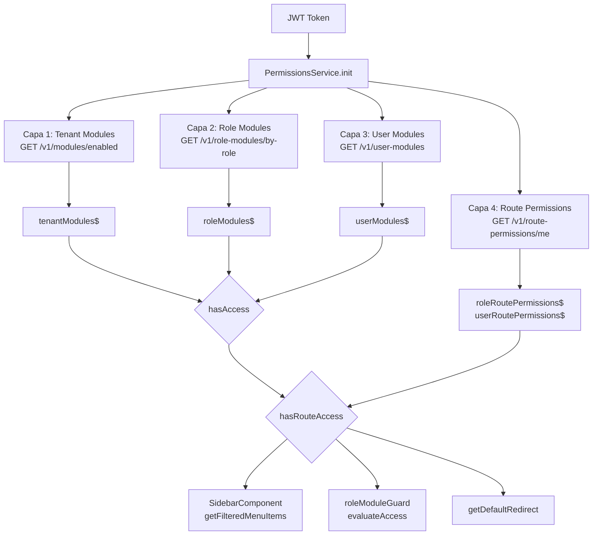
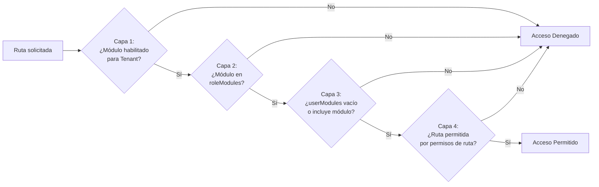

# Documento de Diseño — Validación de Accesos, Roles y Menú

## Visión General

Este diseño describe la arquitectura del sistema de control de acceso de 4 capas (Tenant → Rol → Usuario → Rutas) para la aplicación Angular LariTechFarms. El sistema garantiza que la visibilidad del menú lateral, la protección de rutas mediante guards y la redirección post-login sean consistentes entre sí, utilizando siempre la misma función de validación (`hasRouteAccess`).

El diseño se construye sobre el código existente ya corregido en el spec `access-roles-validation-fix`, que arregló la lógica de intersección en `roleHasModule`, `hasRouteAccess` y `getDefaultRedirect`.

### Decisiones de Diseño Clave

1. **Fuente única de verdad**: `PermissionsService` centraliza toda la lógica de permisos. Tanto el `SidebarComponent` como el `roleModuleGuard` consumen el mismo método `hasRouteAccess()`.
2. **Capas restrictivas**: Cada capa solo puede restringir el acceso, nunca expandirlo. La intersección es el operador fundamental.
3. **Fallback seguro**: Si falla la carga de módulos del tenant, se establece lista vacía (denegación total). Si falla la carga de módulos por rol, se usa la matriz estática. Si fallan los permisos de ruta, se aplica comportamiento permisivo (sin restricciones de ruta).
4. **Inicialización bloqueante**: El guard espera a que `PermissionsService.init()` complete antes de evaluar acceso.

## Arquitectura



### Flujo de Validación de 4 Capas



## Componentes e Interfaces

### 1. PermissionsService (`permissions.service.ts`)

Servicio singleton que centraliza toda la lógica de permisos.

**Estado interno (BehaviorSubjects):**
- `tenantModules$`: Módulos habilitados para el tenant (Capa 1)
- `roleModules$`: Módulos asignados al rol, dinámicos o fallback estático (Capa 2)
- `userModules$`: Módulos asignados al usuario individual (Capa 3)
- `roleRoutePermissions$`: Permisos de ruta a nivel de rol (Capa 4)
- `userRoutePermissions$`: Permisos de ruta a nivel de usuario (Capa 4)
- `userRole$`: Rol del usuario actual
- `initialized$`: Flag de inicialización completada
- `usingFallback$`: Indica si se usa la matriz estática

**Métodos públicos:**

| Método | Descripción |
|--------|-------------|
| `init(): Observable<void>` | Inicializa las 4 capas desde JWT + endpoints |
| `clear(): void` | Resetea todo el estado (logout) |
| `getModuleForRoute(route): ModuleName \| null` | Mapea ruta → módulo usando `MODULE_ROUTE_MAP` |
| `isModuleEnabled(module): boolean` | Verifica Capa 1 (tenant) |
| `roleHasModule(role, module): boolean` | Verifica Capas 2+3 (rol ∩ usuario) |
| `hasAccess(route): boolean` | Verifica Capas 1+2+3 |
| `hasRouteAccess(route): boolean` | Verifica las 4 capas completas |
| `getDefaultRedirect(): string` | Calcula ruta post-login |
| `getFilteredMenuItems(items): Menu[]` | Filtra menú según permisos |
| `waitForInit(): Observable<boolean>` | Observable que emite cuando init() completa |

### 2. Configuración de Permisos (`permissions.config.ts`)

Archivo de configuración estática con tipos y constantes:

- `UserRole`: Tipo unión de roles válidos
- `ModuleName`: Tipo unión de módulos del sistema
- `VALID_ROLES`: Array de roles para validación
- `MODULE_ROUTE_MAP`: Mapa módulo → prefijos de ruta
- `ROLE_ACCESS_MATRIX`: Matriz estática rol → módulos (fallback)
- `DEFAULT_REDIRECTS`: Rutas por defecto post-login por rol

### 3. RoleModuleGuard (`role-module.guard.ts`)

Guard funcional (`CanActivateFn`) que protege rutas hijas del layout principal.

- Espera inicialización de `PermissionsService` si no está listo
- Usa `getModuleForRoute()` para identificar el módulo
- Usa `hasRouteAccess()` para validar acceso completo de 4 capas
- Redirige a `/access-denied` si no tiene acceso

### 4. AuthGuard (`auth.guard.ts`)

Guard de clase que valida la existencia y vigencia del JWT.

- Verifica que el token existe en localStorage
- Valida que `exp` no haya expirado
- Redirige a `/auth/login` si falla

### 5. SidebarComponent (`sidebar.component.ts`)

Componente que renderiza el menú lateral.

- Se suscribe a `navServices.items` y `permissionsService.permissions$` via `combineLatest`
- Llama a `permissionsService.getFilteredMenuItems(items)` para filtrar
- Se actualiza reactivamente cuando cambian los permisos

### Interfaz Menu (`navservice.ts`)

```typescript
interface Menu {
  headTitle?: string;
  path?: string;
  title?: string;
  icon?: string;
  type?: string;
  active?: boolean;
  selected?: boolean;
  children?: Menu[];
  // ... otros campos de UI
}
```

## Modelos de Datos

### Estado de Permisos

```typescript
// Estado interno del PermissionsService
interface PermissionsState {
  tenantModules: string[];          // Capa 1: módulos del tenant
  roleModules: string[];            // Capa 2: módulos del rol
  userModules: string[];            // Capa 3: módulos del usuario
  roleRoutePermissions: Record<string, string[]>;  // Capa 4: rutas por rol
  userRoutePermissions: Record<string, string[]>;   // Capa 4: rutas por usuario
  userRole: UserRole | null;
  initialized: boolean;
  usingFallback: boolean;
}
```

### Módulos Efectivos (calculados)

```
Módulos_Efectivos = tenantModules ∩ roleModules ∩ (userModules.length > 0 ? userModules : roleModules)
```

### Rutas Efectivas por Módulo (calculadas)

```
Si roleRoutes[mod] Y userRoutes[mod] existen:
  rutasEfectivas = roleRoutes[mod] ∩ userRoutes[mod]
Si solo roleRoutes[mod]:
  rutasEfectivas = roleRoutes[mod]
Si solo userRoutes[mod]:
  rutasEfectivas = userRoutes[mod]
Si ninguno:
  rutasEfectivas = todas las rutas del módulo (permisivo)
```

### Respuestas de API

```typescript
// GET /v1/modules/enabled
{ success: boolean; data: { modules: string[] } }

// GET /v1/role-modules/by-role
{ success: boolean; data: { modules: string[] } }

// GET /v1/user-modules
{ success: boolean; data: { modules: { module_name: string }[] } }

// GET /v1/route-permissions/me
{ success: boolean; data: { role_routes: Record<string, string[]>; user_routes: Record<string, string[]> } }
```

## Propiedades de Correctitud

*Una propiedad es una característica o comportamiento que debe mantenerse verdadero en todas las ejecuciones válidas de un sistema — esencialmente, una declaración formal sobre lo que el sistema debe hacer. Las propiedades sirven como puente entre especificaciones legibles por humanos y garantías de correctitud verificables por máquina.*

### Propiedad 1: Invariante de cadena de subconjuntos

*Para cualquier* configuración de módulos de tenant, módulos de rol y módulos de usuario, los módulos efectivos (aquellos para los cuales `hasAccess` retorna `true`) deben ser un subconjunto de los módulos del rol, y los módulos del rol accesibles deben ser un subconjunto de los módulos del tenant.

**Valida: Requisitos 2.5, 3.4, 7.3**

### Propiedad 2: Cálculo de módulos efectivos por intersección

*Para cualquier* lista de módulos de rol y lista de módulos de usuario, si la lista de usuario no está vacía, los módulos efectivos deben ser exactamente la intersección de ambas listas (filtrada por tenant). Si la lista de usuario está vacía, los módulos efectivos deben ser los módulos del rol (filtrados por tenant).

**Valida: Requisitos 3.2, 3.3**

### Propiedad 3: Lógica de acceso a rutas de 4 capas

*Para cualquier* ruta, configuración de módulos (tenant, rol, usuario) y permisos de ruta (rol, usuario), `hasRouteAccess` debe retornar `true` solo cuando: (a) el módulo de la ruta está habilitado en el tenant, (b) el módulo está en los módulos del rol, (c) si existen módulos de usuario, el módulo está en ellos, y (d) si existen permisos de ruta, la ruta coincide con al menos un prefijo en la intersección de los permisos aplicables.

**Valida: Requisitos 4.2, 4.3, 4.4, 4.5, 4.6**

### Propiedad 4: Subconjunto de rutas efectivas

*Para cualquier* configuración de permisos de ruta a nivel de rol y usuario para un módulo, las rutas efectivas (aquellas que pasan `hasRouteAccess`) deben ser un subconjunto de las rutas permitidas por el rol cuando existen permisos de ruta a nivel de rol.

**Valida: Requisito 7.4**

### Propiedad 5: Consistencia bidireccional menú-guard

*Para cualquier* elemento de menú con `path` y cualquier configuración de permisos, el elemento debe aparecer en el resultado de `getFilteredMenuItems` si y solo si `hasRouteAccess(path)` retorna `true`.

**Valida: Requisitos 5.1, 5.2, 5.3**

### Propiedad 6: Filtrado estructural del menú

*Para cualquier* estructura de menú con elementos padre (con `children`) y encabezados de sección (`headTitle`), si ningún hijo/elemento de la sección pasa `hasRouteAccess`, entonces el padre/encabezado no debe aparecer en el resultado de `getFilteredMenuItems`.

**Valida: Requisitos 5.4, 5.5, 1.3, 4.7**

### Propiedad 7: Correctitud de redirección post-login

*Para cualquier* rol válido y configuración de permisos, `getDefaultRedirect` debe retornar: (a) la ruta por defecto del rol si es accesible, (b) la primera ruta accesible de los módulos efectivos si la ruta por defecto no es accesible, o (c) `/access-denied` si no hay rutas accesibles. La ruta retornada (excepto `/access-denied`) siempre debe pasar `hasAccess`.

**Valida: Requisitos 6.1, 6.2, 6.3, 6.4**

### Propiedad 8: Rol inválido deniega todo acceso

*Para cualquier* cadena de texto que no sea un rol válido del sistema (`VALID_ROLES`), `roleHasModule` debe retornar `false` para todos los módulos, y `getDefaultRedirect` debe retornar `/access-denied`.

**Valida: Requisitos 8.1, 8.3**

## Manejo de Errores

| Escenario | Comportamiento | Requisito |
|-----------|---------------|-----------|
| Token JWT ausente o inválido | `userRole$` = null, `tenantModules$` = [], todo acceso denegado, redirige a login | 8.1 |
| Fallo en GET `/v1/modules/enabled` | `tenantModules$` = [], todo acceso a módulos denegado | 1.4 |
| Fallo en GET `/v1/role-modules/by-role` o respuesta vacía | Usa `ROLE_ACCESS_MATRIX[role]` como fallback | 2.2 |
| Fallo en GET `/v1/user-modules` | `userModules$` = [], sin restricción adicional de usuario | 3.3 |
| Fallo en GET `/v1/route-permissions/me` | `roleRoutePermissions$` = {}, `userRoutePermissions$` = {}, comportamiento permisivo en Capa 4 | 8.2 |
| Rol no válido (no está en `VALID_ROLES`) | `userRole$` = null, todo acceso a módulos denegado | 8.3 |
| Ruta no mapeada a ningún módulo | `getModuleForRoute` retorna null, guard redirige a `/access-denied` | — |
| Guard evaluado antes de inicialización | `waitForInit()` bloquea hasta que `initialized$` emita true | 8.4 |

## Estrategia de Testing

### Framework y Herramientas

- **Unit tests**: Jasmine + Karma (ya configurados en el proyecto Angular)
- **Property-based tests**: fast-check v4.6.0 (ya instalado como devDependency)
- **Mocking**: Jasmine spies para HttpClient y servicios

### Tests de Propiedades (PBT)

Cada propiedad del documento de diseño se implementará como un test de propiedad usando `fast-check`:

- Mínimo 100 iteraciones por propiedad
- Cada test referenciará su propiedad del documento de diseño
- Formato de tag: `Feature: access-roles-menu-validation, Property {N}: {título}`

**Generadores necesarios:**
- `arbitraryUserRole`: Genera roles válidos e inválidos
- `arbitraryModuleName`: Genera nombres de módulos del sistema
- `arbitraryModuleList`: Genera subconjuntos de módulos
- `arbitraryRoutePermissions`: Genera mapas de permisos de ruta
- `arbitraryMenuItem`: Genera estructuras de menú con paths, children y headTitles
- `arbitraryPermissionsConfig`: Genera configuraciones completas de 4 capas

### Tests Unitarios (Ejemplos)

Tests de ejemplo para escenarios específicos y manejo de errores:

- Inicialización con token válido carga las 4 capas (Req 1.1, 2.1, 3.1, 4.1)
- Fallback a matriz estática cuando API de rol falla (Req 2.2)
- Token ausente establece estado vacío (Req 8.1)
- Fallo de permisos de ruta aplica comportamiento permisivo (Req 8.2)
- Guard espera inicialización antes de evaluar (Req 8.4)

### Tests de Integración

- Flujo completo de inicialización con respuestas HTTP mockeadas
- Interacción entre SidebarComponent y PermissionsService
- Navegación con roleModuleGuard activo
