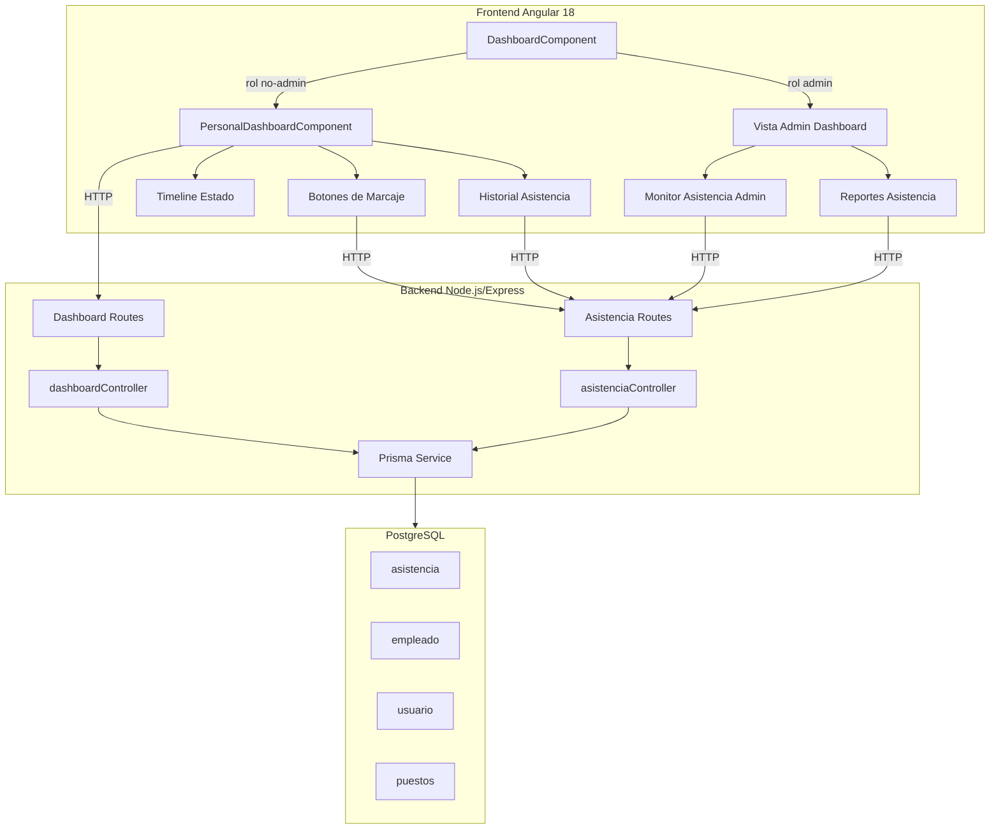
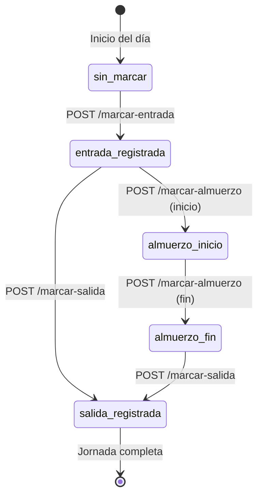

# Diseño Técnico — Sistema de Marcaje de Asistencia

## Resumen General

Este documento describe el diseño técnico para implementar el sistema de marcaje de asistencia en LariTechFarms. El sistema permite a empleados con roles no administrativos (gerente, supervisor, vendedor, operador) registrar su asistencia diaria (entrada, almuerzo, salida) desde un dashboard personal, mientras que los roles administrativos (superadmin, admin) acceden a vistas de monitoreo y reportería.

La implementación se divide en:
- **Backend**: Nuevos endpoints en `dashboardController.ts` y `asistenciaController.ts` para dashboard personal, marcaje y reportes.
- **Frontend**: Renderizado condicional del dashboard existente, nuevo componente de dashboard personal con botones de marcaje, historial y vista administrativa de asistencia.
- **Modelo de datos**: Uso del campo `observaciones` existente en la tabla `asistencia` para almacenar tiempos de almuerzo.

## Arquitectura

### Diagrama de Arquitectura General



### Diagrama de Máquina de Estados del Marcaje



### Decisiones de Diseño

1. **Renderizado condicional en DashboardComponent existente**: En lugar de crear rutas separadas, el `DashboardComponent` detecta el rol del usuario vía `PermissionsService` y renderiza la vista correspondiente. Esto mantiene la URL `/dashboard/hrmdashboards/dashboard` para todos los roles, respetando la configuración de `DEFAULT_REDIRECTS`.

2. **Estado de marcaje derivado, no almacenado**: El `Estado_Marcaje` (sin_marcar, entrada_registrada, almuerzo_inicio, almuerzo_fin, salida_registrada) se calcula a partir de los datos existentes en el registro de asistencia, no se almacena como campo separado. Esto evita inconsistencias.

3. **Almuerzo en campo observaciones**: Se reutiliza el campo `observaciones` (tipo `String?`) del modelo `Asistencia` existente para almacenar los tiempos de almuerzo con formato estructurado, evitando migraciones de esquema.

4. **Hora del servidor**: Todas las marcas de tiempo se generan en el servidor para evitar manipulación desde el cliente.

## Componentes e Interfaces

### Backend — Nuevos Endpoints

#### 1. Dashboard Personal
```
GET /api/v1/dashboard/personal
```
- **Middleware**: `authenticateToken`
- **Lógica**: Busca el `Usuario` autenticado, obtiene su `Empleado` vinculado (via `idEmpleado`), incluye `Puesto` y el `Registro_Asistencia` del día actual.
- **Respuesta exitosa (200)**:
```typescript
{
  success: true,
  data: {
    empleado: {
      id: number,
      nombre: string,
      apellido: string,
      telefono: string | null,
      correo: string | null,
      genero: string | null,
      fechaContratacion: Date,
      puesto: string,
      puestoDetalle: {
        nombre: string,
        descripcion: string | null,
        salarioBase: number | null
      } | null
    },
    asistenciaHoy: {
      id: number,
      horaEntrada: string,
      horaSalida: string | null,
      estado: string,
      observaciones: string | null,
      estadoMarcaje: 'sin_marcar' | 'entrada_registrada' | 'almuerzo_inicio' | 'almuerzo_fin' | 'salida_registrada'
    } | null,
    usuario: {
      rol: string,
      nombre: string,
      apellido: string
    }
  }
}
```
- **Error 404**: Si `idEmpleado` es nulo en el usuario.

#### 2. Marcar Entrada
```
POST /api/v1/asistencias/marcar-entrada
```
- **Middleware**: `authenticateToken`
- **Body**: vacío (la hora se toma del servidor)
- **Lógica**:
  1. Obtener `idEmpleado` del usuario autenticado via tabla `usuario`.
  2. Verificar que no exista registro de asistencia para hoy.
  3. Crear registro con `horaEntrada = now()`, `estado = 'Presente'`, `idUsuarioRegistro = req.user.idUsuario`.
- **Respuesta exitosa (201)**: Registro creado con `estadoMarcaje: 'entrada_registrada'`.
- **Error 409**: Ya existe registro para hoy.
- **Error 400**: Usuario sin empleado vinculado.

#### 3. Marcar Almuerzo
```
POST /api/v1/asistencias/marcar-almuerzo
```
- **Middleware**: `authenticateToken`
- **Body**: vacío
- **Lógica**:
  1. Obtener registro de asistencia del día.
  2. Calcular `estadoMarcaje` actual.
  3. Si `estadoMarcaje === 'entrada_registrada'`: escribir `almuerzo_inicio:HH:MM` en observaciones.
  4. Si `estadoMarcaje === 'almuerzo_inicio'`: agregar `|almuerzo_fin:HH:MM` a observaciones.
- **Respuesta exitosa (200)**: Registro actualizado.
- **Error 400**: Estado no permite la operación.

#### 4. Marcar Salida
```
POST /api/v1/asistencias/marcar-salida
```
- **Middleware**: `authenticateToken`
- **Body**: vacío
- **Lógica**:
  1. Obtener registro de asistencia del día.
  2. Verificar que `estadoMarcaje` sea `entrada_registrada` o `almuerzo_fin`.
  3. Actualizar `horaSalida = now()`.
- **Respuesta exitosa (200)**: Registro actualizado con horas trabajadas calculadas.
- **Error 400**: Estado no permite la operación.

#### 5. Historial Personal
```
GET /api/v1/asistencias/mi-historial?page=1&limit=15&fechaInicio=&fechaFin=
```
- **Middleware**: `authenticateToken`
- **Lógica**: Retorna registros del empleado vinculado al usuario autenticado, con paginación y filtro de fechas.

#### 6. Resumen Diario (Admin)
```
GET /api/v1/asistencias/resumen-diario
```
- **Middleware**: `authenticateToken`, `requireRole('superadmin', 'admin')`
- **Lógica**: Retorna conteo de empleados por estado de marcaje y lista detallada.

#### 7. Reporte de Asistencia (Admin)
```
GET /api/v1/asistencias/reporte?tipo=semanal|mensual&fechaInicio=&fechaFin=
```
- **Middleware**: `authenticateToken`, `requireRole('superadmin', 'admin')`
- **Lógica**: Genera resumen por empleado según el tipo de reporte.

### Frontend — Componentes

#### 1. DashboardComponent (modificación)
- **Cambio**: Inyectar `PermissionsService`, leer el rol del usuario.
- **Lógica condicional**:
  - Si rol es `superadmin` o `admin`: renderizar vista admin existente.
  - Si rol es otro: renderizar `PersonalDashboardComponent`.
- **Implementación**: Usar `@if` en el template para alternar entre vistas.

#### 2. PersonalDashboardComponent (nuevo)
- **Ubicación**: `src/app/componets/dashbord/hrmdashboards/dashboard/personal-dashboard/`
- **Standalone**: Sí
- **Responsabilidades**:
  - Mostrar tarjeta de bienvenida con datos del empleado.
  - Mostrar información del puesto.
  - Mostrar botones de marcaje con estado.
  - Mostrar timeline de estado del día.
  - Mostrar historial de asistencia con paginación.
  - Mostrar resumen mensual.

#### 3. AttendanceTimelineComponent (nuevo)
- **Ubicación**: `src/app/componets/dashbord/hrmdashboards/dashboard/personal-dashboard/attendance-timeline/`
- **Input**: `estadoMarcaje`, `asistenciaHoy`
- **Responsabilidad**: Renderizar el stepper visual Entrada → Almuerzo → Salida.

#### 4. AdminAttendanceComponent (nuevo)
- **Ubicación**: `src/app/componets/dashbord/hrmdashboards/dashboard/admin-attendance/`
- **Responsabilidad**: Tabla de asistencia del día, tarjetas de resumen, reportes.

### Frontend — Servicio Actualizado

Se extiende `AsistenciaService` con nuevos métodos:

```typescript
// Nuevos métodos en asistencia.service.ts
getDashboardPersonal(): Observable<DashboardPersonalResponse>;
marcarEntrada(): Observable<MarcarResponse>;
marcarAlmuerzo(): Observable<MarcarResponse>;
marcarSalida(): Observable<MarcarResponse>;
getMiHistorial(params: HistorialParams): Observable<HistorialResponse>;
getResumenDiario(): Observable<ResumenDiarioResponse>;
getReporte(params: ReporteParams): Observable<ReporteResponse>;
```

## Modelos de Datos

### Modelo Existente: Asistencia (sin cambios al esquema)

```prisma
model Asistencia {
  id                Int       @id @default(autoincrement()) @map("id_asistencia")
  idEmpleado        Int       @map("id_empleado")
  fecha             DateTime  @db.Date
  horaEntrada       DateTime  @map("hora_entrada") @db.Time(6)
  horaSalida        DateTime? @map("hora_salida") @db.Time(6)
  estado            String?   @db.VarChar(20)
  observaciones     String?
  idUsuarioRegistro Int?      @map("id_usuario_registro")
  empleado          Empleado  @relation(...)
  usuarioRegistro   Usuario?  @relation(...)
  @@map("asistencia")
}
```

### Formato del Campo `observaciones` para Almuerzo

El campo `observaciones` almacena los tiempos de almuerzo con el siguiente formato:

| Estado | Valor de `observaciones` |
|--------|--------------------------|
| Sin almuerzo registrado | `null` o vacío |
| Inicio de almuerzo | `"almuerzo_inicio:13:00"` |
| Almuerzo completo | `"almuerzo_inicio:13:00\|almuerzo_fin:14:00"` |

### Función de Derivación de Estado de Marcaje

```typescript
type EstadoMarcaje = 'sin_marcar' | 'entrada_registrada' | 'almuerzo_inicio' | 'almuerzo_fin' | 'salida_registrada';

function calcularEstadoMarcaje(asistencia: Asistencia | null): EstadoMarcaje {
  if (!asistencia) return 'sin_marcar';
  if (asistencia.horaSalida) return 'salida_registrada';
  
  const obs = asistencia.observaciones || '';
  if (obs.includes('almuerzo_fin:')) return 'almuerzo_fin';
  if (obs.includes('almuerzo_inicio:')) return 'almuerzo_inicio';
  
  return 'entrada_registrada';
}
```

### Función de Parseo de Observaciones

```typescript
interface DatosAlmuerzo {
  almuerzoInicio: string | null;  // "HH:MM"
  almuerzoFin: string | null;     // "HH:MM"
}

function parsearObservaciones(observaciones: string | null): DatosAlmuerzo {
  if (!observaciones) return { almuerzoInicio: null, almuerzoFin: null };
  
  const partes = observaciones.split('|');
  let almuerzoInicio: string | null = null;
  let almuerzoFin: string | null = null;
  
  for (const parte of partes) {
    const [clave, valor] = parte.split(':').length === 3 
      ? [parte.substring(0, parte.indexOf(':')), parte.substring(parte.indexOf(':') + 1)]
      : parte.split(':');
    if (clave === 'almuerzo_inicio') almuerzoInicio = valor;
    if (clave === 'almuerzo_fin') almuerzoFin = valor;
  }
  
  return { almuerzoInicio, almuerzoFin };
}
```

### Función de Cálculo de Horas Trabajadas

```typescript
function calcularHorasTrabajadas(
  horaEntrada: Date, 
  horaSalida: Date | null, 
  observaciones: string | null
): { horas: number; minutos: number } | null {
  if (!horaSalida) return null;
  
  const totalMs = horaSalida.getTime() - horaEntrada.getTime();
  const almuerzo = parsearObservaciones(observaciones);
  
  let almuerzoMs = 0;
  if (almuerzo.almuerzoInicio && almuerzo.almuerzoFin) {
    const [hi, mi] = almuerzo.almuerzoInicio.split(':').map(Number);
    const [hf, mf] = almuerzo.almuerzoFin.split(':').map(Number);
    almuerzoMs = ((hf * 60 + mf) - (hi * 60 + mi)) * 60 * 1000;
  }
  
  const trabajadoMs = totalMs - almuerzoMs;
  const horas = Math.floor(trabajadoMs / (1000 * 60 * 60));
  const minutos = Math.floor((trabajadoMs % (1000 * 60 * 60)) / (1000 * 60));
  
  return { horas, minutos };
}
```


## Propiedades de Correctitud

*Una propiedad es una característica o comportamiento que debe mantenerse verdadero en todas las ejecuciones válidas de un sistema — esencialmente, una declaración formal sobre lo que el sistema debe hacer. Las propiedades sirven como puente entre especificaciones legibles por humanos y garantías de correctitud verificables por máquina.*

### Propiedad 1: Cálculo de antigüedad laboral

*Para cualquier* fecha de contratación válida y cualquier fecha actual posterior a la fecha de contratación, el cálculo de antigüedad debe retornar años y meses tales que: `fechaContratacion + años + meses ≤ fechaActual < fechaContratacion + años + (meses + 1)`.

**Valida: Requisito 1.5**

### Propiedad 2: Cálculo de horas trabajadas

*Para cualquier* hora de entrada, hora de salida (posterior a entrada), y tiempos de almuerzo válidos (inicio < fin, ambos entre entrada y salida), el cálculo de horas trabajadas debe ser igual a `(horaSalida - horaEntrada) - (almuerzoFin - almuerzoInicio)`, y el resultado debe ser siempre no negativo.

**Valida: Requisito 7.4**

### Propiedad 3: Ordenamiento de historial por fecha descendente

*Para cualquier* conjunto de registros de asistencia retornados por el endpoint de historial, cada registro en la lista debe tener una fecha mayor o igual al registro siguiente en la lista.

**Valida: Requisito 7.2**

### Propiedad 4: Filtrado por rango de fechas

*Para cualquier* conjunto de registros de asistencia y cualquier rango de fechas [fechaInicio, fechaFin], todos los registros retornados por el filtro deben tener una fecha `f` tal que `fechaInicio ≤ f ≤ fechaFin`, y ningún registro fuera del rango debe ser retornado.

**Valida: Requisito 7.5**

### Propiedad 5: Consistencia del resumen mensual

*Para cualquier* conjunto de registros de asistencia de un mes, el total de horas del resumen mensual debe ser igual a la suma de las horas trabajadas individuales de cada registro, el promedio de horas diarias debe ser igual al total dividido por el número de días trabajados, y los días trabajados deben ser iguales al conteo de registros con hora de entrada.

**Valida: Requisito 7.6**

### Propiedad 6: Clasificación de empleados por estado de marcaje

*Para cualquier* conjunto de empleados con registros de asistencia variados, cada empleado debe aparecer en exactamente una categoría ("Presentes", "En almuerzo", "Jornada completa", "Sin marcar"), y la categoría asignada debe corresponder al estado de marcaje derivado de su registro de asistencia del día.

**Valida: Requisito 8.2**

## Manejo de Errores

### Backend

| Escenario | Código HTTP | Mensaje |
|-----------|-------------|---------|
| Usuario sin token | 401 | "Token de acceso requerido" |
| Token inválido | 403 | "Token inválido" |
| Usuario sin empleado vinculado | 404 | "Perfil de empleado no configurado" |
| Ya existe entrada para hoy | 409 | "Ya existe un registro de entrada para hoy" |
| Marcar almuerzo sin entrada | 400 | "Debe registrar entrada antes de marcar almuerzo" |
| Marcar salida sin entrada | 400 | "Debe registrar entrada antes de marcar salida" |
| Marcar salida durante almuerzo | 400 | "Debe finalizar el almuerzo antes de marcar salida" |
| Rol no autorizado en endpoint admin | 403 | "No tiene permisos para acceder a este recurso" |
| Error interno del servidor | 500 | "Error interno del servidor" |

### Frontend

- Errores HTTP se capturan en el servicio y se muestran como notificaciones toast via `ngx-toastr`.
- Error 404 (sin empleado): Se muestra un mensaje informativo en el dashboard personal con instrucciones para contactar al administrador.
- Error 409 (entrada duplicada): Toast de advertencia indicando que ya se registró la entrada.
- Errores de red: Toast de error genérico con opción de reintentar.
- Los botones de marcaje se deshabilitan durante la petición HTTP para evitar doble clic.

## Estrategia de Testing

### Tests Unitarios (example-based)

- **calcularEstadoMarcaje**: Verificar cada transición de estado con datos concretos.
- **parsearObservaciones**: Verificar parseo correcto con strings de ejemplo (vacío, solo inicio, inicio y fin).
- **Renderizado condicional del dashboard**: Verificar que el rol correcto muestra la vista correcta.
- **Estados de botones de marcaje**: Verificar habilitado/deshabilitado para cada estado.
- **Endpoints de marcaje**: Verificar respuestas correctas para flujos exitosos y errores (409, 400, 404, 403).
- **Formato de observaciones**: Verificar que el formato "almuerzo_inicio:HH:MM|almuerzo_fin:HH:MM" se escribe y lee correctamente.

### Tests de Propiedad (property-based)

Se usará **fast-check** como librería de PBT para TypeScript/JavaScript.

Cada test de propiedad debe:
- Ejecutar mínimo 100 iteraciones.
- Referenciar la propiedad del documento de diseño con un tag en formato: `Feature: attendance-marking, Property {N}: {título}`.

Propiedades a implementar:
1. **Cálculo de antigüedad** — Generar fechas aleatorias, verificar que años y meses son correctos.
2. **Cálculo de horas trabajadas** — Generar horas de entrada/salida/almuerzo aleatorias, verificar la fórmula.
3. **Ordenamiento de historial** — Generar listas aleatorias de registros, verificar orden descendente.
4. **Filtrado por rango de fechas** — Generar registros y rangos aleatorios, verificar inclusión/exclusión.
5. **Consistencia del resumen mensual** — Generar registros mensuales aleatorios, verificar agregaciones.
6. **Clasificación por estado** — Generar empleados con estados aleatorios, verificar clasificación.

### Tests de Integración

- Flujo completo de marcaje: entrada → almuerzo inicio → almuerzo fin → salida.
- Endpoint de dashboard personal con usuario autenticado.
- Endpoint de resumen diario con rol admin.
- Endpoint de reportes con parámetros de fecha.
- Validación de tenant en operaciones de marcaje.
- Rechazo de acceso a endpoints admin con roles no administrativos.
