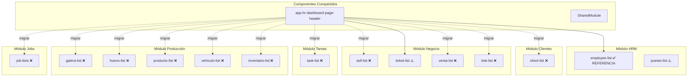
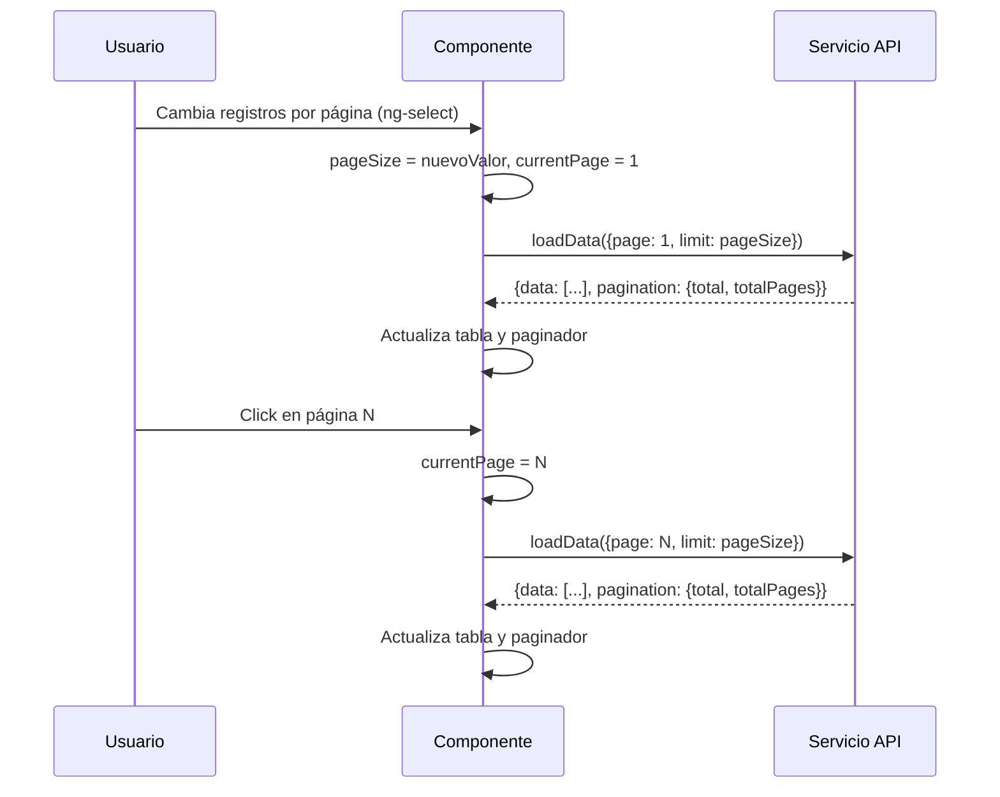

# Documento de Diseño: Estandarización de Componentes

## Resumen

Este diseño define la estrategia técnica para estandarizar los componentes de listado de la aplicación LariTechFarms (Angular 18, template Dayone/Spruko), tomando como referencia el módulo `employee-list`. La estandarización abarca 7 áreas: headers de página, tablas, botones de acción, paginadores funcionales, selectores de registros por página, corrección de navegación en blanco, y traducción de textos al español.

### Hallazgos de la Investigación del Código

La investigación del código fuente reveló los siguientes patrones de inconsistencia:

**Headers:**
- `employee-list`, `ticket-list`: Usan `<app-hr-dashboard-page-header>` correctamente.
- `client-list`, `sell-list`: Usan header inline con `<div class="page-header d-lg-flex d-block">`.
- `galera-list`, `venta-list`: Usan un patrón completamente diferente con `card-header justify-content-between`.
- `task-list`: Usa `<app-task-dashboard-page-header>` (componente diferente al estándar).

**Tablas:**
- `employee-list`, `ticket-list`: `table mb-0 text-nowrap text-md-nowrap table-bordered border` ✅
- `client-list`, `sell-list`, `task-list`: `table table-vcenter text-nowrap table-bordered border-bottom` ❌
- `galera-list`, `venta-list`: `table text-nowrap table-hover` ❌
- `task-list`: Usa `mat-table` con `MatTableDataSource` y datos estáticos ❌

**Botones de acción:**
- `employee-list`, `ticket-list`: `btn btn-icon` con variantes de color ✅
- `client-list`, `sell-list`, `task-list`: `action-btns1` con íconos de texto coloreado ❌
- `galera-list`, `venta-list`: `btn-group` con `btn btn-sm` ❌

**Paginadores:**
- `employee-list`, `ticket-list`, `task-list`, `lote-list`, `producto-list`: Paginador estático (Prev/1/2/3/Next sin funcionalidad) ❌
- `client-list`, `sell-list`: Sin paginador ❌
- `puesto-list`: Paginador funcional con `onPageChange()` ✅ (referencia para lógica)
- `galera-list`, `venta-list`: Paginador funcional con estilo diferente ⚠️

**Textos en inglés encontrados:**
- `task-list`: "All Task's", "My Task", "Pending Tasks", "Completed Tasks", "Recent Task Summary", "From:", "To:", "Assign To:", "Select Employee", "Search", "Show", "entries", "Prev", "Next", "Action", "View Task", "Delete"
- `client-list`, `sell-list`: "entradas" en lugar de "registros"

**RouteReuseStrategy:** No se encontró una implementación personalizada en el código fuente. El problema de navegación en blanco probablemente se debe a la falta de desuscripción de observables o a problemas con la detección de cambios en componentes standalone.

## Arquitectura

### Diagrama de Componentes Afectados



### Flujo de Paginación Estándar



## Componentes e Interfaces

### 1. Header Estándar (`app-hr-dashboard-page-header`)

Componente existente ubicado en `shared/common/page-headers/hr-dashboard-page-header/`.

**Inputs actuales:**
| Input | Tipo | Descripción |
|-------|------|-------------|
| `title` | `string` | Título principal de la página |
| `title1` | `string` | Subtítulo (texto muted) |
| `title2` | `string \| undefined` | Texto del botón de acción principal |
| `title3` | `string` | Texto del botón modal |
| `class` | `string` | Clases CSS del botón de acción |
| `class1` | `string` | Clases CSS del botón modal |
| `path` | `string` | Ruta del routerLink del botón de acción |
| `path1` | `string` | Ruta secundaria |

**Uso estándar:**
```html
<app-hr-dashboard-page-header 
  [title]="'Empleados'" 
  [title2]="'Agregar Nuevo Empleado'" 
  [class]="'btn btn-primary'"
  [class1]="''" 
  [path]="'/dashboard/hrmdashboards/employees/add-empleado'">
</app-hr-dashboard-page-header>
```

**Para módulos sin botón de acción:** Pasar `[title2]="undefined"` y `[class]="'d-none'"`.

### 2. Tabla Estándar

**Estructura HTML requerida:**
```html
<div class="table-responsive">
  <table class="table mb-0 text-nowrap text-md-nowrap table-bordered border">
    <thead>
      <tr class="border-bottom">
        <th scope="col">Columna</th>
      </tr>
    </thead>
    <tbody>
      @for (item of items; track item.id) {
        <tr class="border-bottom">
          <td>{{ item.campo }}</td>
        </tr>
      }
      @empty {
        <tr>
          <td colspan="N" class="text-center py-4">
            <div class="text-muted">
              <i class="fe fe-inbox fs-24 mb-2 d-block"></i>
              <p>No hay registros disponibles</p>
            </div>
          </td>
        </tr>
      }
    </tbody>
  </table>
</div>
```

### 3. Botones de Acción Estándar

**Estructura HTML requerida:**
```html
<td>
  <div class="d-flex gap-2">
    <a class="btn btn-primary btn-icon" [routerLink]="['/ruta', item.id]"
       data-bs-toggle="tooltip" title="Ver">
      <i class="fe fe-eye"></i>
    </a>
    <a class="btn btn-success btn-icon" (click)="edit(item)"
       data-bs-toggle="tooltip" title="Editar">
      <i class="fe fe-edit-2"></i>
    </a>
    <a class="btn btn-danger btn-icon" (click)="delete(item.id)"
       data-bs-toggle="tooltip" title="Eliminar">
      <i class="fe fe-trash-2"></i>
    </a>
  </div>
</td>
```

### 4. Paginador Estándar

**Estructura HTML requerida:**
```html
<nav class="mt-4">
  <ul class="pagination justify-content-end mb-0">
    <li class="page-item" [class.disabled]="currentPage === 1">
      <a class="page-link" href="javascript:void(0);" 
         (click)="onPageChange(currentPage - 1)">Anterior</a>
    </li>
    @for (page of [].constructor(totalPages); track $index) {
      <li class="page-item" [class.active]="currentPage === $index + 1">
        <a class="page-link" href="javascript:void(0);" 
           (click)="onPageChange($index + 1)">{{ $index + 1 }}</a>
      </li>
    }
    <li class="page-item" [class.disabled]="currentPage === totalPages">
      <a class="page-link" href="javascript:void(0);" 
         (click)="onPageChange(currentPage + 1)">Siguiente</a>
    </li>
  </ul>
</nav>
```

### 5. Selector de Registros Estándar

**Estructura HTML requerida:**
```html
<div class="d-flex align-items-center">
  <span>Mostrar</span>
  <div class="d-flex ms-2 mx-2">
    <div class="form-group mb-0">
      <ng-select name="quantity" [ngModel]="pageSize" 
                 (ngModelChange)="onPageSizeChange($event)"
                 class="form-control wd-150 p-0">
        <ng-option [value]="10">10</ng-option>
        <ng-option [value]="25">25</ng-option>
        <ng-option [value]="50">50</ng-option>
        <ng-option [value]="100">100</ng-option>
      </ng-select>
    </div>
  </div>
  <span>registros</span>
</div>
```

### 6. Interfaz de Lógica de Paginación (TypeScript)

Cada componente de listado debe implementar esta lógica:

```typescript
// Propiedades
currentPage = 1;
pageSize = 10;
totalItems = 0;
totalPages = 0;
Math = Math;

// Métodos
onPageChange(page: number): void {
  if (page >= 1 && page <= this.totalPages) {
    this.currentPage = page;
    this.loadData();
  }
}

onPageSizeChange(newSize: number): void {
  this.pageSize = newSize;
  this.currentPage = 1;
  this.loadData();
}

// En loadData(), después de recibir respuesta:
this.totalItems = response.data.pagination.total;
this.totalPages = response.data.pagination.totalPages;
// O calcular: this.totalPages = Math.ceil(this.totalItems / this.pageSize);
```


## Modelos de Datos

### Estado de Paginación

```typescript
interface PaginationState {
  currentPage: number;    // Página actual (1-indexed)
  pageSize: number;       // Registros por página (10, 25, 50, 100)
  totalItems: number;     // Total de registros del backend
  totalPages: number;     // ceil(totalItems / pageSize)
}
```

### Respuesta Paginada del API

```typescript
interface PaginatedResponse<T> {
  success: boolean;
  data: {
    data: T[];
    pagination: {
      total: number;
      totalPages: number;
      currentPage: number;
      limit: number;
    };
  };
}
```

### Configuración del Header por Módulo

| Módulo | title | title2 | path | class |
|--------|-------|--------|------|-------|
| client-list | "Clientes" | "Agregar Cliente" | "/dashboard/client-dashboard/new-client" | "btn btn-primary" |
| sell-list | "Ventas" | "Agregar Venta" | "/dashboard/business-dashboard/new-sell" | "btn btn-primary" |
| task-list | "Tareas" | "Nueva Tarea" | "/dashboard/task-dashboard/new-tasks" | "btn btn-primary" |
| ticket-list | "Tickets" | "Agregar Nuevo Ticket" | "/dashboard/business-dashboard/new-ticket" | "btn btn-primary" |
| venta-list | "Gestión de Ventas" | "Nueva Venta" | "../add" | "btn btn-primary" |
| galera-list | "Galeras" | "Nueva Galera" | "/dashboard/production-dashboard/galeras/add" | "btn btn-primary" |
| huevo-list | "Huevos" | "Nuevo Registro" | ruta correspondiente | "btn btn-primary" |
| producto-list | "Productos" | "Nuevo Producto" | ruta correspondiente | "btn btn-primary" |
| vehiculo-list | "Vehículos" | "Nuevo Vehículo" | ruta correspondiente | "btn btn-primary" |
| inventario-list | "Inventario" | "Nuevo Ingreso" | ruta correspondiente | "btn btn-primary" |
| lote-list | "Lotes" | "Nuevo Lote" | ruta correspondiente | "btn btn-primary" |
| job-lists | "Trabajos" | "Nuevo Trabajo" | ruta correspondiente | "btn btn-primary" |

### Mapeo de Migración de Botones

| Patrón Legacy | Patrón Estándar |
|---------------|-----------------|
| `<a class="action-btns1"><i class="fe fe-eye text-primary"></i></a>` | `<a class="btn btn-primary btn-icon" data-bs-toggle="tooltip" title="Ver"><i class="fe fe-eye"></i></a>` |
| `<a class="action-btns1"><i class="fe fe-edit-2 text-success"></i></a>` | `<a class="btn btn-success btn-icon" data-bs-toggle="tooltip" title="Editar"><i class="fe fe-edit-2"></i></a>` |
| `<a class="action-btns1"><i class="fe fe-trash-2 text-danger"></i></a>` | `<a class="btn btn-danger btn-icon" data-bs-toggle="tooltip" title="Eliminar"><i class="fe fe-trash-2"></i></a>` |
| `<button class="btn btn-sm btn-info">` | `<a class="btn btn-primary btn-icon" data-bs-toggle="tooltip" title="Ver"><i class="fe fe-eye"></i></a>` |
| `<button class="btn btn-sm btn-warning">` | `<a class="btn btn-success btn-icon" data-bs-toggle="tooltip" title="Editar"><i class="fe fe-edit-2"></i></a>` |
| `<button class="btn btn-sm btn-danger">` | `<a class="btn btn-danger btn-icon" data-bs-toggle="tooltip" title="Eliminar"><i class="fe fe-trash-2"></i></a>` |

### Mapeo de Traducción de Textos

| Texto en Inglés | Texto en Español |
|-----------------|------------------|
| "Prev" | "Anterior" |
| "Next" | "Siguiente" |
| "Show" | "Mostrar" |
| "entries" | "registros" |
| "entradas" | "registros" |
| "Search" / "Search..." | "Buscar" |
| "From:" | "Desde:" |
| "To:" | "Hasta:" |
| "Select Employee" | "Seleccionar Empleado" |
| "Assign To:" | "Asignar A:" |
| "Select Priority:" | "Seleccionar Prioridad:" |
| "All Task's" | "Todas las Tareas" |
| "My Task" | "Mis Tareas" |
| "Pending Tasks" | "Tareas Pendientes" |
| "Completed Tasks" | "Tareas Completadas" |
| "Recent Task Summary" | "Resumen de Tareas Recientes" |
| "Action" | "Acciones" |
| "View Task" | "Ver Tarea" |
| "Delete" | "Eliminar" |
| "View" | "Ver" |
| "High" / "Medium" / "Low" | "Alta" / "Media" / "Baja" |
| "Task" | "Tarea" |
| "Department" | "Departamento" |
| "Priority" | "Prioridad" |
| "StartDate" | "Fecha Inicio" |
| "Deadline" | "Fecha Límite" |
| "Progress" | "Progreso" |
| "WorkStatus" | "Estado" |

## Propiedades de Correctitud

*Una propiedad es una característica o comportamiento que debe mantenerse verdadero en todas las ejecuciones válidas de un sistema — esencialmente, una declaración formal sobre lo que el sistema debe hacer. Las propiedades sirven como puente entre especificaciones legibles por humanos y garantías de correctitud verificables por máquina.*

### Propiedad 1: Cálculo correcto del total de páginas

*Para cualquier* cantidad total de registros `totalItems > 0` y cualquier tamaño de página `pageSize` en {10, 25, 50, 100}, el total de páginas calculado debe ser igual a `Math.ceil(totalItems / pageSize)`.

**Valida: Requisitos 4.3**

### Propiedad 2: Estados de los botones de navegación en los límites del paginador

*Para cualquier* estado de paginación válido, el botón "Anterior" debe estar deshabilitado si y solo si `currentPage === 1`, y el botón "Siguiente" debe estar deshabilitado si y solo si `currentPage === totalPages`.

**Valida: Requisitos 4.7, 4.8**

### Propiedad 3: Exactamente una página activa

*Para cualquier* estado de paginación válido con `totalPages >= 1`, debe existir exactamente un elemento de página con la clase `active`, y ese elemento debe corresponder a `currentPage`.

**Valida: Requisitos 4.9**

### Propiedad 4: Cambio de tamaño de página recalcula y reinicia

*Para cualquier* estado de paginación con `totalItems > 0` y cualquier nuevo `pageSize` en {10, 25, 50, 100}, al cambiar el tamaño de página, `currentPage` debe reiniciarse a 1 y `totalPages` debe recalcularse como `Math.ceil(totalItems / pageSize)`.

**Valida: Requisitos 4.10, 5.3**

### Propiedad 5: Los datos mostrados corresponden a la página actual

*Para cualquier* lista de registros y cualquier `currentPage` válido (1 ≤ currentPage ≤ totalPages), los registros visibles en la tabla deben ser el subconjunto correspondiente: desde el índice `(currentPage - 1) * pageSize` hasta `min(currentPage * pageSize, totalItems) - 1`.

**Valida: Requisitos 4.4**

## Manejo de Errores

### Errores de Carga de Datos
- Si el servicio API falla al cargar datos, mostrar un mensaje de error con `Swal.fire()` o `toastr.error()` según el patrón del módulo.
- Mantener el estado de `isLoading = false` para evitar spinners infinitos.
- Mostrar el mensaje "No hay registros disponibles" si la respuesta es vacía.

### Errores de Paginación
- Si `currentPage` excede `totalPages` después de un cambio de filtro, reiniciar a `currentPage = 1`.
- Si la API devuelve `totalPages = 0`, ocultar el paginador completamente.
- Validar que `page >= 1 && page <= totalPages` antes de ejecutar `onPageChange()`.

### Errores de Navegación (Bug de Página en Blanco)
- Implementar `ngOnDestroy` en todos los componentes con suscripciones a observables.
- Usar `takeUntilDestroyed()` de Angular 18 o un `Subject` de destrucción para gestionar suscripciones.
- Si se detecta un `RouteReuseStrategy` personalizado, evaluar si es necesario o reemplazarlo con el comportamiento por defecto de Angular.
- Para componentes con parámetros de ruta dinámicos, suscribirse a `ActivatedRoute.params` en lugar de leer el snapshot una sola vez.

### Errores de Migración de mat-table
- Al migrar `task-list` de `mat-table` a tabla HTML estándar, asegurar que los datos estáticos se reemplacen por datos del servicio API.
- Si el servicio de tareas no existe aún, crear un servicio básico que devuelva datos del backend.
- Eliminar las dependencias de `MatTableModule` y `MatTableDataSource` del componente migrado.

## Estrategia de Testing

### Tests Unitarios (Ejemplo)

Los tests unitarios verificarán escenarios específicos:

1. **Header**: Cada módulo migrado renderiza `<app-hr-dashboard-page-header>` con los inputs correctos.
2. **Tabla**: Las clases CSS de la tabla coinciden con el estándar (`table mb-0 text-nowrap text-md-nowrap table-bordered border`).
3. **Botones**: No existe la clase `action-btns1` en ningún template migrado; los botones usan `btn btn-icon`.
4. **Paginador**: El paginador muestra "Anterior"/"Siguiente" en lugar de "Prev"/"Next".
5. **Selector**: El selector muestra "registros" en lugar de "entradas" o "entries".
6. **Traducción**: No existen textos en inglés en los módulos migrados.
7. **Navegación**: Navegar ida y vuelta entre rutas no produce página en blanco.

### Tests de Propiedad (Property-Based Testing)

Se usará la librería `fast-check` para TypeScript/Angular.

**Configuración:**
- Mínimo 100 iteraciones por test de propiedad.
- Cada test referencia la propiedad del documento de diseño.

**Tests a implementar:**

1. **Feature: component-standardization, Property 1: Cálculo correcto del total de páginas**
   - Generar `totalItems` aleatorio (1-10000) y `pageSize` aleatorio de {10, 25, 50, 100}.
   - Verificar que `Math.ceil(totalItems / pageSize)` produce el resultado correcto.

2. **Feature: component-standardization, Property 2: Estados de botones en límites**
   - Generar estados de paginación aleatorios.
   - Verificar que Prev está disabled ↔ currentPage === 1, y Next está disabled ↔ currentPage === totalPages.

3. **Feature: component-standardization, Property 3: Exactamente una página activa**
   - Generar estados de paginación aleatorios.
   - Verificar que exactamente un page-item tiene clase `active` y corresponde a `currentPage`.

4. **Feature: component-standardization, Property 4: Cambio de tamaño recalcula y reinicia**
   - Generar estado de paginación aleatorio y nuevo pageSize.
   - Verificar que currentPage se reinicia a 1 y totalPages se recalcula.

5. **Feature: component-standardization, Property 5: Datos corresponden a página actual**
   - Generar lista de registros aleatoria y currentPage válido.
   - Verificar que el slice mostrado es correcto.

### Tests de Integración

1. Verificar que la navegación entre módulos no produce página en blanco.
2. Verificar que los componentes ejecutan `ngOnInit` y `ngOnDestroy` correctamente al navegar.
3. Verificar que los componentes con parámetros dinámicos recargan datos al cambiar el parámetro.

### Prioridad de Ejecución

1. **Alta**: Lógica de paginación (Properties 1-5), corrección de navegación en blanco.
2. **Media**: Migración de headers, tablas y botones (tests de ejemplo).
3. **Baja**: Traducción de textos (tests de ejemplo).
