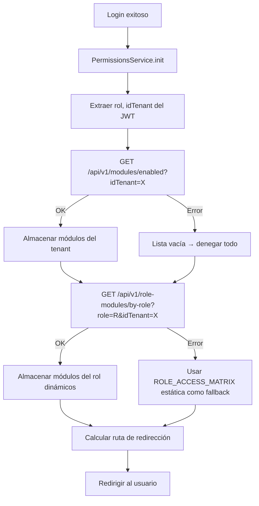
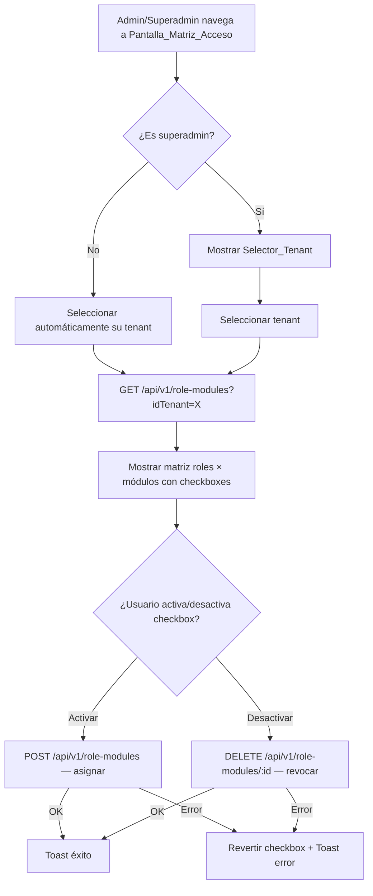

# Documento de Diseño — Matriz Dinámica de Acceso Rol-Módulo

## Visión General

Este diseño convierte la constante estática `ROLE_ACCESS_MATRIX` (definida en `permissions.config.ts`) en una tabla de base de datos `role_modules` gestionable dinámicamente por tenant. Esto permite que cada empresa (tenant) tenga su propia configuración de qué roles acceden a qué módulos, sin necesidad de modificar código ni redesplegar.

El diseño abarca:
- **Backend**: Nuevo modelo Prisma `role_modules`, controlador con endpoints CRUD y consulta, middleware de validación de tenant scoping, y migración de datos iniciales.
- **Frontend**: Pantalla de administración con matriz visual de checkboxes (roles × módulos), actualización del `PermissionsService` para consultar la API en lugar de la constante estática, y fallback a la matriz estática si la API falla.
- **Multi-tenant**: El `superadmin` gestiona la matriz de cualquier tenant; el `admin` solo la de su propio tenant. La protección del módulo "Super Admin" se aplica tanto en backend como en frontend.

La `ROLE_ACCESS_MATRIX` estática se mantiene como fallback, no se elimina.

## Arquitectura

### Diagrama de Flujo — Inicialización de Permisos (Actualizado)



### Diagrama de Flujo — Gestión de Matriz por Admin/Superadmin



### Capas del Sistema (Actualizado)

```
┌──────────────────────────────────────────────────────┐
│                   Angular Frontend                    │
│                                                       │
│  ┌─────────────────────────────────────────────────┐  │
│  │           PermissionsService (actualizado)       │  │
│  │  ┌───────────────────────────────────────────┐  │  │
│  │  │ tenantModules$ ← /modules/enabled         │  │  │
│  │  │ roleModules$   ← /role-modules/by-role    │  │  │
│  │  │ roleHasModule() → consulta roleModules$   │  │  │
│  │  │ fallback → ROLE_ACCESS_MATRIX estática     │  │  │
│  │  └───────────────────────────────────────────┘  │  │
│  └─────────────────────────────────────────────────┘  │
│                                                       │
│  ┌─────────────────────────────────────────────────┐  │
│  │     Pantalla_Matriz_Acceso (nuevo componente)    │  │
│  │  - Selector de tenant (solo superadmin)          │  │
│  │  - Tabla: módulos (filas) × roles (columnas)     │  │
│  │  - Checkboxes para asignar/revocar               │  │
│  │  - Protección visual del módulo "Super Admin"    │  │
│  └─────────────────────────────────────────────────┘  │
└───────────────────────────┬──────────────────────────┘
                            │ HTTP
                            ▼
┌──────────────────────────────────────────────────────┐
│              Backend Node.js (nuevos endpoints)       │
│                                                       │
│  GET    /api/v1/role-modules?idTenant=X               │
│  GET    /api/v1/role-modules/by-role?role=R&idTenant=X│
│  POST   /api/v1/role-modules                          │
│  DELETE /api/v1/role-modules/:id                      │
│  PUT    /api/v1/role-modules/bulk                     │
│                                                       │
│  Middleware: authenticateToken + requireRole +         │
│             validateTenantScope (nuevo)                │
│                                                       │
│  Tabla: role_modules (role, id_module, id_tenant)     │
└──────────────────────────────────────────────────────┘
```

## Componentes e Interfaces

### 1. Modelo Prisma — `role_modules`

Se agrega al archivo `laritechfarms_backend_node/prisma/schema.prisma`:

```prisma
model role_modules {
  id_role_module Int      @id @default(autoincrement())
  role           String   @db.VarChar(20)
  id_module      Int
  id_tenant      Int
  created_at     DateTime @default(now()) @db.Timestamp(6)

  modules modules @relation(fields: [id_module], references: [id_module], onDelete: Cascade, onUpdate: NoAction)
  tenant  Tenant  @relation(fields: [id_tenant], references: [id], onDelete: Cascade, onUpdate: NoAction)

  @@unique([role, id_module, id_tenant], map: "uq_role_module_tenant")
  @@index([id_tenant], map: "idx_role_modules_tenant")
  @@index([role, id_tenant], map: "idx_role_modules_role_tenant")
}
```

Esto requiere agregar la relación inversa en los modelos existentes:
- En `modules`: `role_modules role_modules[]`
- En `Tenant`: `role_modules role_modules[]`

### 2. Migración de Datos Iniciales

Se crea un script de seed/migración que:
1. Lee todos los tenants existentes.
2. Lee todos los módulos activos.
3. Para cada tenant, inserta los registros de `role_modules` equivalentes a la `ROLE_ACCESS_MATRIX` estática actual.

```typescript
// Lógica de seed (pseudocódigo)
const STATIC_MATRIX: Record<string, string[]> = {
  superadmin:  ['RH', 'Clientes', 'Business', 'Lotes', 'Producción', 'Reportería', 'Super Admin'],
  admin:       ['RH', 'Clientes', 'Business', 'Lotes', 'Producción', 'Reportería'],
  gerente:     ['RH', 'Clientes', 'Business', 'Lotes', 'Producción', 'Reportería'],
  supervisor:  ['Business', 'Lotes', 'Producción', 'Reportería'],
  vendedor:    ['Clientes', 'Business', 'Lotes', 'Reportería'],
  veterinario: ['Lotes', 'Producción', 'Reportería'],
};

for (const tenant of allTenants) {
  for (const [role, moduleNames] of Object.entries(STATIC_MATRIX)) {
    for (const moduleName of moduleNames) {
      const mod = modules.find(m => m.name === moduleName);
      if (mod) {
        await prisma.role_modules.upsert({
          where: { role_id_module_id_tenant: { role, id_module: mod.id_module, id_tenant: tenant.id } },
          create: { role, id_module: mod.id_module, id_tenant: tenant.id },
          update: {},
        });
      }
    }
  }
}
```

### 3. Backend — Controlador `roleModulesController.ts`

Nuevo archivo: `laritechfarms_backend_node/src/controllers/roleModulesController.ts`

```typescript
import { Response } from 'express'
import { prisma } from '../services/database'
import { AuthenticatedRequest } from '../types'
import { createSuccessResponse, createErrorResponse, validateRequired } from '../utils/helpers'

const VALID_ROLES = ['superadmin', 'admin', 'gerente', 'supervisor', 'vendedor', 'veterinario'];

// GET /api/v1/role-modules?idTenant=X
// Retorna todas las asignaciones del tenant, agrupadas por rol
export const getRoleModulesByTenant = async (req: AuthenticatedRequest, res: Response) => { ... };

// GET /api/v1/role-modules/by-role?role=R&idTenant=X
// Retorna los nombres de módulos asignados a un rol en un tenant
export const getRoleModulesByRole = async (req: AuthenticatedRequest, res: Response) => { ... };

// POST /api/v1/role-modules
// Body: { role, id_module, id_tenant }
// Crea una asignación. Valida: rol válido, módulo existe, tenant existe,
// no duplicado, protección "Super Admin" solo para superadmin
export const assignRoleModule = async (req: AuthenticatedRequest, res: Response) => { ... };

// DELETE /api/v1/role-modules/:id
// Elimina una asignación por id_role_module
export const revokeRoleModule = async (req: AuthenticatedRequest, res: Response) => { ... };

// PUT /api/v1/role-modules/bulk
// Body: { role, id_tenant, module_ids: number[] }
// Reemplaza todas las asignaciones del rol en el tenant con la nueva lista
// Ejecuta en transacción: delete all + create all
export const bulkUpdateRoleModules = async (req: AuthenticatedRequest, res: Response) => { ... };
```

Detalle de validaciones clave:
- `assignRoleModule`: Si el módulo es "Super Admin" y el `role` no es `superadmin`, retorna 403.
- `bulkUpdateRoleModules`: Si `module_ids` incluye el id del módulo "Super Admin" y el `role` no es `superadmin`, retorna 403.
- Todos los endpoints validan que el `role` sea uno de los 6 válidos (400 si no).
- Todos validan que `id_module` exista en `modules` (400 si no).
- Todos validan que `id_tenant` exista en `tenants` (400 si no).

### 4. Backend — Middleware `validateTenantScope`

Nuevo middleware que se aplica a las rutas de `role-modules` para forzar el scoping por tenant:

```typescript
// En middleware/auth.ts o archivo separado
export const validateTenantScope = (req: AuthenticatedRequest, res: Response, next: NextFunction) => {
  const userRole = req.user?.rol;
  const userTenant = req.user?.idTenant;
  
  // superadmin puede operar sobre cualquier tenant
  if (userRole === 'superadmin') return next();
  
  // admin solo puede operar sobre su propio tenant
  const requestedTenant = parseInt(req.query.idTenant as string || req.body.id_tenant);
  if (requestedTenant && requestedTenant !== userTenant) {
    return res.status(403).json(createErrorResponse('No tiene permisos para operar sobre este tenant', 403));
  }
  
  // Forzar el tenant del usuario si no se especificó
  if (!requestedTenant) {
    req.query.idTenant = String(userTenant);
    if (req.body) req.body.id_tenant = userTenant;
  }
  
  next();
};
```

### 5. Backend — Rutas `roleModules.ts`

Nuevo archivo: `laritechfarms_backend_node/src/routes/roleModules.ts`

```typescript
import { Router } from 'express'
import {
  getRoleModulesByTenant,
  getRoleModulesByRole,
  assignRoleModule,
  revokeRoleModule,
  bulkUpdateRoleModules
} from '../controllers/roleModulesController'
import { authenticateToken, requireRole } from '../middleware/auth'
import { validateTenantScope } from '../middleware/validateTenantScope'

const router = Router()
router.use(authenticateToken)

// Consulta: superadmin y admin
router.get('/', requireRole('superadmin', 'admin'), validateTenantScope, getRoleModulesByTenant)
router.get('/by-role', requireRole('superadmin', 'admin'), validateTenantScope, getRoleModulesByRole)

// Mutación: superadmin y admin
router.post('/', requireRole('superadmin', 'admin'), validateTenantScope, assignRoleModule)
router.delete('/:id', requireRole('superadmin', 'admin'), validateTenantScope, revokeRoleModule)
router.put('/bulk', requireRole('superadmin', 'admin'), validateTenantScope, bulkUpdateRoleModules)

export default router
```

Se registra en `laritechfarms_backend_node/src/routes/index.ts`:
```typescript
import roleModulesRoutes from './roleModules'
// ...
router.use('/role-modules', roleModulesRoutes)
```

### 6. Frontend — Métodos en `SuperAdminService`

Se agregan al servicio existente `src/app/shared/services/super-admin.service.ts`:

```typescript
// Consultar matriz completa de un tenant
getRoleModules(tenantId: number): Observable<any> {
  return this.http.get(`${this.apiUrl}/role-modules`, { params: { idTenant: tenantId.toString() } });
}

// Consultar módulos de un rol en un tenant
getRoleModulesByRole(role: string, tenantId: number): Observable<any> {
  return this.http.get(`${this.apiUrl}/role-modules/by-role`, {
    params: { role, idTenant: tenantId.toString() }
  });
}

// Asignar un módulo a un rol en un tenant
assignRoleModule(data: { role: string; id_module: number; id_tenant: number }): Observable<any> {
  return this.http.post(`${this.apiUrl}/role-modules`, data);
}

// Revocar una asignación
revokeRoleModule(id: number): Observable<any> {
  return this.http.delete(`${this.apiUrl}/role-modules/${id}`);
}

// Actualización masiva
bulkUpdateRoleModules(data: { role: string; id_tenant: number; module_ids: number[] }): Observable<any> {
  return this.http.put(`${this.apiUrl}/role-modules/bulk`, data);
}
```

### 7. Frontend — Actualización del `PermissionsService`

Cambios en `src/app/shared/services/permissions.service.ts`:

```typescript
@Injectable({ providedIn: 'root' })
export class PermissionsService {
  // Nuevo BehaviorSubject para módulos dinámicos del rol
  private roleModules$ = new BehaviorSubject<string[]>([]);
  private usingFallback$ = new BehaviorSubject<boolean>(false);

  // ... (existentes: tenantModules$, userRole$, initialized$)

  init(): Observable<void> {
    // ... (existente: extraer token, obtener rol, fetch tenant modules)
    // NUEVO: después de obtener tenant modules, fetch role modules
    return this.http.get<...>(`${this.apiUrl}/v1/modules/enabled`, { params: { idTenant } })
      .pipe(
        tap(res => { /* almacenar tenantModules */ }),
        switchMap(() =>
          this.http.get<{ success: boolean; data: { modules: string[] } }>(
            `${this.apiUrl}/v1/role-modules/by-role`,
            { params: { role: rol, idTenant: String(idTenant) } }
          ).pipe(
            tap(res => {
              if (res?.success && res.data?.modules) {
                this.roleModules$.next(res.data.modules);
                this.usingFallback$.next(false);
              } else {
                this.useFallback(rol);
              }
            }),
            catchError(() => {
              this.useFallback(rol);
              return of(undefined);
            })
          )
        ),
        // ... (set initialized)
      );
  }

  private useFallback(role: string): void {
    if (VALID_ROLES.includes(role as UserRole)) {
      this.roleModules$.next(ROLE_ACCESS_MATRIX[role as UserRole] || []);
    } else {
      this.roleModules$.next([]);
    }
    this.usingFallback$.next(true);
  }

  // ACTUALIZADO: consulta roleModules$ en lugar de ROLE_ACCESS_MATRIX
  roleHasModule(role: UserRole, module: ModuleName): boolean {
    return this.roleModules$.getValue().includes(module);
  }

  clear(): void {
    // ... (existente)
    this.roleModules$.next([]);
    this.usingFallback$.next(false);
  }
}
```

La firma de `roleHasModule` se mantiene compatible. El parámetro `role` se conserva por compatibilidad pero internamente se usan los módulos dinámicos del rol actual (ya que el servicio solo carga los módulos del rol del usuario autenticado).

### 8. Frontend — Componente `RoleAccessMatrixComponent`

Nuevo componente: `src/app/componets/dashbord/super-admin/role-access-matrix/`

Reemplaza o complementa el componente `role-access` existente (que actualmente es un placeholder estático).

```typescript
@Component({
  selector: 'app-role-access-matrix',
  standalone: true,
  imports: [SharedModule, RouterModule, FormsModule, NgSelectModule],
  templateUrl: './role-access-matrix.component.html',
  styleUrls: ['./role-access-matrix.component.scss']
})
export class RoleAccessMatrixComponent implements OnInit {
  tenants: any[] = [];
  selectedTenantId: number | null = null;
  modules: any[] = [];           // Módulos activos del catálogo
  roles: string[] = ['superadmin', 'admin', 'gerente', 'supervisor', 'vendedor', 'veterinario'];
  matrix: Record<string, Record<number, { assigned: boolean; id_role_module: number | null }>> = {};
  loading = false;
  isSuperadmin = false;
  userTenantId: number | null = null;
  superAdminModuleId: number | null = null;  // ID del módulo "Super Admin"

  constructor(
    private superAdminService: SuperAdminService,
    private toastr: ToastrService
  ) {}

  ngOnInit(): void { /* cargar tenants, detectar rol del usuario */ }
  onTenantChange(tenantId: number): void { /* recargar matriz */ }
  loadMatrix(tenantId: number): void { /* GET /role-modules?idTenant=X + GET /module-catalog */ }
  toggleAccess(role: string, moduleId: number): void { /* POST o DELETE según estado actual */ }
  isCheckboxDisabled(role: string, moduleId: number): boolean {
    // Deshabilitar "Super Admin" para roles != superadmin
    return moduleId === this.superAdminModuleId && role !== 'superadmin';
  }
}
```

Sigue los estándares de diseño UI existentes:
- `app-hr-dashboard-page-header` para título
- `card custom-card` con `card-header` y `card-body`
- Tabla `table-bordered` con checkboxes en cada celda
- Selector de tenant con `ng-select` (solo visible para superadmin)
- `ToastrService` para notificaciones
- Spinner de carga

### 9. Frontend — Ruta del Componente

Se actualiza `super-admin.routes.ts` para agregar o reemplazar la ruta:

```typescript
{
  path: 'role-access-matrix',
  loadComponent: () =>
    import('./role-access-matrix/role-access-matrix.component')
      .then((m) => m.RoleAccessMatrixComponent),
}
```

También se agrega la ruta en las rutas del admin (si el admin tiene acceso a la sección de configuración de su tenant). Alternativamente, se puede reutilizar la ruta existente `role-access` apuntando al nuevo componente.

### 10. Integración con NavService

Se agrega un nuevo ítem de menú en `MENUITEMS` dentro de la sección "Super Admin":

```typescript
{ path: '/dashboard/super-admin/role-access-matrix', title: 'Matriz de Acceso', type: 'link', selected: false },
```

## Modelos de Datos

### Tabla `role_modules` (nueva)

| Campo | Tipo | Restricciones | Descripción |
|---|---|---|---|
| `id_role_module` | `SERIAL` | PK, autoincremental | Identificador único |
| `role` | `VARCHAR(20)` | NOT NULL | Nombre del rol (`superadmin`, `admin`, etc.) |
| `id_module` | `INT` | NOT NULL, FK → `modules.id_module` ON DELETE CASCADE | Referencia al módulo |
| `id_tenant` | `INT` | NOT NULL, FK → `tenant.id_tenant` ON DELETE CASCADE | Referencia al tenant |
| `created_at` | `TIMESTAMP` | DEFAULT NOW() | Fecha de creación |

Restricciones:
- `UNIQUE(role, id_module, id_tenant)` — evita asignaciones duplicadas dentro del mismo tenant.
- Índice en `(id_tenant)` para consultas por tenant.
- Índice en `(role, id_tenant)` para consultas por rol dentro de un tenant.

### Respuesta de `GET /api/v1/role-modules?idTenant=X`

```typescript
interface RoleModulesResponse {
  success: boolean;
  data: {
    [role: string]: {
      modules: {
        id_role_module: number;
        id_module: number;
        module_name: string;
      }[];
    };
  };
}
```

### Respuesta de `GET /api/v1/role-modules/by-role?role=R&idTenant=X`

```typescript
interface RoleModulesByRoleResponse {
  success: boolean;
  data: {
    role: string;
    id_tenant: number;
    modules: string[];  // Nombres de módulos: ["RH", "Clientes", ...]
  };
}
```

### Request Body de `POST /api/v1/role-modules`

```typescript
interface AssignRoleModuleRequest {
  role: string;       // Uno de los 6 roles válidos
  id_module: number;  // ID del módulo en tabla modules
  id_tenant: number;  // ID del tenant
}
```

### Request Body de `PUT /api/v1/role-modules/bulk`

```typescript
interface BulkUpdateRequest {
  role: string;          // Uno de los 6 roles válidos
  id_tenant: number;     // ID del tenant
  module_ids: number[];  // Lista de IDs de módulos a asignar
}
```

### Estado Interno del PermissionsService (actualizado)

```typescript
interface PermissionsState {
  tenantModules: string[];    // Módulos habilitados del tenant (Capa 1)
  roleModules: string[];      // Módulos del rol desde API (Capa 2 dinámica)
  userRole: UserRole | null;
  initialized: boolean;
  usingFallback: boolean;     // true si se usa ROLE_ACCESS_MATRIX estática
}
```

## Propiedades de Correctitud

*Una propiedad es una característica o comportamiento que debe mantenerse verdadero en todas las ejecuciones válidas de un sistema — esencialmente, una declaración formal sobre lo que el sistema debe hacer. Las propiedades sirven como puente entre especificaciones legibles por humanos y garantías de correctitud verificables por máquina.*

### Propiedad 1: Alcance de tenant (Tenant Scoping)

*Para cualquier* usuario autenticado y cualquier `id_tenant` solicitado, el acceso a los endpoints de `role-modules` debe ser permitido si y solo si: (a) el usuario tiene rol `superadmin`, O (b) el usuario tiene rol `admin` Y el `id_tenant` solicitado es igual al `id_tenant` del usuario. En cualquier otro caso, la solicitud debe ser rechazada con código 403.

**Valida: Requisitos 2.4, 2.5, 3.5, 3.6**

### Propiedad 2: Correctitud de consultas por tenant y rol

*Para cualquier* conjunto de registros en `role_modules` para un tenant dado, la consulta por tenant debe retornar exactamente esos registros agrupados por rol. *Para cualquier* rol específico dentro de un tenant, la consulta por rol debe retornar exactamente los nombres de módulos asignados a ese rol en ese tenant, sin omisiones ni adiciones.

**Valida: Requisitos 2.1, 2.2**

### Propiedad 3: Unicidad de asignaciones

*Para cualquier* combinación válida de `(role, id_module, id_tenant)`, si ya existe un registro con esa combinación en `role_modules`, un intento de crear otra asignación con la misma combinación debe ser rechazado con código 409.

**Valida: Requisitos 1.2, 3.2**

### Propiedad 4: Actualización masiva como round-trip

*Para cualquier* rol válido, tenant existente y lista de IDs de módulos válidos, después de ejecutar una actualización masiva (`PUT /bulk`), consultar los módulos del rol en ese tenant debe retornar exactamente la lista de módulos proporcionada, sin importar el estado previo de las asignaciones.

**Valida: Requisito 3.4**

### Propiedad 5: Rechazo de roles inválidos

*Para cualquier* cadena de texto que no sea uno de los 6 roles válidos (`superadmin`, `admin`, `gerente`, `supervisor`, `vendedor`, `veterinario`), los endpoints de asignación y actualización masiva deben rechazar la solicitud con código 400.

**Valida: Requisito 3.8**

### Propiedad 6: Protección del módulo "Super Admin"

*Para cualquier* rol distinto de `superadmin`, un intento de asignar el módulo "Super Admin" (ya sea individual o mediante actualización masiva) debe ser rechazado con código 403. Solo el rol `superadmin` puede tener asignado el módulo "Super Admin".

**Valida: Requisitos 6.1, 6.2**

### Propiedad 7: Correctitud de roleHasModule con datos dinámicos y fallback

*Para cualquier* rol válido y módulo del sistema: (a) cuando la API retorna datos exitosamente, `roleHasModule(role, module)` debe retornar `true` si y solo si el módulo está en la lista retornada por la API para ese rol; (b) cuando la API falla, `roleHasModule(role, module)` debe retornar el mismo resultado que la `ROLE_ACCESS_MATRIX` estática para ese rol y módulo.

**Valida: Requisitos 5.3, 5.4**

### Propiedad 8: Correctitud del seed inicial

*Para cualquier* tenant existente y cualquier par (rol, módulo) definido en la `ROLE_ACCESS_MATRIX` estática, después de ejecutar la migración/seed inicial, debe existir un registro correspondiente en `role_modules` con ese `role`, `id_module` e `id_tenant`.

**Valida: Requisito 1.5**

## Manejo de Errores

| Escenario | Comportamiento |
|---|---|
| Rol inválido en solicitud de asignación | Retornar HTTP 400 con mensaje "El rol no es válido". |
| `id_module` inexistente en solicitud | Retornar HTTP 400 con mensaje "El módulo no existe". |
| `id_tenant` inexistente en solicitud | Retornar HTTP 400 con mensaje "El tenant no existe". |
| Asignación duplicada (role + module + tenant) | Retornar HTTP 409 con mensaje "La asignación ya existe". |
| Admin intenta operar sobre otro tenant | Retornar HTTP 403 con mensaje "No tiene permisos para operar sobre este tenant". |
| Usuario sin rol admin/superadmin intenta acceder | Middleware `requireRole` retorna HTTP 403. |
| Intento de asignar "Super Admin" a rol no-superadmin | Retornar HTTP 403 con mensaje "El módulo Super Admin solo puede asignarse al rol superadmin". |
| Error en API `/role-modules/by-role` durante init() | `PermissionsService` usa `ROLE_ACCESS_MATRIX` estática como fallback. Muestra toast de advertencia opcional. |
| Error en bulk update (transacción falla) | Rollback automático de Prisma. Retornar HTTP 500. Frontend muestra toast de error. |
| Revocación de asignación inexistente | Retornar HTTP 404 con mensaje "La asignación no existe". |
| Checkbox deshabilitado para "Super Admin" en UI | El checkbox se renderiza como `disabled` para roles != superadmin. No se envía solicitud al backend. |

## Estrategia de Testing

### Tests Unitarios (Jasmine/Karma para Angular, Jest para Node.js)

**Backend:**
- `roleModulesController`: Verificar CRUD completo con mocks de Prisma.
  - Crear asignación válida → 201.
  - Crear asignación duplicada → 409.
  - Crear con rol inválido → 400.
  - Crear con módulo inexistente → 400.
  - Crear con tenant inexistente → 400.
  - Asignar "Super Admin" a admin → 403.
  - Bulk update reemplaza asignaciones correctamente.
  - Consulta por tenant retorna datos agrupados.
  - Consulta por rol retorna módulos correctos.
  - Revocar asignación existente → 200.
  - Revocar asignación inexistente → 404.
- `validateTenantScope` middleware: Verificar que admin solo accede a su tenant, superadmin a cualquiera.

**Frontend:**
- `PermissionsService` (actualizado):
  - `init()` hace fetch a `/role-modules/by-role` después de `/modules/enabled`.
  - `roleHasModule()` usa datos dinámicos cuando disponibles.
  - Fallback a `ROLE_ACCESS_MATRIX` cuando API falla.
  - `clear()` limpia `roleModules$`.
- `RoleAccessMatrixComponent`:
  - Superadmin ve selector de tenant; admin no.
  - Checkboxes reflejan estado de la matriz.
  - Toggle de checkbox llama a API correcta (POST/DELETE).
  - Error en API revierte checkbox.
  - Checkboxes de "Super Admin" deshabilitados para roles != superadmin.
  - Cambio de tenant recarga la matriz.

### Tests de Propiedades (fast-check)

Se utiliza la librería `fast-check` para tests de propiedades. Cada test debe ejecutar mínimo 100 iteraciones.

Los tests de propiedades se enfocan en la lógica pura del controlador y del `PermissionsService`:

- **Propiedad 1**: Generar combinaciones aleatorias de (userRole, userTenant, requestedTenant), verificar que el acceso se permite/deniega según las reglas de scoping.
  - Tag: `Feature: dynamic-role-access-matrix, Property 1: Alcance de tenant`

- **Propiedad 2**: Generar conjuntos aleatorios de registros role_modules para un tenant, verificar que las consultas retornan exactamente esos registros.
  - Tag: `Feature: dynamic-role-access-matrix, Property 2: Correctitud de consultas por tenant y rol`

- **Propiedad 3**: Generar combinaciones aleatorias de (role, module, tenant), insertar una vez, verificar que la segunda inserción falla.
  - Tag: `Feature: dynamic-role-access-matrix, Property 3: Unicidad de asignaciones`

- **Propiedad 4**: Generar listas aleatorias de module_ids, ejecutar bulk update, verificar que la consulta posterior retorna exactamente esa lista.
  - Tag: `Feature: dynamic-role-access-matrix, Property 4: Actualización masiva como round-trip`

- **Propiedad 5**: Generar cadenas aleatorias que no sean roles válidos, verificar rechazo con 400.
  - Tag: `Feature: dynamic-role-access-matrix, Property 5: Rechazo de roles inválidos`

- **Propiedad 6**: Generar roles aleatorios distintos de superadmin, verificar que asignar "Super Admin" retorna 403.
  - Tag: `Feature: dynamic-role-access-matrix, Property 6: Protección del módulo Super Admin`

- **Propiedad 7**: Generar combinaciones de (rol, módulo) y dos escenarios (API exitosa con lista aleatoria, API fallida), verificar que `roleHasModule` retorna el resultado correcto en ambos casos.
  - Tag: `Feature: dynamic-role-access-matrix, Property 7: Correctitud de roleHasModule con datos dinámicos y fallback`

- **Propiedad 8**: Generar subconjuntos de tenants y verificar que después del seed, los registros en role_modules coinciden con la ROLE_ACCESS_MATRIX estática.
  - Tag: `Feature: dynamic-role-access-matrix, Property 8: Correctitud del seed inicial`
