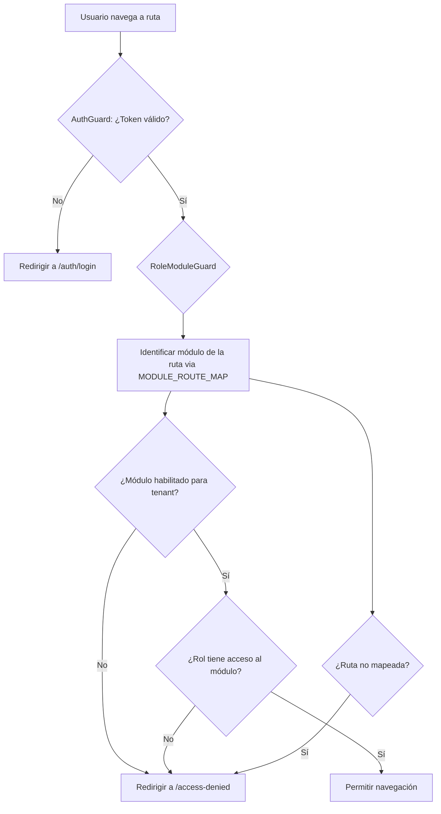
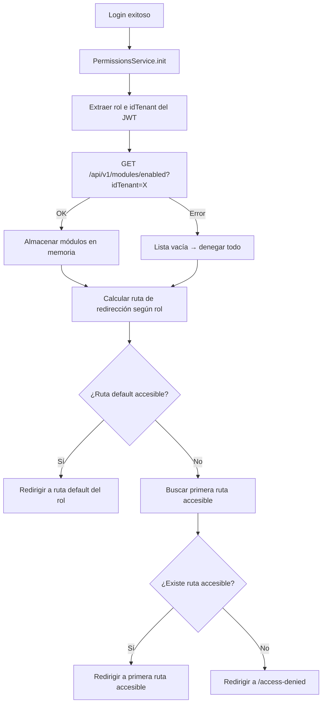
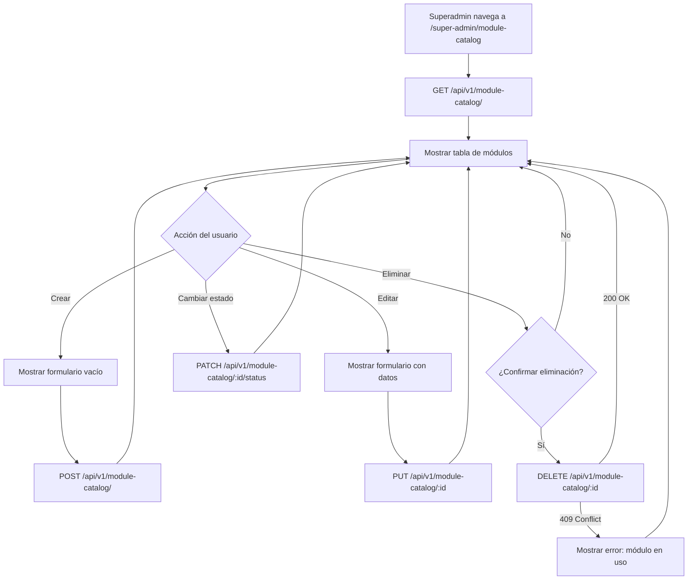

# Documento de Diseño — Permisos Basados en Roles

## Visión General

Este diseño implementa un sistema de control de acceso híbrido de dos capas para LariTechFarms. La **Capa 1 (Tenant)** verifica qué módulos tiene habilitados la empresa del usuario consultando el endpoint existente `/api/v1/modules/enabled`. La **Capa 2 (Rol)** verifica si el rol del usuario (extraído del JWT) tiene acceso al módulo según una matriz estática definida en el frontend. Ambas capas deben cumplirse simultáneamente.

El diseño se integra con la infraestructura existente sin reemplazarla:
- El `AuthGuard` existente sigue validando autenticación (token válido/expirado).
- El nuevo `RoleModuleGuard` se aplica como guard adicional en las rutas protegidas.
- El `NavService` existente se extiende para filtrar `MENUITEMS` según permisos.
- El backend no requiere cambios — el endpoint `/api/v1/modules/enabled` y el middleware `requireRole` ya existen.

## Arquitectura

### Diagrama de Flujo de Acceso



### Diagrama de Flujo Post-Login



### Capas del Sistema

```
┌─────────────────────────────────────────────────┐
│                   Angular Frontend               │
│                                                  │
│  ┌──────────────┐  ┌─────────────────────────┐  │
│  │  AuthGuard   │  │   RoleModuleGuard       │  │
│  │  (existente) │  │   (nuevo)               │  │
│  └──────┬───────┘  └──────────┬──────────────┘  │
│         │                     │                  │
│         │         ┌───────────▼──────────────┐   │
│         │         │   PermissionsService     │   │
│         │         │  ┌─────────────────────┐ │   │
│         │         │  │ MODULE_ROUTE_MAP    │ │   │
│         │         │  │ ROLE_ACCESS_MATRIX  │ │   │
│         │         │  │ DEFAULT_REDIRECTS   │ │   │
│         │         │  │ tenantModules$      │ │   │
│         │         │  │ userRole$           │ │   │
│         │         │  └─────────────────────┘ │   │
│         │         └───────────┬──────────────┘   │
│         │                     │                  │
│  ┌──────▼─────────────────────▼──────────────┐   │
│  │          NavService (extendido)           │   │
│  │  filteredItems$ = MENUITEMS filtrado       │   │
│  └───────────────────────────────────────────┘   │
│                                                  │
│  ┌───────────────────────────────────────────┐   │
│  │     Sidebar (consume filteredItems$)      │   │
│  └───────────────────────────────────────────┘   │
└──────────────────────────────┬───────────────────┘
                               │ HTTP
                               ▼
┌──────────────────────────────────────────────────┐
│              Backend Node.js (sin cambios)        │
│  GET /api/v1/modules/enabled?idTenant=X          │
│  → Retorna: { modules: ["RH", "Clientes", ...] } │
└──────────────────────────────────────────────────┘
```

## Componentes e Interfaces

### 1. PermissionsService (`src/app/shared/services/permissions.service.ts`)

Servicio central que gestiona ambas capas de acceso. Es un singleton (`providedIn: 'root'`).

```typescript
// Tipos del módulo
type UserRole = 'superadmin' | 'admin' | 'gerente' | 'supervisor' | 'vendedor' | 'veterinario';
type ModuleName = 'RH' | 'Clientes' | 'Business' | 'Lotes' | 'Producción' | 'Reportería' | 'Super Admin';

@Injectable({ providedIn: 'root' })
export class PermissionsService {
  // Estado reactivo
  private tenantModules$ = new BehaviorSubject<string[]>([]);
  private userRole$ = new BehaviorSubject<UserRole | null>(null);
  private initialized$ = new BehaviorSubject<boolean>(false);

  // Métodos públicos
  init(): Observable<void>;                          // Llamado post-login
  clear(): void;                                     // Llamado en logout
  hasAccess(route: string): boolean;                 // Evaluación combinada
  getModuleForRoute(route: string): ModuleName | null;
  isModuleEnabled(module: ModuleName): boolean;
  roleHasModule(role: UserRole, module: ModuleName): boolean;
  getDefaultRedirect(): string;                      // Ruta post-login según rol
  getFilteredMenuItems(items: Menu[]): Menu[];       // Filtrado del menú
}
```

### 2. Estructuras de Datos Estáticas

Definidas como constantes exportables en `src/app/shared/services/permissions.config.ts`:

```typescript
// Mapa módulo → prefijos de ruta
export const MODULE_ROUTE_MAP: Record<ModuleName, string[]> = {
  'RH':          ['/dashboard/hrmdashboards/'],
  'Clientes':    ['/dashboard/client-dashboard/'],
  'Business':    ['/dashboard/business-dashboard/clientes/',
                  '/dashboard/business-dashboard/ventas/',
                  '/dashboard/business-dashboard/tickets/',
                  '/dashboard/business-dashboard/sell-list'],
  'Lotes':       ['/dashboard/business-dashboard/lotes/'],
  'Producción':  ['/dashboard/production-dashboard/'],
  'Reportería':  ['/dashboard/reports/'],
  'Super Admin': ['/dashboard/super-admin/'],
};

// Matriz de acceso rol → módulos
export const ROLE_ACCESS_MATRIX: Record<UserRole, ModuleName[]> = {
  superadmin:  ['RH', 'Clientes', 'Business', 'Lotes', 'Producción', 'Reportería', 'Super Admin'],
  admin:       ['RH', 'Clientes', 'Business', 'Lotes', 'Producción', 'Reportería'],
  gerente:     ['RH', 'Clientes', 'Business', 'Lotes', 'Producción', 'Reportería'],
  supervisor:  ['Business', 'Lotes', 'Producción', 'Reportería'],
  vendedor:    ['Clientes', 'Business', 'Lotes', 'Reportería'],
  veterinario: ['Lotes', 'Producción', 'Reportería'],
};

// Redirecciones post-login por rol
export const DEFAULT_REDIRECTS: Record<UserRole, string> = {
  superadmin:  '/dashboard/hrmdashboards/dashboard',
  admin:       '/dashboard/hrmdashboards/dashboard',
  gerente:     '/dashboard/hrmdashboards/dashboard',
  supervisor:  '/dashboard/production-dashboard/huevos',
  vendedor:    '/dashboard/business-dashboard/ventas/list',
  veterinario: '/dashboard/production-dashboard/huevos',
};

// Roles válidos
export const VALID_ROLES: UserRole[] = [
  'superadmin', 'admin', 'gerente', 'supervisor', 'vendedor', 'veterinario'
];
```

### 3. RoleModuleGuard (`src/app/core/role-module.guard.ts`)

Guard funcional de Angular que evalúa ambas capas. Se aplica junto al `AuthGuard` existente.

```typescript
export const roleModuleGuard: CanActivateFn = (route, state) => {
  const permissions = inject(PermissionsService);
  const router = inject(Router);

  if (!permissions.isInitialized()) {
    // Esperar inicialización si es necesario
    return permissions.waitForInit().pipe(
      map(() => evaluateAccess(permissions, state.url, router))
    );
  }
  return evaluateAccess(permissions, state.url, router);
};

function evaluateAccess(permissions: PermissionsService, url: string, router: Router): boolean | UrlTree {
  const module = permissions.getModuleForRoute(url);
  if (!module) return router.createUrlTree(['/access-denied']);
  if (!permissions.hasAccess(url)) return router.createUrlTree(['/access-denied']);
  return true;
}
```

### 4. Integración con Rutas Existentes

En `app.routes.ts`, se agrega el guard a las rutas protegidas:

```typescript
// Antes:
{ path: '', component: MainLayoutComponent, children: content }

// Después:
{ path: '', component: MainLayoutComponent, canActivate: [AuthGuard], canActivateChild: [roleModuleGuard], children: content }
```

Esto permite que `AuthGuard` valide autenticación a nivel padre y `roleModuleGuard` valide permisos en cada ruta hija.

### 5. Integración con NavService y Sidebar

El `NavService` existente expone `MENUITEMS` via `BehaviorSubject`. La integración se hace en el `SidebarComponent`:

```typescript
// En SidebarComponent.ngOnInit():
combineLatest([
  this.navServices.items,
  this.permissionsService.permissions$
]).subscribe(([items, _]) => {
  this.menuItems = this.permissionsService.getFilteredMenuItems(items);
});
```

El método `getFilteredMenuItems` aplica filtrado recursivo:
1. Para cada ítem con `path`, determina su módulo via `MODULE_ROUTE_MAP`.
2. Verifica ambas capas (tenant + rol).
3. Para ítems con `children`, filtra recursivamente y oculta padres sin hijos visibles.
4. Los ítems `headTitle` se ocultan si la sección completa queda vacía.

### 6. Integración con Login

En `LoginComponent`, después de `saveToken()`:

```typescript
// Antes:
this.authservice.saveToken(res.data.token);
this.router.navigate(['/dashboard/hrmdashboards/dashboard']);

// Después:
this.authservice.saveToken(res.data.token);
this.permissionsService.init().subscribe(() => {
  const redirect = this.permissionsService.getDefaultRedirect();
  this.router.navigate([redirect]);
});
```

### 7. Página de Acceso Denegado (`src/app/componets/custom-pages/access-denied/`)

> **Nota**: Este componente debe seguir los estándares de diseño UI definidos en la sección "Estándares de Diseño UI": layout de tarjeta (`card custom-card`), encabezado de página (`app-hr-dashboard-page-header`), y estilo de botones consistente con iconos feather.

Componente standalone que muestra:
- Mensaje: "No tienes permisos para acceder a esta pantalla."
- Botón "Ir al inicio" que redirige a `permissionsService.getDefaultRedirect()`.

Ruta registrada en `app.routes.ts`:
```typescript
{ path: 'access-denied', loadComponent: () => import('./componets/custom-pages/access-denied/access-denied.component').then(m => m.AccessDeniedComponent) }
```

### 8. Integración con Logout

En `AuthService.universalLogout()` y `singout()`:

```typescript
universalLogout() {
  this.permissionsService.clear(); // Limpia módulos y rol
  this.singout();
  this.removeToken();
}
```

## Modelos de Datos

### JWT Payload (existente, sin cambios)

```typescript
interface JwtPayload {
  idUsuario: number;
  idTenant: number;
  email: string;
  rol: string;       // 'superadmin' | 'admin' | 'gerente' | 'supervisor' | 'vendedor' | 'veterinario'
  exp: number;
  iat: number;
  firebaseUid?: string;  // Solo en login con Firebase
}
```

### Respuesta de `/api/v1/modules/enabled` (existente, sin cambios)

```typescript
interface EnabledModulesResponse {
  success: boolean;
  data: {
    modules: string[];  // Ej: ["RH", "Clientes", "Business", "Lotes", "Producción"]
  };
}
```

### Estado Interno del PermissionsService

```typescript
interface PermissionsState {
  tenantModules: string[];    // Módulos habilitados del tenant
  userRole: UserRole | null;  // Rol extraído del JWT
  initialized: boolean;       // Si ya se completó init()
}
```

### Interfaz Menu Extendida (sin cambios al tipo existente)

No se modifica la interfaz `Menu` existente en `navservice.ts`. El filtrado se hace externamente comparando `path` contra `MODULE_ROUTE_MAP`.

## Estándares de Diseño UI

Todos los componentes nuevos creados como parte de esta feature DEBEN seguir los patrones de diseño existentes en la aplicación (referencia: `modules.component.html`, `companies.component.html`). Esto garantiza consistencia visual y de experiencia de usuario.

### Reglas de Template

1. **Encabezado de Página**: Usar el componente `<app-hr-dashboard-page-header>` para títulos de página.
2. **Layout de Tarjeta**: Usar `<div class="card custom-card">` con `<div class="card-header">` conteniendo `<h3 class="card-title">` y `<div class="card-body">`.
3. **Tablas**: Usar `<table class="table mb-0 text-nowrap text-md-nowrap table-bordered border">` con `<thead>` y `<tbody>`, filas con `class="border-bottom"`.
4. **Badges de Estado**: Usar `<span class="badge bg-success">` para activo/habilitado y `<span class="badge bg-danger">` para inactivo/deshabilitado.
5. **Botones de Acción**: Usar `<button class="btn btn-sm btn-{variant}">` con iconos feather `<i class="fe fe-{icon}"></i>`:
   - `fe-edit-2` para editar
   - `fe-trash-2` para eliminar
   - `fe-check` para habilitar
   - `fe-x` para deshabilitar
   - `fe-plus` para crear
6. **Modales**: Usar `<ng-template #templateRef let-modal>` con `NgbModal` service. Estructura del modal:
   - `modal-header` con título y botón de cierre
   - `modal-body` con campos de formulario
   - `modal-footer` con botón Cerrar (`btn-outline-danger` o `btn-outline-primary`) y botón Guardar/Actualizar (`btn-success`)
7. **Campos de Formulario**: Usar `<div class="form-group">` con `<label class="form-label">` y `<input class="form-control">`.
8. **Spinner de Carga**: Usar `<div class="spinner-border text-primary" role="status"><span class="visually-hidden">Cargando...</span></div>`.
9. **Notificaciones**: Usar `ToastrService` para mensajes de éxito/error (`toastr.success`, `toastr.error`).
10. **Imports del Componente**: Los componentes standalone deben importar `SharedModule`, `RouterModule`, `FormsModule`, y opcionalmente `NgSelectModule`.
11. **Sistema de Grid**: Usar Bootstrap grid con `<div class="row">` y `<div class="col-md-{n}">`.
12. **Diálogos de Confirmación**: Para acciones destructivas (eliminar), mostrar una confirmación antes de proceder.

### Aplicación por Componente

- **AccessDeniedComponent** (Requisito 7): Debe usar el layout de tarjeta (`card custom-card`), encabezado de página (`app-hr-dashboard-page-header`), y estilo de botones consistente (`btn btn-{variant}` con iconos feather).
- **ModuleCatalogComponent** (Requisito 9): Debe usar el patrón completo: encabezado de página, tarjeta con tabla, modales para crear/editar, badges para estado, botones de acción con iconos feather, `ToastrService` para notificaciones, y diálogo de confirmación antes de eliminar.

## Componentes e Interfaces — Requisito 9: CRUD del Catálogo de Módulos

### 9. Backend: Controlador CRUD de Módulos (`laritechfarms_backend_node/src/controllers/moduloCatalogController.ts`)

Nuevo controlador con operaciones CRUD sobre la tabla `modules`. Separado del `moduloController.ts` existente (que gestiona `tenant_modules`).

```typescript
// GET    /api/v1/module-catalog/         → Listar todos los módulos
// POST   /api/v1/module-catalog/         → Crear un módulo
// PUT    /api/v1/module-catalog/:id      → Actualizar nombre y descripción
// PATCH  /api/v1/module-catalog/:id/status → Cambiar is_active
// DELETE /api/v1/module-catalog/:id      → Eliminar (solo si no tiene tenant_modules asociados)
```

```typescript
import { Response } from 'express'
import { prisma } from '../services/database'
import { AuthenticatedRequest } from '../types'
import { createSuccessResponse, createErrorResponse, validateRequired } from '../utils/helpers'

// GET /api/v1/module-catalog/
export const getAllModules = async (req: AuthenticatedRequest, res: Response) => {
  const modules = await prisma.modules.findMany({ orderBy: { id_module: 'asc' } });
  res.json(createSuccessResponse(modules));
};

// POST /api/v1/module-catalog/
export const createModule = async (req: AuthenticatedRequest, res: Response) => {
  const { name, description } = req.body;
  const missing = validateRequired({ name });
  if (missing.length > 0) return res.status(400).json(createErrorResponse(`Faltan parámetros: ${missing.join(', ')}`, 400));
  const module = await prisma.modules.create({ data: { name, description: description || null, is_active: true } });
  res.status(201).json(createSuccessResponse(module, 'Módulo creado correctamente'));
};

// PUT /api/v1/module-catalog/:id
export const updateModule = async (req: AuthenticatedRequest, res: Response) => {
  const id = parseInt(req.params.id);
  const { name, description } = req.body;
  const missing = validateRequired({ name });
  if (missing.length > 0) return res.status(400).json(createErrorResponse(`Faltan parámetros: ${missing.join(', ')}`, 400));
  const module = await prisma.modules.update({ where: { id_module: id }, data: { name, description: description || null } });
  res.json(createSuccessResponse(module, 'Módulo actualizado correctamente'));
};

// PATCH /api/v1/module-catalog/:id/status
export const toggleModuleStatus = async (req: AuthenticatedRequest, res: Response) => {
  const id = parseInt(req.params.id);
  const { is_active } = req.body;
  const module = await prisma.modules.update({ where: { id_module: id }, data: { is_active: Boolean(is_active) } });
  res.json(createSuccessResponse(module, 'Estado del módulo actualizado correctamente'));
};

// DELETE /api/v1/module-catalog/:id
export const deleteModule = async (req: AuthenticatedRequest, res: Response) => {
  const id = parseInt(req.params.id);
  const tenantCount = await prisma.tenant_modules.count({ where: { id_module: id } });
  if (tenantCount > 0) {
    return res.status(409).json(createErrorResponse('No se puede eliminar el módulo porque está asignado a uno o más tenants', 409));
  }
  await prisma.modules.delete({ where: { id_module: id } });
  res.json(createSuccessResponse(null, 'Módulo eliminado correctamente'));
};
```

### 10. Backend: Rutas del Catálogo de Módulos (`laritechfarms_backend_node/src/routes/moduloCatalog.ts`)

```typescript
import { Router } from 'express'
import { getAllModules, createModule, updateModule, toggleModuleStatus, deleteModule } from '../controllers/moduloCatalogController'
import { authenticateToken, requireRole } from '../middleware/auth'

const router = Router()
router.use(authenticateToken)

router.get('/', requireRole('superadmin'), getAllModules)
router.post('/', requireRole('superadmin'), createModule)
router.put('/:id', requireRole('superadmin'), updateModule)
router.patch('/:id/status', requireRole('superadmin'), toggleModuleStatus)
router.delete('/:id', requireRole('superadmin'), deleteModule)

export default router
```

Se registra en el archivo principal de rutas del backend como `/api/v1/module-catalog`.

### 11. Frontend: Servicio de Catálogo de Módulos

Se agregan métodos al `SuperAdminService` existente (`src/app/shared/services/super-admin.service.ts`):

```typescript
// Nuevos métodos en SuperAdminService
getModuleCatalog(): Observable<any> {
  return this.http.get(`${this.apiUrl}/module-catalog`);
}

createModuleCatalog(data: { name: string; description?: string }): Observable<any> {
  return this.http.post(`${this.apiUrl}/module-catalog`, data);
}

updateModuleCatalog(id: number, data: { name: string; description?: string }): Observable<any> {
  return this.http.put(`${this.apiUrl}/module-catalog/${id}`, data);
}

toggleModuleCatalogStatus(id: number, is_active: boolean): Observable<any> {
  return this.http.patch(`${this.apiUrl}/module-catalog/${id}/status`, { is_active });
}

deleteModuleCatalog(id: number): Observable<any> {
  return this.http.delete(`${this.apiUrl}/module-catalog/${id}`);
}
```

### 12. Frontend: Componente Pantalla_Catálogo_Módulos (`src/app/componets/dashbord/super-admin/module-catalog/`)

> **Nota**: Este componente debe seguir todos los estándares de diseño UI definidos en la sección "Estándares de Diseño UI". Usar `app-hr-dashboard-page-header` para el título, layout `card custom-card` con tabla `table-bordered`, badges `bg-success`/`bg-danger` para estado, botones con iconos `fe fe-*`, modales `ng-template` para crear/editar, `ToastrService` para notificaciones, y diálogo de confirmación antes de eliminar.

Componente standalone Angular que muestra una tabla con todos los módulos del sistema y permite CRUD completo.

```typescript
@Component({
  selector: 'app-module-catalog',
  standalone: true,
  imports: [SharedModule, RouterModule, FormsModule, ReactiveFormsModule],
  templateUrl: './module-catalog.component.html',
  styleUrls: ['./module-catalog.component.scss']
})
export class ModuleCatalogComponent implements OnInit {
  modules: ModuleCatalogItem[] = [];
  loading = false;
  showForm = false;
  editingModule: ModuleCatalogItem | null = null;
  moduleForm: FormGroup;  // campos: name (required), description (optional)

  loadModules(): void;           // GET todos los módulos
  openCreateForm(): void;        // Mostrar formulario vacío
  openEditForm(module): void;    // Mostrar formulario con datos del módulo
  saveModule(): void;            // POST o PUT según editingModule
  toggleStatus(module): void;    // PATCH is_active
  confirmDelete(module): void;   // Confirmación + DELETE
}

interface ModuleCatalogItem {
  id_module: number;
  name: string;
  description: string | null;
  is_active: boolean;
}
```

### 13. Frontend: Ruta del Catálogo de Módulos

Se agrega una nueva ruta en `super-admin.routes.ts`:

```typescript
{
  path: 'module-catalog',
  loadComponent: () =>
    import('./module-catalog/module-catalog.component').then((m) => m.ModuleCatalogComponent),
}
```

Esta ruta es independiente de la ruta `modules` existente (que gestiona la asignación de módulos por tenant).

### Diagrama de Flujo — CRUD Catálogo de Módulos




## Propiedades de Correctitud

*Una propiedad es una característica o comportamiento que debe mantenerse verdadero en todas las ejecuciones válidas de un sistema — esencialmente, una declaración formal sobre lo que el sistema debe hacer. Las propiedades sirven como puente entre especificaciones legibles por humanos y garantías de correctitud verificables por máquina.*

### Propiedad 1: Validación de roles

*Para cualquier* cadena de texto, el servicio debe reconocerla como rol válido si y solo si es uno de los 6 valores definidos: `superadmin`, `admin`, `gerente`, `supervisor`, `vendedor`, `veterinario`. Cualquier otra cadena debe resultar en permisos mínimos (sin acceso a módulos).

**Valida: Requisitos 2.2, 2.3**

### Propiedad 2: Resolución ruta-a-módulo

*Para cualquier* ruta del sistema, si la ruta coincide con algún prefijo en `MODULE_ROUTE_MAP`, debe resolverse al módulo correcto. *Para cualquier* ruta que no coincida con ningún prefijo, la resolución debe retornar `null`, resultando en denegación de acceso.

**Valida: Requisitos 3.1, 3.2, 5.1**

### Propiedad 3: Correctitud de la matriz de acceso

*Para cualquier* combinación válida de rol y módulo, la `ROLE_ACCESS_MATRIX` debe retornar `true` si y solo si el rol tiene acceso al módulo según las reglas definidas. En particular, *para cualquier* rol distinto de `superadmin`, el acceso al módulo "Super Admin" debe ser `false`.

**Valida: Requisitos 4.1, 4.2**

### Propiedad 4: Decisión de acceso de dos capas

*Para cualquier* combinación de (módulos habilitados del tenant, rol del usuario, ruta destino), el acceso debe ser concedido si y solo si: (1) la ruta se resuelve a un módulo válido, (2) ese módulo está en la lista de módulos habilitados del tenant, Y (3) el rol del usuario tiene acceso a ese módulo según la matriz. Si cualquiera de estas condiciones falla, el acceso debe ser denegado.

**Valida: Requisitos 5.2, 5.3, 5.4**

### Propiedad 5: Completitud del filtrado de menú

*Para cualquier* conjunto de ítems de menú, módulos habilitados del tenant y rol del usuario, el menú filtrado debe contener únicamente ítems cuyo módulo asociado esté habilitado para el tenant Y sea accesible por el rol. Además, *para cualquier* ítem padre cuyo conjunto de hijos visibles quede vacío después del filtrado, el ítem padre debe ser excluido del resultado.

**Valida: Requisitos 6.1, 6.2, 6.4**

### Propiedad 6: Redirección post-login por rol

*Para cualquier* rol válido, la ruta de redirección post-login debe coincidir con el valor definido en `DEFAULT_REDIRECTS` para ese rol.

**Valida: Requisitos 8.1, 8.2, 8.3, 8.4**

### Propiedad 7: Redirección fallback cuando el módulo default está deshabilitado

*Para cualquier* rol válido y conjunto de módulos habilitados del tenant donde el módulo de la ruta default del rol NO está habilitado, el sistema debe redirigir a la primera ruta accesible según el orden de prioridad de módulos del rol. Si ningún módulo está accesible, debe redirigir a la página de acceso denegado.

**Valida: Requisito 8.5**

### Propiedad 8: Integridad de eliminación de módulos del catálogo

*Para cualquier* módulo en la tabla `modules`, si el módulo tiene registros asociados en la tabla `tenant_modules`, la operación de eliminación debe ser rechazada con un error 409. *Para cualquier* módulo sin registros asociados en `tenant_modules`, la eliminación debe completarse exitosamente y el módulo debe dejar de existir en la tabla `modules`.

**Valida: Requisitos 9.5, 9.6**

## Manejo de Errores

| Escenario | Comportamiento |
|---|---|
| Token JWT sin campo `rol` | Asignar permisos mínimos (sin acceso a módulos). El usuario verá la página de acceso denegado. |
| Token JWT con `rol` no reconocido | Mismo tratamiento que rol ausente — sin acceso a módulos. |
| Error HTTP en `/api/v1/modules/enabled` | Lista de módulos vacía → denegar acceso a todos los módulos. Mostrar toast de error. |
| Ruta no mapeada a ningún módulo | Redirigir a `/access-denied`. |
| Token expirado durante navegación | `AuthGuard` existente redirige a `/auth/login`. |
| Tenant inactivo | El backend ya retorna 403 en `authenticateToken`. El interceptor puede manejar este caso. |
| Ruta default post-login inaccesible | Buscar primera ruta accesible. Si no hay ninguna, redirigir a `/access-denied`. |
| Intento de eliminar módulo en uso | Retornar HTTP 409 con mensaje "No se puede eliminar el módulo porque está asignado a uno o más tenants". Mostrar toast de error en frontend. |
| Intento de crear módulo sin nombre | Retornar HTTP 400 con mensaje indicando que el campo `name` es obligatorio. |
| Usuario no superadmin accede a endpoints de catálogo de módulos | Middleware `requireRole('superadmin')` retorna HTTP 403. |

## Estrategia de Testing

### Tests Unitarios (Jasmine/Karma — framework existente del proyecto Angular)

- **PermissionsService**: Verificar `init()`, `clear()`, `hasAccess()`, `getModuleForRoute()`, `getFilteredMenuItems()`, `getDefaultRedirect()` con ejemplos concretos.
- **RoleModuleGuard**: Verificar redirecciones con mocks del `PermissionsService`.
- **Integración Sidebar**: Verificar que el menú se filtra correctamente al cambiar permisos.
- **AccessDeniedComponent**: Verificar que muestra mensaje y botón con ruta correcta.
- **Edge cases**: Token sin rol, API con error, ruta no mapeada, logout limpia estado.
- **ModuleCatalogController**: Verificar CRUD completo, validación de campos obligatorios, rechazo de eliminación cuando el módulo está en uso.
- **ModuleCatalogComponent**: Verificar renderizado de tabla, formulario de creación/edición, toggle de estado, confirmación de eliminación, manejo de error 409.

### Tests de Propiedades (fast-check)

Se utilizará la librería `fast-check` para tests de propiedades. Cada test debe ejecutar mínimo 100 iteraciones.

Los tests de propiedades se enfocan en las funciones puras del `PermissionsService` y `permissions.config.ts`:

- **Propiedad 1**: Generar cadenas aleatorias, verificar que solo las 6 válidas son reconocidas.
  - Tag: `Feature: role-based-permissions, Property 1: Validación de roles`
- **Propiedad 2**: Generar rutas aleatorias (tanto válidas del mapa como aleatorias), verificar resolución correcta.
  - Tag: `Feature: role-based-permissions, Property 2: Resolución ruta-a-módulo`
- **Propiedad 3**: Generar pares (rol, módulo) aleatorios, verificar contra la matriz esperada.
  - Tag: `Feature: role-based-permissions, Property 3: Correctitud de la matriz de acceso`
- **Propiedad 4**: Generar tuplas (tenantModules, rol, ruta), verificar decisión de acceso.
  - Tag: `Feature: role-based-permissions, Property 4: Decisión de acceso de dos capas`
- **Propiedad 5**: Generar combinaciones de menú + permisos, verificar filtrado.
  - Tag: `Feature: role-based-permissions, Property 5: Completitud del filtrado de menú`
- **Propiedad 6**: Generar roles válidos, verificar ruta de redirección.
  - Tag: `Feature: role-based-permissions, Property 6: Redirección post-login por rol`
- **Propiedad 7**: Generar (rol, subconjunto de módulos sin el default), verificar fallback.
  - Tag: `Feature: role-based-permissions, Property 7: Redirección fallback`
- **Propiedad 8**: Generar módulos con y sin tenant_modules asociados, verificar que la eliminación se permite o rechaza correctamente.
  - Tag: `Feature: role-based-permissions, Property 8: Integridad de eliminación de módulos`

### Tests de Integración

- Flujo completo login → init → navegación → verificación de acceso.
- Flujo logout → re-login con diferente rol → verificación de menú actualizado.
- Coexistencia de `AuthGuard` + `RoleModuleGuard` en rutas.
