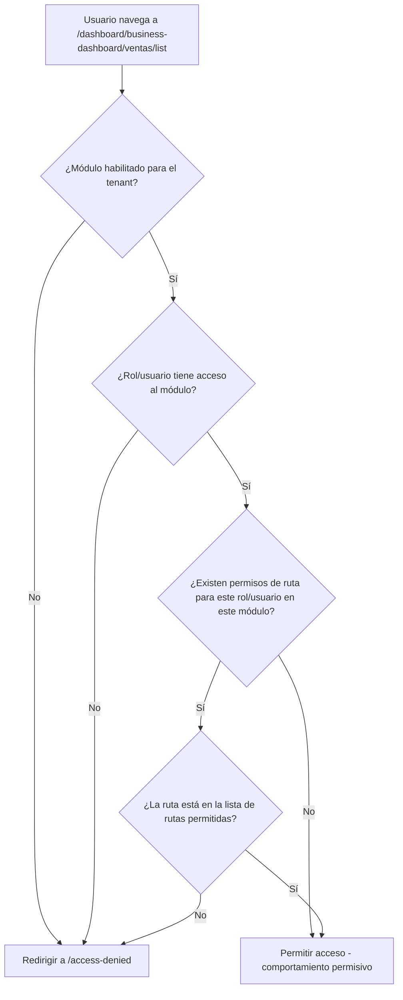
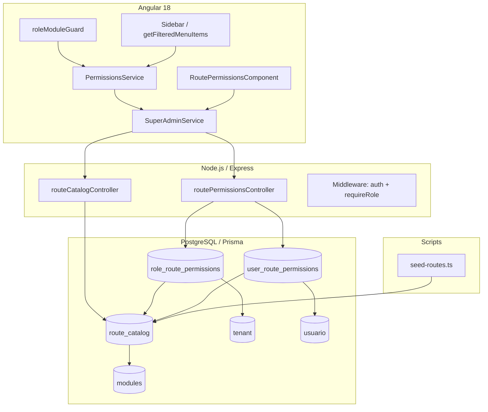
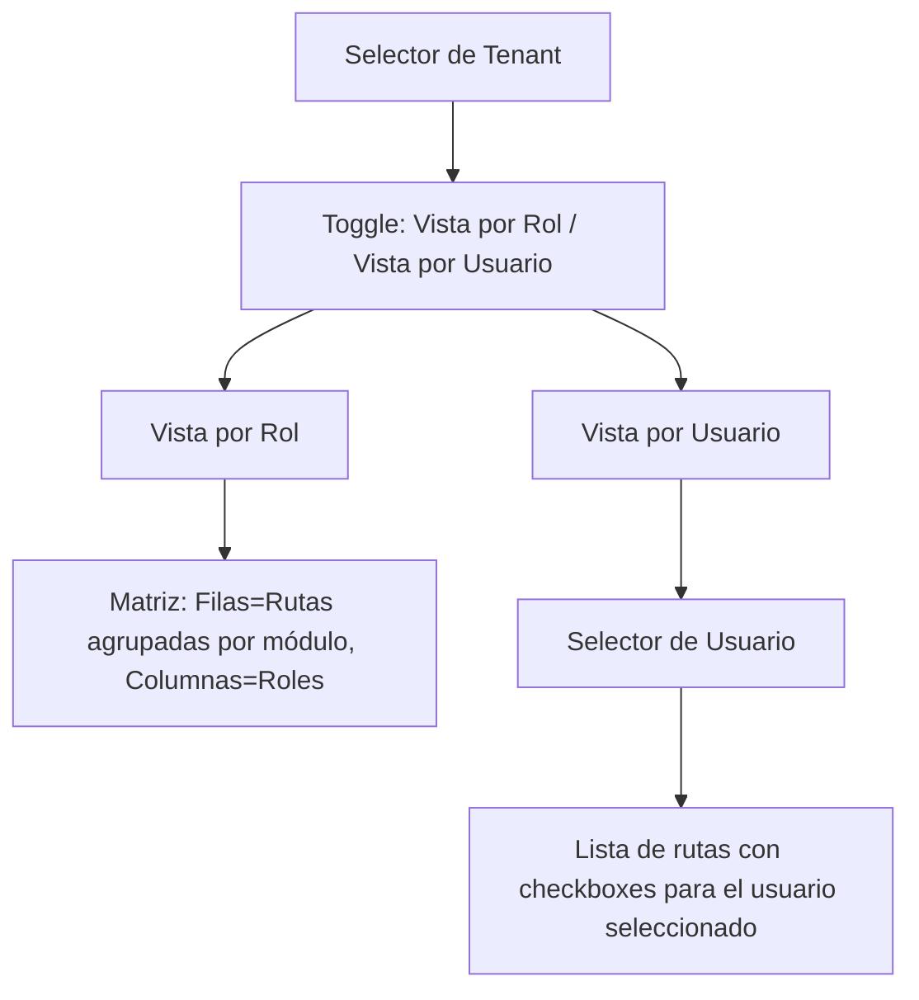
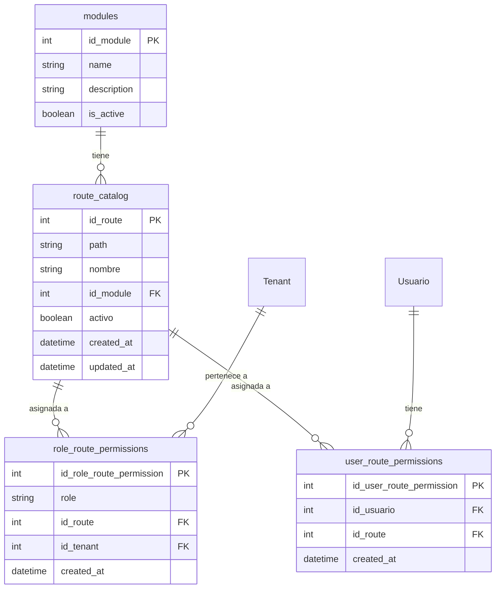

# Diseño Técnico — Control de Acceso a Nivel de Ruta

## Resumen General

Esta funcionalidad agrega una tercera capa de control de acceso al sistema LariTechFarms. Actualmente existen dos capas:

1. **Capa Tenant-Módulo**: Qué módulos tiene habilitados cada tenant (`tenant_modules`).
2. **Capa Rol/Usuario-Módulo**: Qué módulos puede acceder cada rol o usuario (`role_modules`, `user_modules`).

La nueva capa permite restringir el acceso a **rutas específicas** dentro de un módulo, por rol o por usuario. Esto habilita escenarios como: un "vendedor" tiene acceso al módulo "Business" pero solo puede ver "Ventas", no "Tickets".

### Principio de Diseño: Permisivo por Defecto

Cuando **no existen** registros de permisos de ruta para un rol/usuario en un módulo dado, el sistema permite acceso a **todas** las rutas de ese módulo (comportamiento actual). Solo cuando se crean registros explícitos de permisos de ruta, el acceso se restringe a las rutas asignadas. Esto garantiza retrocompatibilidad total.

### Flujo de Evaluación de Acceso (3 capas)



## Arquitectura

### Diagrama de Componentes



### Capas del Sistema

| Capa | Componente | Responsabilidad |
|------|-----------|-----------------|
| Presentación | `RoutePermissionsComponent` | UI de matriz de permisos de ruta |
| Servicio Frontend | `SuperAdminService` | Métodos HTTP para CRUD de permisos de ruta |
| Servicio Frontend | `PermissionsService` | Evaluación de acceso con 3 capas, filtrado de menú |
| Guard | `roleModuleGuard` | Intercepta navegación, evalúa `hasRouteAccess()` |
| API | `routePermissionsController` | Endpoints REST para permisos de ruta |
| API | `routeCatalogController` | Endpoints REST para catálogo de rutas |
| Middleware | `auth.ts` | `authenticateToken`, `requireRole('superadmin')` |
| Datos | Prisma models | `route_catalog`, `role_route_permissions`, `user_route_permissions` |
| Script | `seed-routes.ts` | Extrae rutas de MENUITEMS y puebla `route_catalog` |


## Componentes e Interfaces

### 1. Backend — Modelos Prisma

Se agregan tres nuevos modelos al schema de Prisma, siguiendo el patrón existente de `role_modules` y `user_modules`.

#### `route_catalog`

```prisma
model route_catalog {
  id_route    Int      @id @default(autoincrement())
  path        String   @db.VarChar(500)
  nombre      String   @db.VarChar(255)
  id_module   Int
  activo      Boolean  @default(true)
  created_at  DateTime @default(now()) @db.Timestamp(6)
  updated_at  DateTime @default(now()) @updatedAt @db.Timestamp(6)

  modules                modules                  @relation(fields: [id_module], references: [id_module], onDelete: Cascade, onUpdate: NoAction)
  role_route_permissions role_route_permissions[]
  user_route_permissions user_route_permissions[]

  @@unique([path, id_module], map: "uq_route_catalog_path_module")
  @@index([id_module], map: "idx_route_catalog_module")
}
```

#### `role_route_permissions`

```prisma
model role_route_permissions {
  id_role_route_permission Int      @id @default(autoincrement())
  role                     String   @db.VarChar(20)
  id_route                 Int
  id_tenant                Int
  created_at               DateTime @default(now()) @db.Timestamp(6)

  route_catalog route_catalog @relation(fields: [id_route], references: [id_route], onDelete: Cascade, onUpdate: NoAction)
  tenant        Tenant        @relation(fields: [id_tenant], references: [id], onDelete: Cascade, onUpdate: NoAction)

  @@unique([role, id_route, id_tenant], map: "uq_role_route_tenant")
  @@index([role, id_tenant], map: "idx_role_route_perm_role_tenant")
  @@index([id_tenant], map: "idx_role_route_perm_tenant")
}
```

#### `user_route_permissions`

```prisma
model user_route_permissions {
  id_user_route_permission Int      @id @default(autoincrement())
  id_usuario               Int
  id_route                 Int
  created_at               DateTime @default(now()) @db.Timestamp(6)

  usuario       Usuario       @relation(fields: [id_usuario], references: [id], onDelete: Cascade, onUpdate: NoAction)
  route_catalog route_catalog @relation(fields: [id_route], references: [id_route], onDelete: Cascade, onUpdate: NoAction)

  @@unique([id_usuario, id_route], map: "uq_user_route")
  @@index([id_usuario], map: "idx_user_route_perm_usuario")
}
```

**Relaciones inversas requeridas** en modelos existentes:
- `modules`: agregar `route_catalog route_catalog[]`
- `Tenant`: agregar `role_route_permissions role_route_permissions[]`
- `Usuario`: agregar `user_route_permissions user_route_permissions[]`

### 2. Backend — Script Seed (`seed-routes.ts`)

Ubicación: `laritechfarms_backend_node/prisma/seed-routes.ts`

**Algoritmo:**
1. Importar `MENUITEMS` (se copia la estructura como constante JSON, ya que es código Angular no importable directamente en Node).
2. Importar `MODULE_ROUTE_MAP` (se copia como constante equivalente).
3. Recorrer recursivamente `MENUITEMS` extrayendo todos los items con `path` y su `title`.
4. Para cada `{ path, title }`, buscar en `MODULE_ROUTE_MAP` el módulo correspondiente usando `path.startsWith(prefix)`.
5. Si no se encuentra módulo, imprimir advertencia en consola y omitir.
6. Buscar el `id_module` en la tabla `modules` por nombre.
7. Ejecutar upsert: `INSERT INTO route_catalog (path, nombre, id_module) ... ON CONFLICT (path, id_module) DO UPDATE SET nombre = ..., updated_at = NOW()`.

**Ejecución:** `npx ts-node prisma/seed-routes.ts` o como parte del seed general.

### 3. Backend — Controller: `routeCatalogController.ts`

Ubicación: `laritechfarms_backend_node/src/controllers/routeCatalogController.ts`

| Método | Endpoint | Descripción | Acceso |
|--------|----------|-------------|--------|
| `getRouteCatalog` | `GET /api/v1/route-catalog` | Retorna rutas agrupadas por módulo | superadmin |
| `createRoute` | `POST /api/v1/route-catalog` | Crea una ruta manual en el catálogo | superadmin |
| `updateRoute` | `PUT /api/v1/route-catalog/:id` | Actualiza nombre/activo de una ruta | superadmin |

**Interfaz de respuesta de `getRouteCatalog`:**
```typescript
{
  success: true,
  data: {
    [moduleName: string]: {
      id_module: number;
      routes: {
        id_route: number;
        path: string;
        nombre: string;
        activo: boolean;
      }[]
    }
  }
}
```

### 4. Backend — Controller: `routePermissionsController.ts`

Ubicación: `laritechfarms_backend_node/src/controllers/routePermissionsController.ts`

| Método | Endpoint | Descripción | Acceso |
|--------|----------|-------------|--------|
| `getRoleRoutePermissions` | `GET /api/v1/route-permissions/by-role?role=X&idTenant=Y` | Permisos de ruta de un rol en un tenant | superadmin |
| `updateRoleRoutePermissions` | `PUT /api/v1/route-permissions/by-role` | Actualiza permisos de ruta de un rol (lista completa) | superadmin |
| `getMyRoutePermissions` | `GET /api/v1/route-permissions/me` | Permisos de ruta del usuario autenticado | cualquier usuario autenticado |
| `getUserRoutePermissions` | `GET /api/v1/route-permissions/by-user?idUsuario=X` | Permisos de ruta de un usuario específico | superadmin |
| `updateUserRoutePermissions` | `PUT /api/v1/route-permissions/by-user` | Actualiza permisos de ruta de un usuario | superadmin |

**Interfaz de `getMyRoutePermissions` (respuesta):**
```typescript
{
  success: true,
  data: {
    role_routes: {
      [moduleName: string]: string[]  // array de paths
    },
    user_routes: {
      [moduleName: string]: string[]  // array de paths (vacío si no tiene overrides)
    }
  }
}
```

**Interfaz de `updateRoleRoutePermissions` (body):**
```typescript
{
  role: string;
  id_tenant: number;
  route_ids: number[];  // lista completa de id_route permitidos
}
```

**Lógica de `updateRoleRoutePermissions`:**
1. Validar que el rol es válido.
2. Validar que el tenant existe.
3. Validar que cada `id_route` existe en `route_catalog` y está activo.
4. Validar que el rol tiene acceso al módulo padre de cada ruta (consultar `role_modules`).
5. En transacción: eliminar todos los `role_route_permissions` del rol+tenant, insertar los nuevos.

**Lógica de `updateUserRoutePermissions` (body):**
```typescript
{
  id_usuario: number;
  route_ids: number[];  // lista completa de id_route permitidos
}
```

### 5. Backend — Rutas

#### `routes/routeCatalog.ts`
```typescript
router.use(authenticateToken)
router.get('/', requireRole('superadmin'), getRouteCatalog)
router.post('/', requireRole('superadmin'), createRoute)
router.put('/:id', requireRole('superadmin'), updateRoute)
```

#### `routes/routePermissions.ts`
```typescript
router.use(authenticateToken)
// Endpoint para el usuario autenticado (usado por PermissionsService.init)
router.get('/me', getMyRoutePermissions)
// Endpoints de administración (solo superadmin)
router.get('/by-role', requireRole('superadmin'), getRoleRoutePermissions)
router.put('/by-role', requireRole('superadmin'), updateRoleRoutePermissions)
router.get('/by-user', requireRole('superadmin'), getUserRoutePermissions)
router.put('/by-user', requireRole('superadmin'), updateUserRoutePermissions)
```

**Registro en `routes/index.ts`:**
```typescript
import routeCatalogRoutes from './routeCatalog'
import routePermissionsRoutes from './routePermissions'
// ...
router.use('/route-catalog', routeCatalogRoutes)
router.use('/route-permissions', routePermissionsRoutes)
```

### 6. Frontend — `SuperAdminService` (nuevos métodos)

Se agregan métodos al servicio existente siguiendo el patrón de `getRoleModules`, `assignRoleModule`, etc.

```typescript
// --- Route Catalog ---
getRouteCatalog(): Observable<any> {
  return this.http.get(`${this.apiUrl}/route-catalog`);
}

createRouteCatalogEntry(data: { path: string; nombre: string; id_module: number }): Observable<any> {
  return this.http.post(`${this.apiUrl}/route-catalog`, data);
}

updateRouteCatalogEntry(id: number, data: { nombre?: string; activo?: boolean }): Observable<any> {
  return this.http.put(`${this.apiUrl}/route-catalog/${id}`, data);
}

// --- Route Permissions (por rol) ---
getRoleRoutePermissions(role: string, tenantId: number): Observable<any> {
  return this.http.get(`${this.apiUrl}/route-permissions/by-role`, {
    params: { role, idTenant: tenantId.toString() }
  });
}

updateRoleRoutePermissions(data: { role: string; id_tenant: number; route_ids: number[] }): Observable<any> {
  return this.http.put(`${this.apiUrl}/route-permissions/by-role`, data);
}

// --- Route Permissions (por usuario) ---
getUserRoutePermissions(idUsuario: number): Observable<any> {
  return this.http.get(`${this.apiUrl}/route-permissions/by-user`, {
    params: { idUsuario: idUsuario.toString() }
  });
}

updateUserRoutePermissions(data: { id_usuario: number; route_ids: number[] }): Observable<any> {
  return this.http.put(`${this.apiUrl}/route-permissions/by-user`, data);
}

// --- Mis permisos de ruta (para PermissionsService) ---
getMyRoutePermissions(): Observable<any> {
  return this.http.get(`${this.apiUrl}/route-permissions/me`);
}
```

### 7. Frontend — Actualizaciones a `PermissionsService`

#### Nuevos BehaviorSubjects

```typescript
private roleRoutePermissions$ = new BehaviorSubject<Record<string, string[]>>({});
private userRoutePermissions$ = new BehaviorSubject<Record<string, string[]>>({});
```

- `roleRoutePermissions$`: Mapa `{ [moduleName]: ['/path1', '/path2'] }` — rutas permitidas por rol.
- `userRoutePermissions$`: Mapa `{ [moduleName]: ['/path1', '/path2'] }` — rutas permitidas por usuario (override).

#### Cambios en `init()`

Después de cargar `userModules`, agregar un paso adicional:

```typescript
// Paso adicional: cargar permisos de ruta
switchMap(() =>
  this.http.get<{ success: boolean; data: { role_routes: Record<string, string[]>; user_routes: Record<string, string[]> } }>(
    `${this.apiUrl}/v1/route-permissions/me`
  ).pipe(
    tap((res) => {
      if (res?.success && res.data) {
        this.roleRoutePermissions$.next(res.data.role_routes || {});
        this.userRoutePermissions$.next(res.data.user_routes || {});
      }
    }),
    catchError(() => {
      // Fallback permisivo: sin restricciones de ruta
      this.roleRoutePermissions$.next({});
      this.userRoutePermissions$.next({});
      return of(undefined);
    })
  )
)
```

#### Nuevo método `hasRouteAccess(route: string): boolean`

```typescript
hasRouteAccess(route: string): boolean {
  // Primero verificar acceso a módulo (capas 1 y 2)
  if (!this.hasAccess(route)) return false;

  const module = this.getModuleForRoute(route);
  if (!module) return false;

  // Verificar permisos de ruta del usuario (override)
  const userRoutes = this.userRoutePermissions$.getValue();
  if (userRoutes[module] && userRoutes[module].length > 0) {
    return userRoutes[module].some(p => route.startsWith(p));
  }

  // Verificar permisos de ruta del rol
  const roleRoutes = this.roleRoutePermissions$.getValue();
  if (roleRoutes[module] && roleRoutes[module].length > 0) {
    return roleRoutes[module].some(p => route.startsWith(p));
  }

  // Sin restricciones de ruta → acceso permisivo
  return true;
}
```

#### Cambios en `clear()`

Agregar limpieza de los nuevos subjects:
```typescript
this.roleRoutePermissions$.next({});
this.userRoutePermissions$.next({});
```

#### Cambios en `getFilteredMenuItems()` y `filterMenuChildren()`

Reemplazar las llamadas a `this.hasAccess(item.path)` por `this.hasRouteAccess(item.path)` en ambos métodos. Esto automáticamente aplica las 3 capas de permisos al filtrado del menú.

### 8. Frontend — Actualizaciones a `roleModuleGuard`

Cambiar `evaluateAccess` para usar `hasRouteAccess` en lugar de `hasAccess`:

```typescript
function evaluateAccess(
  permissions: PermissionsService,
  url: string,
  router: Router
): boolean | UrlTree {
  const module = permissions.getModuleForRoute(url);
  if (!module) return router.createUrlTree(['/access-denied']);
  if (!permissions.hasRouteAccess(url)) return router.createUrlTree(['/access-denied']);
  return true;
}
```

### 9. Frontend — `RoutePermissionsComponent`

Ubicación: `LariTechFarms/src/app/componets/dashbord/super-admin/route-permissions/`

Componente standalone que sigue el patrón de `RoleAccessMatrixComponent`.

#### Estructura de la UI



#### Comportamiento

**Vista por Rol:**
- Carga el catálogo de rutas (`getRouteCatalog`) y los permisos de ruta por rol para cada rol (`getRoleRoutePermissions`).
- Muestra una tabla donde las filas son rutas agrupadas por módulo (con encabezados de sección) y las columnas son los 6 roles.
- Cada celda es un checkbox. Si está marcado, el rol tiene acceso a esa ruta.
- Al marcar/desmarcar, se envía `updateRoleRoutePermissions` con la lista completa de `route_ids` para ese rol+tenant.
- Si un rol no tiene acceso al módulo padre (según `role_modules`), los checkboxes de las rutas de ese módulo se deshabilitan.

**Vista por Usuario:**
- Selector de usuario (lista de usuarios del tenant seleccionado).
- Muestra las rutas con checkboxes para el usuario seleccionado.
- Al cambiar, envía `updateUserRoutePermissions`.

**Gestión del Catálogo:**
- Botón "Agregar Ruta" que abre un formulario inline o modal para crear una ruta manual.
- Cada fila de ruta tiene un botón de edición para cambiar nombre y estado activo.

#### Registro de Ruta

En `super-admin.routes.ts`:
```typescript
{
  path: 'route-permissions',
  loadComponent: () =>
    import('./route-permissions/route-permissions.component')
      .then((m) => m.RoutePermissionsComponent),
}
```

En `navservice.ts` MENUITEMS, dentro del sub-menú "Super Admin":
```typescript
{ path: '/dashboard/super-admin/route-permissions', title: 'Permisos de Ruta', type: 'link', selected: false },
```


## Modelos de Datos

### Diagrama Entidad-Relación



### Tabla `route_catalog`

| Columna | Tipo | Restricciones | Descripción |
|---------|------|---------------|-------------|
| `id_route` | `SERIAL` | PK | Identificador único |
| `path` | `VARCHAR(500)` | NOT NULL | Ruta del frontend (ej. `/dashboard/business-dashboard/ventas/list`) |
| `nombre` | `VARCHAR(255)` | NOT NULL | Nombre descriptivo en español (ej. "Lista de Ventas") |
| `id_module` | `INT` | FK → `modules.id_module`, ON DELETE CASCADE | Módulo al que pertenece |
| `activo` | `BOOLEAN` | DEFAULT true | Si la ruta está activa |
| `created_at` | `TIMESTAMP` | DEFAULT NOW() | Fecha de creación |
| `updated_at` | `TIMESTAMP` | DEFAULT NOW(), auto-update | Fecha de última actualización |

**Índices:** `UNIQUE(path, id_module)`, `INDEX(id_module)`

### Tabla `role_route_permissions`

| Columna | Tipo | Restricciones | Descripción |
|---------|------|---------------|-------------|
| `id_role_route_permission` | `SERIAL` | PK | Identificador único |
| `role` | `VARCHAR(20)` | NOT NULL | Rol del sistema |
| `id_route` | `INT` | FK → `route_catalog.id_route`, ON DELETE CASCADE | Ruta permitida |
| `id_tenant` | `INT` | FK → `tenant.id_tenant`, ON DELETE CASCADE | Tenant al que aplica |
| `created_at` | `TIMESTAMP` | DEFAULT NOW() | Fecha de creación |

**Índices:** `UNIQUE(role, id_route, id_tenant)`, `INDEX(role, id_tenant)`, `INDEX(id_tenant)`

### Tabla `user_route_permissions`

| Columna | Tipo | Restricciones | Descripción |
|---------|------|---------------|-------------|
| `id_user_route_permission` | `SERIAL` | PK | Identificador único |
| `id_usuario` | `INT` | FK → `usuario.id_usuario`, ON DELETE CASCADE | Usuario al que aplica |
| `id_route` | `INT` | FK → `route_catalog.id_route`, ON DELETE CASCADE | Ruta permitida |
| `created_at` | `TIMESTAMP` | DEFAULT NOW() | Fecha de creación |

**Índices:** `UNIQUE(id_usuario, id_route)`, `INDEX(id_usuario)`

### Lógica de Resolución de Permisos de Ruta

```
función hasRouteAccess(ruta):
  módulo = getModuleForRoute(ruta)
  si módulo es null → retornar false
  si no isModuleEnabled(módulo) → retornar false
  si no roleHasModule(rol, módulo) → retornar false

  // Capa 3: permisos de ruta
  si userRoutePermissions[módulo] tiene entradas:
    retornar ruta está en userRoutePermissions[módulo]
  si roleRoutePermissions[módulo] tiene entradas:
    retornar ruta está en roleRoutePermissions[módulo]

  // Sin restricciones → permisivo
  retornar true
```


## Propiedades de Correctitud

*Una propiedad es una característica o comportamiento que debe mantenerse verdadero en todas las ejecuciones válidas de un sistema — esencialmente, una declaración formal sobre lo que el sistema debe hacer. Las propiedades sirven como puente entre especificaciones legibles por humanos y garantías de correctitud verificables por máquina.*

### Propiedad 1: Unicidad del catálogo de rutas

*Para cualquier* par (path, id_module), intentar insertar una ruta duplicada en el catálogo SHALL ser rechazado, y el catálogo no debe contener entradas duplicadas para la misma combinación.

**Valida: Requerimiento 1.2**

### Propiedad 2: Agrupación correcta del catálogo por módulo

*Para cualquier* conjunto de rutas en el catálogo distribuidas entre múltiples módulos, la respuesta del endpoint GET de catálogo SHALL agrupar cada ruta bajo su módulo correcto, y la suma de rutas en todos los grupos debe ser igual al total de rutas activas.

**Valida: Requerimiento 1.4**

### Propiedad 3: Extracción recursiva y mapeo de rutas del seed

*Para cualquier* estructura MENUITEMS anidada con profundidad arbitraria, la función de extracción del seed SHALL encontrar todos los elementos hoja que tengan `path` y `title`, y cada path extraído SHALL ser mapeado al módulo correcto según los prefijos de MODULE_ROUTE_MAP.

**Valida: Requerimientos 1.5, 1.6**

### Propiedad 4: Idempotencia del seed y preservación de datos existentes

*Para cualquier* conjunto inicial de rutas en el catálogo y cualquier conjunto adicional de rutas nuevas, ejecutar el seed dos veces con los mismos datos SHALL producir el mismo resultado (sin duplicados), y agregar nuevas rutas al re-ejecutar SHALL preservar las rutas existentes y sus permisos asociados sin modificación.

**Valida: Requerimientos 1.7, 1.8**

### Propiedad 5: Validación de acceso al módulo padre en asignación de permisos

*Para cualquier* rol y ruta del catálogo, si el rol no tiene acceso al módulo padre de la ruta (según `role_modules`), la asignación de permisos de ruta SHALL ser rechazada por la API.

**Valida: Requerimiento 2.2**

### Propiedad 6: Comportamiento permisivo por defecto vs restrictivo con permisos explícitos

*Para cualquier* rol con acceso a un módulo, si no existen registros de permisos de ruta para ese rol en ese módulo, `hasRouteAccess` SHALL retornar `true` para todas las rutas del módulo. Si existen registros de permisos de ruta, `hasRouteAccess` SHALL retornar `true` únicamente para las rutas explícitamente asignadas y `false` para las demás rutas del mismo módulo.

**Valida: Requerimientos 2.3, 2.4**

### Propiedad 7: Eliminación de permisos restaura comportamiento permisivo (round-trip)

*Para cualquier* rol con permisos de ruta asignados en un módulo, eliminar todos los permisos de ruta de ese rol SHALL restaurar el comportamiento permisivo, donde `hasRouteAccess` retorna `true` para todas las rutas del módulo.

**Valida: Requerimiento 2.5**

### Propiedad 8: Prioridad de permisos de usuario sobre permisos de rol

*Para cualquier* usuario, si tiene permisos de ruta individuales para un módulo, `hasRouteAccess` SHALL usar los permisos del usuario (ignorando los del rol) para ese módulo. Si no tiene permisos individuales para un módulo, SHALL usar los permisos de ruta del rol del usuario para ese módulo.

**Valida: Requerimientos 3.2, 3.3**

### Propiedad 9: Filtrado del menú respeta permisos de ruta

*Para cualquier* estructura de menú y conjunto de permisos de ruta, `getFilteredMenuItems` SHALL retornar únicamente elementos donde `hasRouteAccess` es `true`, SHALL excluir elementos padre cuando ninguno de sus hijos es accesible, y SHALL excluir encabezados de sección cuando no tienen elementos visibles debajo.

**Valida: Requerimientos 5.1, 5.2, 5.3**

### Propiedad 10: Desactivación de ruta preserva datos

*Para cualquier* ruta del catálogo con permisos asociados, desactivar la ruta (activo=false) SHALL preservar el registro de la ruta y todos sus permisos asociados en la base de datos sin eliminarlos.

**Valida: Requerimiento 6.11**


## Manejo de Errores

### Backend (API)

| Escenario | Código HTTP | Mensaje |
|-----------|-------------|---------|
| Token ausente o inválido | 401 | "Token de acceso requerido" / "Token inválido" |
| Rol no es superadmin (endpoints de mutación/admin) | 403 | "Permisos insuficientes" |
| Parámetros requeridos faltantes | 400 | "Faltan parámetros: {lista}" |
| Rol no válido | 400 | "El rol no es válido" |
| Ruta no existe en catálogo | 400 | "Una o más rutas no existen en el catálogo" |
| Ruta duplicada (path+module) | 409 | "La ruta ya existe para este módulo" |
| Tenant no existe | 400 | "El tenant no existe" |
| Usuario no existe o no pertenece al tenant | 404 | "Usuario no encontrado en el tenant especificado" |
| Rol no tiene acceso al módulo padre | 400 | "El rol no tiene acceso al módulo de la ruta" |
| Error interno del servidor | 500 | "Error interno del servidor" |

Todas las respuestas de error siguen el formato estándar de `createErrorResponse`:
```json
{
  "success": false,
  "error": "mensaje descriptivo",
  "statusCode": 400,
  "timestamp": "2024-01-01T00:00:00.000Z"
}
```

### Frontend

| Escenario | Comportamiento |
|-----------|---------------|
| Fallo al cargar permisos de ruta en `init()` | Fallback permisivo: acceso a todas las rutas del módulo |
| Error al guardar permisos en el panel admin | Toast de error con `toastr.error()`, revertir estado del checkbox |
| Error al cargar catálogo de rutas | Toast de error, mostrar estado vacío |
| Error al cargar usuarios para selector | Toast de error, selector vacío |

### Script Seed

| Escenario | Comportamiento |
|-----------|---------------|
| Ruta no mapeada a ningún módulo | `console.warn()` con la ruta, omitir del catálogo |
| Módulo no encontrado en BD | `console.warn()` con el nombre del módulo, omitir rutas de ese módulo |
| Error de conexión a BD | Lanzar error, terminar ejecución con código de salida 1 |

## Estrategia de Testing

### Enfoque Dual

Se utilizan dos tipos de tests complementarios:

1. **Tests unitarios (example-based)**: Para escenarios específicos, edge cases, y verificación de integración entre componentes.
2. **Tests de propiedad (property-based)**: Para verificar propiedades universales que deben cumplirse para todos los inputs válidos.

### Librería de Property-Based Testing

- **Backend (Node.js):** `fast-check` — librería PBT madura para TypeScript/JavaScript.
- **Frontend (Angular):** `fast-check` — misma librería, compatible con Jasmine/Jest.

### Configuración de Tests de Propiedad

- Mínimo **100 iteraciones** por test de propiedad.
- Cada test de propiedad debe referenciar su propiedad del documento de diseño.
- Formato de tag: `Feature: route-level-access-control, Property {número}: {texto}`

### Tests de Propiedad (basados en las Propiedades de Correctitud)

| Propiedad | Descripción | Generadores |
|-----------|-------------|-------------|
| 1 | Unicidad del catálogo | Generar pares (path, id_module) aleatorios |
| 2 | Agrupación por módulo | Generar rutas distribuidas entre módulos aleatorios |
| 3 | Extracción recursiva del seed | Generar estructuras MENUITEMS anidadas con profundidad variable |
| 4 | Idempotencia del seed | Generar conjuntos de rutas, ejecutar seed dos veces |
| 5 | Validación de módulo padre | Generar combinaciones rol+ruta con/sin acceso al módulo |
| 6 | Permisivo vs restrictivo | Generar roles con/sin permisos de ruta, verificar hasRouteAccess |
| 7 | Round-trip de eliminación | Generar permisos, eliminar, verificar estado permisivo |
| 8 | Prioridad usuario vs rol | Generar permisos de rol y usuario, verificar prioridad |
| 9 | Filtrado de menú | Generar menús y permisos, verificar filtrado correcto |
| 10 | Soft-delete preserva datos | Generar rutas con permisos, desactivar, verificar preservación |

### Tests Unitarios (example-based)

| Área | Tests |
|------|-------|
| API - Catálogo | Crear ruta, obtener catálogo, actualizar ruta, desactivar ruta |
| API - Permisos Rol | Asignar permisos, obtener permisos, actualizar bulk, eliminar |
| API - Permisos Usuario | Asignar permisos, obtener permisos, actualizar, eliminar |
| API - Autorización | Verificar 403 para non-superadmin en todos los endpoints de mutación |
| API - Validación | Verificar 400/404 para datos inválidos (rol inexistente, ruta inexistente, etc.) |
| Guard | Verificar redirección a /access-denied cuando falla cada capa |
| PermissionsService | Verificar init() carga permisos de ruta, clear() los limpia |
| PermissionsService | Verificar fallback permisivo cuando API falla |
| Seed | Verificar advertencia para rutas no mapeadas |
| Componente | Verificar renderizado de matriz, toggle de vista, selector de tenant |

### Tests de Integración

| Área | Tests |
|------|-------|
| Flujo completo | Login → init() → cargar permisos → navegar → guard evalúa → menú filtrado |
| Seed → API | Ejecutar seed, verificar catálogo vía API |
| Panel Admin → API → BD | Crear/editar permisos desde UI, verificar persistencia |

