# Diseño — Security Hardening

## Resumen

Este documento describe el diseño técnico para reforzar la seguridad del sistema LariTechFarms. El sistema actual tiene varias debilidades: tokens JWT de 24h sin refresh token real, ausencia de validación de entrada centralizada, rate limiting genérico sin granularidad, tokens almacenados en `localStorage` (vulnerable a XSS), endpoint de registro público sin protección, y un error handler que expone detalles internos en producción. El diseño aborda los 14 requisitos de seguridad con cambios incrementales que preservan la arquitectura existente Express + Prisma + Angular.

### Hallazgos clave del análisis del código actual

- **JWT**: El `authController.ts` emite tokens de 24h. El `refreshToken` endpoint simplemente re-firma el mismo payload sin un mecanismo de refresh token separado.
- **Almacenamiento de tokens**: El frontend usa `localStorage.getItem('auth_token')` en `auth.service.ts`, `auth-interceptor.service.ts`, `user-session.service.ts` y `permissions.service.ts`.
- **Registro abierto**: `POST /auth/register` es público (sin `authenticateToken`).
- **Error handler**: El `errorHandler.ts` expone `details.code` (código Prisma) y `path`/`method` en producción para errores no mapeados.
- **CORS**: `server.ts` permite todas las peticiones sin `Origin` header (`if (!origin) return cb(null, true)`).
- **Helmet**: CSP está deshabilitado (`contentSecurityPolicy: false`).
- **Validación**: No hay middleware de validación centralizado; cada controlador valida manualmente con `validateRequired`.
- **Auditoría**: Existe un modelo `Auditoria` en Prisma pero no se usa de forma consistente para eventos de seguridad.
- **Password policy**: Solo se valida `length >= 6` en `changePassword`.

## Arquitectura

El diseño sigue un enfoque de capas de middleware que se insertan en el pipeline de Express existente. No se introduce ningún framework nuevo; se extienden los patrones ya presentes.

```mermaid
graph TD
    subgraph "Request Pipeline"
        A[Cliente Angular] -->|HTTPS| B[Railway Proxy]
        B --> C[Express Server]
        C --> D[Helmet + Security Headers]
        D --> E[CORS Hardened]
        E --> F[Rate Limiter Granular]
        F --> G[Request Logger + Correlation ID]
        G --> H[Body Parser]
        H --> I{Ruta Pública?}
        I -->|Sí| J[Input Validator]
        I -->|No| K[Auth Middleware]
        K --> L[Tenant Scope Validator]
        L --> J
        J --> M[Controller]
        M --> N[Audit Logger]
        M --> O[Error Handler Seguro]
    end

    subgraph "Token Flow"
        P[Login] -->|Access Token 15min| Q[Cliente]
        P -->|Refresh Token 7d httpOnly cookie| Q
        Q -->|401 Expired| R[Interceptor Angular]
        R -->|POST /auth/refresh con cookie| S[Backend]
        S -->|Nuevo Access + Refresh| R
        R -->|Fallo| T[Redirect Login]
    end
```



### Decisiones de diseño

1. **Refresh token en httpOnly cookie**: En lugar de enviar el refresh token en el body y almacenarlo en `localStorage`, se usa una cookie `httpOnly; Secure; SameSite=Strict`. Esto elimina la exposición a XSS sin requerir cambios drásticos en el flujo.

2. **Access token en memoria**: El frontend almacena el access token en una variable de servicio (`TokenService`) en lugar de `localStorage`. Se pierde al recargar la página, pero el refresh token en cookie permite obtener uno nuevo de forma transparente.

3. **Zod para validación**: El proyecto ya tiene `zod` como dependencia. Se crean esquemas declarativos por endpoint y un middleware genérico `validate(schema)` que los aplica.

4. **Winston para audit log**: El proyecto ya usa Winston. Se agrega un transport dedicado para `logs/audit.log` con un logger separado.

5. **Familia de refresh tokens**: Cada refresh token tiene un `familyId`. Si se detecta reutilización (replay), se invalidan todos los tokens de esa familia, protegiendo contra robo de tokens.

## Componentes e Interfaces

### Backend — Nuevos Middlewares y Servicios

#### 1. `src/middleware/rateLimiter.ts` — Rate Limiters Granulares

```typescript
// Exporta rate limiters específicos por endpoint
export const loginLimiter: RequestHandler    // 5 req/min por IP
export const forgotPasswordLimiter: RequestHandler  // 3 req/min por IP
export const registerLimiter: RequestHandler  // 10 req/hora por tenant
export const generalLimiter: RequestHandler   // 100 req/15min por IP
```

Usa `express-rate-limit` (ya instalado). Cada limiter responde con HTTP 429 y headers `Retry-After` + `X-RateLimit-Reset`.

#### 2. `src/middleware/inputValidator.ts` — Validación Centralizada

```typescript
import { ZodSchema } from 'zod'

// Middleware factory que valida body, params y query contra un esquema Zod
export const validate = (schema: ZodSchema): RequestHandler
```

Responde con HTTP 400 y lista de campos inválidos con razón.

#### 3. `src/middleware/sanitizer.ts` — Sanitización de Strings

```typescript
// Middleware que recorre req.body recursivamente y escapa HTML/caracteres de control
export const sanitizeInput: RequestHandler
```

Se aplica globalmente después del body parser.

#### 4. `src/middleware/tenantScope.ts` — Aislamiento de Tenant

```typescript
// Middleware que inyecta idTenant del JWT en req.body/req.query
// y valida que no se acceda a datos de otro tenant
export const validateTenantScope: RequestHandler
```

Reemplaza el `validateTenant` actual que solo verifica el header `X-Tenant-ID`.

#### 5. `src/services/auditLogger.ts` — Logger de Auditoría

```typescript
interface AuditEvent {
  correlationId: string
  timestamp: string
  action: string
  userId: number | null
  targetUserId?: number
  tenantId: number
  ip: string
  userAgent: string
  result: 'success' | 'failure'
  details?: Record<string, unknown>
}

export const auditLogger: {
  log(event: AuditEvent): void
}
```

Escribe en `logs/audit.log` usando un Winston logger dedicado.

#### 6. `src/middleware/correlationId.ts` — ID de Correlación

```typescript
// Genera un UUID v4 por request y lo adjunta a req y res headers
export const correlationId: RequestHandler
```

#### 7. `src/services/tokenService.ts` — Gestión de Tokens

```typescript
export const tokenService: {
  generateAccessToken(payload: TokenPayload): string          // JWT 15min
  generateRefreshToken(): string                               // Token opaco crypto
  hashRefreshToken(token: string): Promise<string>            // bcrypt hash
  verifyRefreshToken(token: string, hash: string): Promise<boolean>
  generateResetToken(): string                                 // Token opaco para reset password
  generateTemporaryPassword(): string                          // Password temporal que cumple policy
}
```

#### 8. `src/services/passwordPolicy.ts` — Validación de Contraseñas

```typescript
interface PolicyResult {
  valid: boolean
  failures: string[]  // Lista de criterios no cumplidos
}

export function validatePasswordPolicy(password: string): PolicyResult
export function calculatePasswordStrength(password: string): 'weak' | 'medium' | 'strong'
```

Reglas: mínimo 8 caracteres, 1 mayúscula, 1 minúscula, 1 dígito, 1 carácter especial.

#### 9. `src/services/emailService.ts` — Servicio de Email

```typescript
export const emailService: {
  sendPasswordResetEmail(to: string, resetUrl: string, expiresInMinutes: number): Promise<void>
}
```

Usa nodemailer con SMTP configurable vía variables de entorno.

#### 10. `src/validation/schemas/` — Esquemas Zod por Dominio

```
schemas/
  auth.schema.ts        // login, register, changePassword, forgotPassword, resetPassword
  usuarios.schema.ts    // CRUD usuarios
  ventas.schema.ts      // CRUD ventas
  lotes.schema.ts       // CRUD lotes
  ... (un archivo por dominio)
```

Cada esquema define los campos, tipos, formatos y rangos permitidos.

### Backend — Cambios en Archivos Existentes

#### `src/controllers/authController.ts`

- **login**: Emite access token (15min) + refresh token (7d). Almacena refresh token hasheado en DB. Envía refresh token como httpOnly cookie. Registra evento de auditoría.
- **refreshToken**: Recibe refresh token de cookie, valida contra DB, detecta replay (familia), emite nuevos tokens, invalida el anterior.
- **logout**: Invalida refresh token en DB, limpia cookie.
- **register**: Requiere `authenticateToken` + `requireRole('admin', 'superadmin')`. Valida email y password policy.
- **changePassword**: Valida password policy, verifica que nueva ≠ actual, invalida otras sesiones.
- **forgotPassword**: Genera reset token, lo almacena hasheado en DB, envía email.
- **Nuevo: resetPassword**: Valida reset token, actualiza contraseña, marca token como usado, invalida sesiones.
- **Nuevo: adminResetPassword**: Genera contraseña temporal, marca `mustChangePassword`, registra auditoría.

#### `src/middleware/auth.ts`

- Sin cambios estructurales. El `authenticateToken` sigue verificando el JWT del header `Authorization`.

#### `src/middleware/errorHandler.ts`

- En producción: omitir `stack`, `details.code`, `path`, `method` de la respuesta.
- Siempre loguear el error completo internamente con Winston.
- Mapear errores Prisma no conocidos a "Error de base de datos" sin código.

#### `src/server.ts`

- Reemplazar rate limiter genérico por los granulares.
- Agregar middleware de `correlationId`, `sanitizeInput`.
- Configurar Helmet con CSP, HSTS, X-Frame-Options, etc.
- Endurecer CORS: no permitir requests sin `Origin` en producción.
- Configurar cookie parser para refresh tokens.

### Frontend — Cambios

#### `src/app/shared/services/token.service.ts` (Nuevo)

```typescript
@Injectable({ providedIn: 'root' })
export class TokenService {
  private accessToken: string | null = null  // En memoria, no localStorage

  setAccessToken(token: string): void
  getAccessToken(): string | null
  clearAccessToken(): void
  isTokenExpired(): boolean
  decodePayload(): JwtPayload | null
}
```

#### `src/app/shared/services/auth-interceptor.service.ts` (Modificado)

- Lee token de `TokenService` (memoria) en lugar de `localStorage`.
- Intercepta respuestas 401: intenta refresh automático vía `POST /auth/refresh` (el refresh token viaja en cookie automáticamente).
- Si el refresh falla, limpia sesión y redirige a login.
- Cola de peticiones pendientes durante el refresh para evitar múltiples refreshes simultáneos.

#### `src/app/shared/services/auth.service.ts` (Modificado)

- `saveToken` → usa `TokenService.setAccessToken` en lugar de `localStorage`.
- `getToken` → usa `TokenService.getAccessToken`.
- `removeToken` → usa `TokenService.clearAccessToken`.
- `universalLogout` → llama al endpoint de logout del backend (para invalidar refresh token).

#### `src/app/shared/services/user-session.service.ts` (Modificado)

- Reemplaza `localStorage.getItem('auth_token')` por `TokenService.getAccessToken`.
- En `initSession`: si no hay access token en memoria, intenta refresh silencioso.

#### `src/app/shared/services/permissions.service.ts` (Modificado)

- Reemplaza `localStorage.getItem('auth_token')` por `TokenService`.

#### `src/app/shared/components/password-strength/` (Nuevo)

Componente Angular que muestra un indicador visual de fortaleza de contraseña (débil/media/fuerte) basado en las mismas reglas del backend.

#### Pantallas Nuevas/Modificadas

- **Cambio de contraseña**: Formulario con contraseña actual, nueva, confirmación + indicador de fortaleza.
- **Olvidé mi contraseña**: Pantalla accesible desde login con campo de email.
- **Reset password**: Pantalla que recibe token por URL y muestra formulario de nueva contraseña.
- **Cambio obligatorio**: Redirect a cambio de contraseña cuando `mustChangePassword = true`.

## Modelos de Datos

### Cambios al Schema Prisma

#### Nuevo modelo: `RefreshToken`

```prisma
model RefreshToken {
  id            String   @id @default(uuid()) @map("id_refresh_token") @db.Uuid
  idUsuario     Int      @map("id_usuario")
  tokenHash     String   @map("token_hash") @db.VarChar(255)
  familyId      String   @map("family_id") @db.Uuid
  expiresAt     DateTime @map("expires_at") @db.Timestamp(6)
  revoked       Boolean  @default(false)
  createdAt     DateTime @default(now()) @map("created_at") @db.Timestamp(6)
  revokedAt     DateTime? @map("revoked_at") @db.Timestamp(6)
  replacedById  String?  @map("replaced_by_id") @db.Uuid
  ip            String?  @db.VarChar(45)
  userAgent     String?  @map("user_agent")
  usuario       Usuario  @relation(fields: [idUsuario], references: [id], onDelete: Cascade)

  @@index([idUsuario], map: "idx_refresh_token_usuario")
  @@index([familyId], map: "idx_refresh_token_family")
  @@map("refresh_token")
}
```

#### Nuevo modelo: `PasswordResetToken`

```prisma
model PasswordResetToken {
  id          String    @id @default(uuid()) @map("id_reset_token") @db.Uuid
  idUsuario   Int       @map("id_usuario")
  tokenHash   String    @map("token_hash") @db.VarChar(255)
  expiresAt   DateTime  @map("expires_at") @db.Timestamp(6)
  used        Boolean   @default(false)
  usedAt      DateTime? @map("used_at") @db.Timestamp(6)
  createdAt   DateTime  @default(now()) @map("created_at") @db.Timestamp(6)
  ip          String?   @db.VarChar(45)
  usuario     Usuario   @relation(fields: [idUsuario], references: [id], onDelete: Cascade)

  @@index([idUsuario], map: "idx_reset_token_usuario")
  @@map("password_reset_token")
}
```

#### Nuevo modelo: `SecurityAuditLog`

```prisma
model SecurityAuditLog {
  id              String   @id @default(uuid()) @map("id_audit") @db.Uuid
  correlationId   String   @map("correlation_id") @db.Uuid
  action          String   @db.VarChar(50)
  idUsuario       Int?     @map("id_usuario")
  targetUserId    Int?     @map("target_user_id")
  idTenant        Int?     @map("id_tenant")
  ip              String?  @db.VarChar(45)
  userAgent       String?  @map("user_agent")
  result          String   @db.VarChar(10)
  details         Json?
  createdAt       DateTime @default(now()) @map("created_at") @db.Timestamp(6)

  @@index([idUsuario], map: "idx_security_audit_usuario")
  @@index([idTenant], map: "idx_security_audit_tenant")
  @@index([action], map: "idx_security_audit_action")
  @@map("security_audit_log")
}
```

#### Cambios al modelo `Usuario`

```prisma
// Agregar campo:
mustChangePassword  Boolean  @default(false) @map("must_change_password")

// Agregar relaciones:
refreshTokens       RefreshToken[]
passwordResetTokens PasswordResetToken[]
```

### Variables de Entorno Nuevas

| Variable | Descripción | Ejemplo |
|---|---|---|
| `JWT_ACCESS_EXPIRY` | Expiración del access token | `15m` |
| `JWT_REFRESH_EXPIRY_DAYS` | Días de vida del refresh token | `7` |
| `ALLOWED_ORIGINS` | Orígenes CORS permitidos (ya existe) | `https://app.laritechfarms.com` |
| `SMTP_HOST` | Host del servidor SMTP | `smtp.resend.com` |
| `SMTP_PORT` | Puerto SMTP | `465` |
| `SMTP_USER` | Usuario SMTP | `resend` |
| `SMTP_PASS` | Contraseña SMTP | `re_xxx` |
| `SMTP_FROM` | Email remitente | `noreply@laritechfarms.com` |
| `FRONTEND_URL` | URL del frontend para enlaces de reset | `https://app.laritechfarms.com` |
| `COOKIE_DOMAIN` | Dominio para cookies | `.railway.app` |

## Correctness Properties

*A property is a characteristic or behavior that should hold true across all valid executions of a system — essentially, a formal statement about what the system should do. Properties serve as the bridge between human-readable specifications and machine-verifiable correctness guarantees.*

### Property 1: Token expiry invariants

*For any* successful login, the emitted access token SHALL have an `exp` claim approximately 15 minutes in the future, and the corresponding refresh token record in the database SHALL have an `expiresAt` approximately 7 days in the future.

**Validates: Requirements 1.1**

### Property 2: Refresh token rotation round-trip

*For any* valid, non-expired, non-revoked refresh token, calling the refresh endpoint SHALL produce a new valid access token and a new refresh token, AND the original refresh token SHALL be marked as revoked in the database.

**Validates: Requirements 1.2**

### Property 3: Replay detection invalidates token family

*For any* refresh token that has already been used (revoked), attempting to use it again SHALL result in ALL refresh tokens sharing the same `familyId` being revoked, and the response SHALL be HTTP 401.

**Validates: Requirements 1.3**

### Property 4: Logout revokes refresh token

*For any* authenticated user with an active refresh token, calling the logout endpoint SHALL mark that refresh token as revoked in the database.

**Validates: Requirements 1.4**

### Property 5: Security tokens stored as bcrypt hashes

*For any* refresh token or password reset token stored in the database, the stored `tokenHash` value SHALL be a valid bcrypt hash (matching the `$2b$` prefix pattern) and SHALL NOT equal the raw token value.

**Validates: Requirements 1.6, 13.3**

### Property 6: Input validation rejects invalid data with descriptive errors

*For any* request body that violates its Zod schema (wrong type, out of range, bad format, exceeds max length), the input validator middleware SHALL respond with HTTP 400 and a response body that lists the invalid field names and the reason for rejection.

**Validates: Requirements 2.1, 2.2, 2.4, 2.5**

### Property 7: Sanitizer escapes HTML and control characters

*For any* string input containing HTML tags (e.g., `<script>`, ``) or control characters, after passing through the sanitizer middleware, the resulting string SHALL NOT contain unescaped HTML tags or control characters.

**Validates: Requirements 2.3**

### Property 8: Audit logging captures security events with required fields

*For any* security-sensitive operation (login attempt, password change, user CRUD, permission modification), the audit logger SHALL create a log entry containing: a valid `correlationId`, `timestamp`, `action`, `userId` (when available), `tenantId`, `ip`, `userAgent`, and `result` (success/failure). Password values SHALL NOT appear in audit entries.

**Validates: Requirements 4.1, 4.2, 4.3, 4.4, 4.6**

### Property 9: Error handler hides internals in production, logs fully internally

*For any* error thrown during request processing while `NODE_ENV=production`, the HTTP response SHALL NOT contain stack traces, Prisma error codes, or internal file paths, AND the error SHALL be logged internally with full stack trace and context via Winston.

**Validates: Requirements 5.1, 5.2, 5.3, 5.4**

### Property 10: Password policy validation

*For any* password string, the password policy function SHALL return `valid: true` if and only if the string has ≥8 characters, ≥1 uppercase letter, ≥1 lowercase letter, ≥1 digit, and ≥1 special character. For invalid passwords, the `failures` array SHALL list exactly the criteria that are not met.

**Validates: Requirements 6.1, 6.2, 14.1**

### Property 11: CORS origin validation

*For any* HTTP request with an `Origin` header, the CORS middleware SHALL include the `Access-Control-Allow-Origin` header in the response if and only if the origin is in the `ALLOWED_ORIGINS` list or is a subdomain of `railway.app`.

**Validates: Requirements 7.1, 7.2**

### Property 12: Tenant data isolation

*For any* authenticated request from a user with role other than `superadmin`, the tenant scope validator SHALL block access (HTTP 403) when the requested `idTenant` differs from the user's JWT `idTenant`, AND SHALL auto-inject the user's `idTenant` when no tenant is specified in the request.

**Validates: Requirements 9.1, 9.2, 9.3**

### Property 13: Register endpoint requires admin authorization

*For any* request to the register endpoint, the backend SHALL return HTTP 401 if unauthenticated, HTTP 403 if the authenticated user's role is not `admin` or `superadmin`, and SHALL proceed only for authenticated admin/superadmin users.

**Validates: Requirements 11.1, 11.2, 11.3**

### Property 14: Forgot-password response uniformity

*For any* email address sent to the forgot-password endpoint (whether it exists in the database or not), the HTTP response status SHALL be 200 and the response body SHALL be identical, preventing email enumeration.

**Validates: Requirements 13.2**

### Property 15: Reset token validation and password update round-trip

*For any* valid, non-expired, non-used password reset token, submitting a new password (that meets the password policy) SHALL update the user's password hash, mark the token as `used`, and revoke all active refresh tokens for that user.

**Validates: Requirements 13.5, 13.6**

### Property 16: Password change invalidates other sessions

*For any* successful password change, all refresh tokens belonging to the user EXCEPT the one associated with the current session SHALL be revoked.

**Validates: Requirements 12.5**

### Property 17: Admin reset sets forced password change flag

*For any* admin password reset operation, the target user's `mustChangePassword` field SHALL be set to `true`, and the generated temporary password SHALL pass the password policy validation.

**Validates: Requirements 14.1, 14.2**

## Error Handling

### Backend Error Strategy

| Escenario | Código HTTP | Mensaje (producción) | Log interno |
|---|---|---|---|
| Token JWT expirado | 401 | "Token de acceso expirado" | Sí, con detalles del token |
| Refresh token inválido/expirado | 401 | "Refresh token expirado" o "Sesión inválida" | Sí, con familyId |
| Replay de refresh token | 401 | "Sesión inválida" | Sí + alerta de seguridad |
| Validación de entrada fallida | 400 | Lista de campos y razones | No (no es error del servidor) |
| Rate limit excedido | 429 | "Demasiadas solicitudes" + headers Retry-After | Sí, con IP |
| Acceso a tenant ajeno | 403 | "Acceso denegado" | Sí + alerta de seguridad |
| Rol insuficiente | 403 | "Permisos insuficientes" | Sí |
| Error Prisma mapeado (P2002, P2025) | 409/404 | Mensaje descriptivo sin código | Sí, con código Prisma |
| Error Prisma no mapeado | 500 | "Error de base de datos" | Sí, con código y stack |
| Error no controlado | 500 | "Error interno del servidor" | Sí, con stack completo |
| Reset token inválido/expirado/usado | 400 | "El enlace de restablecimiento es inválido o ha expirado" | Sí |

### Frontend Error Strategy

- **401 sin refresh**: Intentar refresh automático via interceptor. Si falla, limpiar sesión y redirigir a login.
- **403**: Mostrar toast "No tienes permisos para esta acción".
- **400 (validación)**: Mostrar errores inline en el formulario correspondiente.
- **429**: Mostrar toast "Demasiados intentos, espera X segundos" usando el header `Retry-After`.
- **500**: Mostrar toast genérico "Error del servidor, intenta más tarde".
- **Network error (status 0)**: Mostrar toast "Sin conexión al servidor".

## Testing Strategy

### Enfoque dual: Unit Tests + Property-Based Tests

El proyecto usa Node.js/TypeScript en el backend. Se usará **fast-check** como librería de property-based testing junto con **Jest** como test runner.

### Property-Based Tests (PBT)

Cada propiedad del documento se implementa como un test con `fast-check` configurado a mínimo 100 iteraciones. Los tests se ubican en `laritechfarms_backend_node/src/__tests__/properties/`.

Configuración:
```typescript
import fc from 'fast-check'

// Mínimo 100 iteraciones por propiedad
const PBT_CONFIG = { numRuns: 100 }
```

Tag format por test:
```typescript
// Feature: security-hardening, Property 10: Password policy validation
```

**Tests PBT planificados:**

1. **Property 5**: Generar tokens aleatorios, almacenarlos, verificar que el hash en DB es bcrypt y no coincide con el raw token.
2. **Property 6**: Generar objetos con campos inválidos (tipos incorrectos, strings demasiado largos, números fuera de rango), pasar por el validador, verificar rechazo con campos y razones.
3. **Property 7**: Generar strings con HTML tags y caracteres de control aleatorios, pasar por sanitizer, verificar que no quedan tags sin escapar.
4. **Property 9**: Generar errores aleatorios (Prisma, custom, genéricos), procesar con error handler en modo producción, verificar que la respuesta no contiene stack/paths/códigos internos.
5. **Property 10**: Generar strings aleatorios, evaluar con password policy, verificar que el resultado coincide con la evaluación manual de los criterios.
6. **Property 11**: Generar URLs de origen aleatorias, evaluar con la función CORS, verificar que solo los orígenes en allowlist o subdominios de railway.app son aceptados.
7. **Property 12**: Generar combinaciones de (rol, tenantId del JWT, tenantId solicitado), evaluar con tenant scope validator, verificar que solo superadmin puede acceder cross-tenant.
8. **Property 14**: Generar emails aleatorios (existentes y no existentes), llamar forgot-password, verificar que todas las respuestas son idénticas.
9. **Property 17**: Ejecutar admin-reset múltiples veces, verificar que cada contraseña temporal generada pasa la validación de password policy.

### Unit Tests (Example-Based)

Tests específicos para escenarios concretos y edge cases. Se ubican en `laritechfarms_backend_node/src/__tests__/unit/`.

**Tests unitarios planificados:**

- Login con credenciales correctas retorna tokens
- Login con credenciales incorrectas retorna 401
- Refresh con token expirado retorna 401 con mensaje específico
- Replay de refresh token revoca toda la familia
- Logout limpia cookie y revoca token
- Register sin autenticación retorna 401
- Register con rol `operador` retorna 403
- Cambio de contraseña con contraseña actual incorrecta retorna 401
- Cambio de contraseña donde nueva = actual retorna 400
- Reset password con token ya usado retorna 400
- Rate limiter retorna 429 con headers correctos
- Security headers presentes en respuestas (HSTS, X-Frame-Options, CSP, etc.)
- Helmet oculta X-Powered-By
- CORS rechaza origen no autorizado
- Error handler en producción no expone stack trace
- Bcrypt cost factor es 12

### Integration Tests

Tests end-to-end para flujos completos. Se ubican en `laritechfarms_backend_node/src/__tests__/integration/`.

- Flujo completo de login → refresh → logout
- Flujo de forgot-password → reset-password
- Flujo de admin-reset → login con mustChangePassword → cambio obligatorio
- Tenant isolation: usuario de tenant A no puede ver datos de tenant B

### Dependencias de Testing

```json
{
  "devDependencies": {
    "jest": "^29.x",
    "@types/jest": "^29.x",
    "ts-jest": "^29.x",
    "fast-check": "^3.x",
    "supertest": "^6.x",
    "@types/supertest": "^6.x"
  }
}
```
