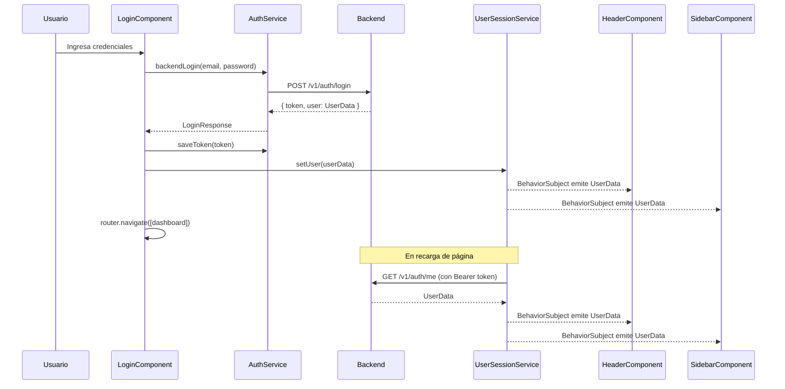
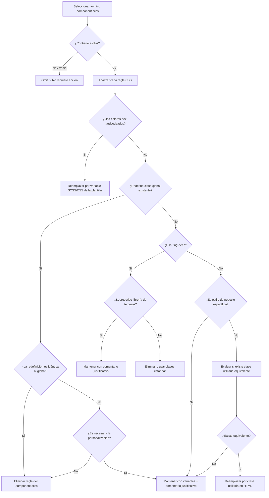

# Documento de Diseño: User Session Profile

## Resumen

Este diseño describe la implementación de un servicio centralizado de sesión de usuario (`UserSessionService`) en Angular 18 que reemplaza los datos estáticos/hardcodeados en los componentes Header y Sidebar con datos reales del usuario autenticado. Incluye la corrección del comportamiento del sidebar en dispositivos móviles y la estandarización de estilos según la plantilla base "Dayone".

### Hallazgos clave de la investigación del código existente

- El backend ya expone `GET /v1/auth/me` (protegido con `authenticateToken`) que retorna: `id`, `nombre`, `apellido`, `email`, `rol`, `ultimoLogin`, `fechaCreacion` y `tenant` (con `id`, `nombre`, `correo`, `telefono`).
- La respuesta de login (`POST /v1/auth/login` y `POST /v1/auth/firebase-login`) incluye `token` y `user` con `idUsuario`, `nombre`, `apellido`, `email`, `rol` y `tenant`.
- La interfaz `LoginResponse` ya existe en `shared/interfaces/login-response.interface.ts` con `UserData` y `Tenant`.
- El JWT contiene: `idUsuario`, `idTenant`, `email`, `rol` (firmado con expiración de 24h).
- El `AuthInterceptor` ya adjunta el token `Bearer` a todas las peticiones HTTP.
- El `AuthGuard` valida la expiración del token decodificando el payload.
- El Header muestra "John Thomson" / "App Developer" hardcodeados en el HTML.
- El Sidebar muestra "Kevin Larios" / "Administrador" hardcodeados en el HTML.
- El `NavService` maneja `collapseSidebar` y suscribe a eventos de router para cerrar el sidebar en móvil, pero se suscribe a TODOS los eventos del router (no solo `NavigationEnd`).
- El `CustomHeaderComponent.ngOnDestroy` establece `data-toggled = 'open'` en pantallas ≤991px, lo cual reabre el sidebar al destruir el componente.

---

## Arquitectura

### Diagrama de arquitectura general

```mermaid
graph TD
    subgraph Frontend Angular 18
        LC[LoginComponent]
        USS[UserSessionService]
        HC[HeaderComponent]
        SC[SidebarComponent]
        CHC[CustomHeaderComponent]
        NS[NavService]
        AS[AuthService]
        AI[AuthInterceptor]
        AG[AuthGuard]
    end

    subgraph Backend Node.js/Express
        AUTH_LOGIN[POST /v1/auth/login]
        AUTH_FIREBASE[POST /v1/auth/firebase-login]
        AUTH_ME[GET /v1/auth/me]
    end

    LC -->|1. Login exitoso| AS
    AS -->|2. HTTP POST| AUTH_LOGIN
    AS -->|2b. Firebase exchange| AUTH_FIREBASE
    LC -->|3. setUser(userData)| USS
    USS -->|4. BehaviorSubject| HC
    USS -->|4. BehaviorSubject| SC
    AG -->|5. Verifica token| AS
    USS -->|6. init() con token válido| AUTH_ME
    AI -->|Bearer token| AUTH_ME
    HC -->|logout()| USS
    NS -->|collapseSidebar| SC
    CHC -->|toggleSidebar()| SC
```

### Flujo de datos de sesión



---

## Componentes e Interfaces

### 1. UserSessionService (NUEVO)

Servicio Angular `providedIn: 'root'` que centraliza el estado del usuario autenticado.

```typescript
// Ubicación: src/app/shared/services/user-session.service.ts

@Injectable({ providedIn: 'root' })
export class UserSessionService {
  private userSubject = new BehaviorSubject<UserData | null>(null);
  private loadingSubject = new BehaviorSubject<boolean>(false);

  user$ = this.userSubject.asObservable();
  loading$ = this.loadingSubject.asObservable();

  // Establece los datos del usuario (llamado tras login exitoso)
  setUser(user: UserData): void;

  // Limpia la sesión (llamado en logout o error 401)
  clearSession(): void;

  // Inicializa la sesión consultando GET /me (llamado en APP_INITIALIZER o guard)
  initSession(): Observable<void>;

  // Extrae datos básicos del JWT como fallback
  private extractFromToken(): Partial<UserData> | null;

  // Getter sincrónico del usuario actual
  get currentUser(): UserData | null;
}
```

### 2. LoginComponent (MODIFICACIÓN)

Cambios requeridos en `src/app/authentication/login/login.component.ts`:

- Inyectar `UserSessionService`.
- En `loginWithBackend()`: tras `saveToken()`, llamar `userSessionService.setUser(res.data.user)` antes de navegar.
- En `validateBackendUser()` (flujo Firebase): tras `saveToken()`, llamar `userSessionService.setUser(response.data.user)` antes de navegar.

### 3. HeaderComponent (MODIFICACIÓN)

Cambios requeridos en `src/app/shared/common/header/header.component.ts`:

- Inyectar `UserSessionService`.
- Suscribirse a `user$` en `ngOnInit()`.
- En `logout()`: llamar `userSessionService.clearSession()`.
- En el template HTML: reemplazar "John Thomson" por `{{ user?.nombre }} {{ user?.apellido }}`, "App Developer" por `{{ user?.rol }}`, y la imagen estática por avatar dinámico con fallback.

### 4. SidebarComponent (MODIFICACIÓN)

Cambios requeridos en `src/app/shared/common/sidebar/sidebar.component.ts`:

- Inyectar `UserSessionService`.
- Suscribirse a `user$` en `ngOnInit()`.
- En el template HTML: reemplazar "Kevin Larios" por `{{ user?.nombre }} {{ user?.apellido }}`, "Administrador" por `{{ user?.rol }}`, y la imagen estática por avatar dinámico con fallback.

### 5. NavService (MODIFICACIÓN)

Cambios requeridos en `src/app/shared/services/navservice.ts`:

- En el constructor, filtrar los eventos del router para suscribirse SOLO a `NavigationEnd`:
  ```typescript
  this.router.events.pipe(
    filter(event => event instanceof NavigationEnd)
  ).subscribe(() => {
    this.collapseSidebar = true;
  });
  ```

### 6. CustomHeaderComponent (MODIFICACIÓN)

Cambios requeridos en `src/app/shared/common/custom-header/custom-header.component.ts`:

- En `ngOnDestroy()`: NO establecer `data-toggled = 'open'` cuando `window.innerWidth <= 991`. Cambiar a `'close'`.
- En el listener de resize dentro de `ngOnDestroy()`: evitar establecer `'open'` en pantallas móviles.

---

## Auditoría y Estandarización de Estilos SCSS (Requisitos 7 y 8)

### a. Inventario de estilos de la plantilla base

La plantilla Dayone de Spruko provee un sistema completo de estilos globales compilados desde `src/assets/scss/styles.scss` e importados globalmente en `src/styles.scss`. A continuación se documenta el inventario de recursos disponibles.

#### Variables de diseño (`assets/scss/_variables.scss`)

Tokens de diseño definidos como CSS custom properties (`:root`) con soporte para modo oscuro (`[data-theme-mode="dark"]`):

| Categoría | Variables disponibles | Ejemplo de uso |
|---|---|---|
| Colores primarios | `--primary-rgb`, `--secondary-rgb`, `--success-rgb`, `--danger-rgb`, `--warning-rgb`, `--info-rgb` | `color: var(--primary-color)` o SCSS `$primary` |
| Opacidades de primario | `--primary01` a `--primary09`, `--primary005` | `background: var(--primary01)` o SCSS `$primary-01` |
| Colores extendidos | `$orange`, `$pink`, `$purple`, `$teal`, `$red`, `$blue`, `$green`, `$cyan`, `$indigo`, `$yellow` | `color: $purple` |
| Grises | `--gray-1` a `--gray-9` (SCSS: `$gray-1` a `$gray-9`) | `color: $gray-5` |
| Blancos/Negros | `--white-1` a `--white-9`, `--black-1` a `--black-9` | `background: $white-1` |
| Texto | `--default-text-color`, `--text-muted` | `color: $default-text-color` |
| Fondos | `--default-body-bg-color`, `--default-background`, `--default-background2` | `background: $default-background` |
| Bordes | `--default-border`, `--bootstrap-card-border`, `--input-border` | `border-color: $default-border` |
| Header | `--header-bg`, `--header-prime-color`, `--header-border-color` | `background: $header-bg` |
| Menú | `--menu-bg`, `--menu-prime-color`, `--menu-border-color` | `background: $menu-bg` |
| Tipografía | `--default-font-family` (Roboto), `$default-font-size` (0.875rem), `$default-font-weight` (400) | `font-family: $default-font-family` |
| Radio de borde | `$default-radius` (0.5rem) | `border-radius: $default-radius` |
| Sombra | `$box-shadow` (`0 0.125rem 0 rgba(10,10,10,.04)`) | `box-shadow: $box-shadow` |
| Gradientes | `$primary-gradient`, `$secondary-gradient`, `$success-gradient`, etc. | `background: $primary-gradient` |
| Redes sociales | `$facebook`, `$twitter`, `$linkedin`, `$instagram`, `$google`, `$youtube` | `background: $facebook` |
| Custom white/black | `$custom-white` (#fff / dark mode aware), `$custom-black` (#000 / dark mode aware) | `color: $custom-white` |

#### Clases utilitarias (`assets/scss/util/`)

| Archivo | Clases disponibles | Descripción |
|---|---|---|
| `_avatars.scss` | `.avatar`, `.avatar-xs`, `.avatar-sm`, `.avatar-md`, `.avatar-lg`, `.avatar-xl`, `.avatar-xxl`, `.avatar-rounded`, `.avatar-list-stacked`, `.online`, `.offline` | Sistema completo de avatares con tamaños predefinidos, estados online/offline y badges |
| `_background.scss` | `.bg-primary`, `.bg-secondary`, `.bg-success`, `.bg-danger`, `.bg-warning`, `.bg-info`, `.bg-light`, `.bg-dark`, `.bg-purple`, `.bg-orange`, `.bg-pink`, `.bg-teal` + variantes `-transparent`, `-gradient`, `-outline`, opacidades (`bg-opacity-10/25/50/75`) | Fondos semánticos con soporte de opacidad y gradientes |
| `_typography.scss` | `.fs-1` a `.fs-60` (tamaños en px), `.fs-sm` (11px), `.fs-base` (14px), `.fs-lg` (18px), `.text-primary`, `.text-secondary`, `.text-success`, `.text-danger`, `.text-muted`, `.text-default`, `.fw-semibold` | Tamaños de fuente granulares y colores de texto semánticos |
| `_border.scss` | `.border`, `.border-primary`, `.border-secondary`, etc., `.border-dashed`, `.border-dotted`, `.border-1` a `.border-5`, `.br-1` a `.br-20`, `.rounded` | Bordes con colores, estilos, anchos y radios predefinidos |
| `_width.scss` | `.w-10` a `.w-100` (porcentajes en pasos de 5), `.w-0` a `.w-9` (rem), `.w-100h` a `.w-500` (px fijos), `.w-auto` | Anchos porcentuales, rem y px |
| `_height.scss` | `.h-10` a `.h-100` (porcentajes), `.h-0` a `.h-9` (rem), `.h-100h` a `.h-500` (px fijos), `.h-100vh`, `.h-auto` | Alturas porcentuales, rem, px y viewport |
| `_opacity.scss` | `.op-0` a `.op-9`, `.op-1-1` | Opacidades de 0 a 1 en pasos de 0.1 |
| `_padding.scss` | (archivo vacío actualmente) | — |

#### Estilos de componentes de la plantilla (`assets/scss/custom/`)

| Archivo | Componentes cubiertos |
|---|---|
| `_header.scss` | `.app-header`, `.main-header-container`, `.header-link`, `.header-link-icon`, `.main-profile-user`, `.main-header-dropdown`, `.header-profile-dropdown`, `.page-header`, `.page-title`, `.search-tags`, `.sidemenu-toggle`, `.animated-arrow` |
| `_dashboard_styles.scss` | Estilos de cards de dashboard, widgets de estadísticas |
| `_authentication.scss` | Estilos de páginas de login, registro, recuperación |
| `_cards.scss` (bootstrap) | `.card`, `.card-header`, `.card-body`, `.card-footer` con variables de la plantilla |
| `_tables.scss` (bootstrap) | `.table`, estilos de encabezados, filas alternadas |
| `_buttons.scss` (bootstrap) | `.btn-primary`, `.btn-secondary`, etc. con colores de la plantilla |
| `_forms.scss` (bootstrap) | `.form-control`, `.form-label`, `.invalid-feedback` con variables de la plantilla |
| `_widgets.scss` | Estilos de widgets reutilizables |
| `_error.scss` | Páginas de error (404, 500, acceso denegado) |

#### Estilos de páginas (`assets/scss/pages/`)

Estilos específicos para: contacto, ecommerce, file-manager, landing, loaders, mail, notificaciones, pricing, perfil, ribbons, timeline.

#### Estilos de menú (`assets/scss/menu-styles/`)

12 variantes de menú lateral: vertical, horizontal, closed, detached, double, icon_click, icon_hover, icon_overlay, icontext, menu_click, menu_hover, support_menu.

#### Bootstrap y librerías de íconos

- **Bootstrap CSS**: Importado globalmente desde `assets/css/bootstrap.css` — todas las clases de Bootstrap 5 están disponibles (`d-flex`, `align-items-center`, `justify-content-between`, `p-3`, `m-2`, `rounded`, `shadow-sm`, etc.)
- **Librerías de íconos**: Bootstrap Icons, Feather Icons, Font Awesome, Remix Icons, Tabler Icons (importados desde `assets/css/icons.css`)

---

### b. Criterios de auditoría

Para cada archivo `.component.scss` del proyecto, se debe verificar la presencia de los siguientes anti-patrones:

| # | Criterio | Qué buscar | Severidad |
|---|---|---|---|
| 1 | **Colores hexadecimales hardcodeados** | Valores como `#6c757d`, `#212529`, `#f8f9fa`, `#e9ecef`, `#495057`, `#6f42c1`, `#dc3545`, `#dee2e6` | Alta |
| 2 | **Redefinición de clases globales** | Selectores que redefinen `.bg-purple`, `.bg-light`, `.alert-light`, `.badge`, `.table th`, `.card`, `.text-danger`, `.form-label` ya estilizados globalmente | Alta |
| 3 | **Tamaños de fuente en px o rem sin usar clases utilitarias** | `font-size: 0.75rem`, `font-size: 30px` cuando existen `.fs-12`, `.fs-30` | Media |
| 4 | **Dimensiones de avatar duplicadas** | Redefinición de `.avatar-xl { width: 4rem; height: 4rem; }` que ya existe en `_avatars.scss` | Alta |
| 5 | **Box-shadow personalizados** | `box-shadow: 0 0.125rem 0.25rem rgba(...)` cuando existe `$box-shadow` y `.shadow-sm` | Media |
| 6 | **Uso de `::ng-deep`** | Sobrescrituras de estilos globales que podrían resolverse con clases de la plantilla o `ViewEncapsulation.None` selectivo | Alta |
| 7 | **Bordes hardcodeados** | `border: 1px solid #e9ecef` cuando existe `$default-border` y `.border` | Media |
| 8 | **Colores de fondo hardcodeados** | `background-color: #f8f9fa` cuando existe `.bg-light`, `$light` | Alta |
| 9 | **Padding/margin en valores fijos** | Valores que podrían usar clases de Bootstrap (`p-3`, `mb-2`, etc.) | Baja |
| 10 | **Estilos de componentes Bootstrap redefinidos** | `.card`, `.btn`, `.progress`, `.pagination .page-link` ya estilizados por la plantilla | Media |

---

### c. Estrategia de reemplazo

El proceso de reemplazo sigue tres niveles de acción, de menor a mayor impacto:

#### Nivel 1: Reemplazo directo en HTML con clases utilitarias

Para estilos que tienen equivalente exacto en las clases utilitarias de la plantilla, se elimina la regla del `.component.scss` y se aplica la clase directamente en el template HTML.

```html
<!-- ANTES (en .component.scss): .avatar-xl { width: 4rem; height: 4rem; } -->
<!-- DESPUÉS (en template HTML): -->
<span class="avatar avatar-xl">...</span>

<!-- ANTES: font-size: 1.5rem en .component.scss -->
<!-- DESPUÉS: -->
<span class="fs-24">...</span>

<!-- ANTES: font-size: 0.75rem en .component.scss -->
<!-- DESPUÉS: -->
<span class="fs-12">...</span>

<!-- ANTES: background-color: #6f42c1 en .component.scss -->
<!-- DESPUÉS: -->
<span class="bg-purple">...</span>
```

#### Nivel 2: Reemplazo de valores hardcodeados por variables CSS/SCSS

Para estilos personalizados que deben permanecer en el `.component.scss` pero usan valores hardcodeados, se reemplazan por las variables de la plantilla.

```scss
// ANTES
.info-label {
  color: #6c757d;
  font-size: 0.875rem;
}
.card.border {
  border: 1px solid #e9ecef !important;
}
.card-header.bg-light {
  background-color: #f8f9fa !important;
  border-bottom: 1px solid #e9ecef;
}

// DESPUÉS
.info-label {
  color: $text-muted;        // var(--text-muted)
  font-size: $default-font-size;
}
.card.border {
  border: 1px solid $default-border !important;  // var(--default-border)
}
.card-header.bg-light {
  background-color: $light !important;           // rgb(var(--light-rgb))
  border-bottom: 1px solid $default-border;
}
```

#### Nivel 3: Eliminación de reglas redundantes

Para estilos que duplican exactamente lo que la plantilla ya provee globalmente, se eliminan del `.component.scss` sin necesidad de cambios en el HTML.

```scss
// ELIMINAR — ya definido en assets/scss/util/_avatars.scss
.avatar {
  display: inline-flex;
  align-items: center;
  justify-content: center;
}

// ELIMINAR — ya definido en assets/scss/bootstrap/_tables.scss
.table th {
  font-weight: 600;
}

// ELIMINAR — ya definido en assets/scss/bootstrap/_cards.scss
.card {
  box-shadow: 0 0.125rem 0.25rem rgba(0, 0, 0, 0.075);
}
```

#### Manejo de `::ng-deep`

Para cada uso de `::ng-deep`, evaluar caso por caso:

1. **Si sobrescribe estilos de librerías de terceros** (Angular Material, ng-select, angular-editor): mantener pero documentar con comentario justificativo.
2. **Si sobrescribe estilos de la plantilla base**: eliminar y usar las clases estándar de la plantilla.
3. **Si es necesario para componentes encapsulados**: considerar mover el estilo a `styles.scss` global o usar `ViewEncapsulation.None` en el componente específico.

---

### d. Lista de componentes a auditar

Los siguientes archivos `.component.scss` contienen estilos personalizados que requieren revisión:

#### Prioridad Alta (contienen múltiples anti-patrones)

| Componente | Archivo | Anti-patrones detectados |
|---|---|---|
| view-inventario | `production-dashboard/inventario/view-inventario/view-inventario.component.scss` | 6 colores hex hardcodeados, redefinición de `.avatar`, `.alert-light`, `.card.border`, `.card-header.bg-light`, `.progress` |
| view-gasto | `production-dashboard/gastos-operacion/view-gasto/view-gasto.component.scss` | 4 colores hex, redefinición de `.bg-purple`, `.card.border` |
| vehiculo-list | `production-dashboard/vehiculos/vehiculo-list/vehiculo-list.component.scss` | 2 colores hex en `.table th`, font-size hardcodeados, redefinición de `.badge` |
| inventario-list | `production-dashboard/inventario/inventario-list/inventario-list.component.scss` | 2 colores hex en `.table th`, font-size hardcodeados |
| view-tasks | `task-dashboard/view-tasks/view-tasks.component.scss` | `::ng-deep` extenso con ~15 colores hex hardcodeados para dark mode del angular-editor |
| view-vehiculo | `production-dashboard/vehiculos/view-vehiculo/view-vehiculo.component.scss` | 3 colores hex, redefinición de `.card.border`, `.card-header.bg-light` |
| hr-dashboard-page-header | `shared/common/page-headers/hr-dashboard-page-header/hr-dashboard-page-header.component.scss` | `::ng-deep` con colores hex para Angular Material |

#### Prioridad Media (anti-patrones aislados)

| Componente | Archivo | Anti-patrones detectados |
|---|---|---|
| view-cliente | `bussiness-dashboard/clientes/view-cliente/view-cliente.component.scss` | 2 colores hex en `.info-label`/`.info-value`, font-size hardcodeado |
| view-venta | `bussiness-dashboard/ventas/view-venta/view-venta.component.scss` | 2 colores hex en `.info-label`/`.info-value`, font-size hardcodeado |
| galera-list | `production-dashboard/galeras/galera-list/galera-list.component.scss` | Redefinición de `.bg-purple` con hex |
| view-galera | `production-dashboard/galeras/view-galera/view-galera.component.scss` | Redefinición de `.bg-purple` con hex |
| gasto-list | `production-dashboard/gastos-operacion/gasto-list/gasto-list.component.scss` | Redefinición de `.bg-purple`, `.badge` con font-size |
| edit-user | `hrmdashboards/users/edit-user/edit-user.component.scss` | Color hex en `.form-control.ng-invalid` |
| add-inventario | `production-dashboard/inventario/add-inventario/add-inventario.component.scss` | Redefinición de `.text-danger` con hex |
| edit-inventario | `production-dashboard/inventario/edit-inventario/edit-inventario.component.scss` | Redefinición de `.text-danger` con hex |

#### Prioridad Baja (estilos mínimos o justificados)

| Componente | Archivo | Observación |
|---|---|---|
| view-huevo | `production-dashboard/huevos/view-huevo/view-huevo.component.scss` | Redefinición de `.avatar-xl` y `.fs-24`/`.fs-48` (ya existen como utilitarias) |
| ticket-list | `bussiness-dashboard/tickets/ticket-list/ticket-list.component.scss` | Redefinición de `.badge` |
| venta-list | `bussiness-dashboard/ventas/venta-list/venta-list.component.scss` | Redefinición de `.badge` |
| cliente-list | `bussiness-dashboard/clientes/cliente-list/cliente-list.component.scss` | Redefinición de `.badge` |
| view-ticket | `bussiness-dashboard/tickets/view-ticket/view-ticket.component.scss` | Box-shadow custom en `.card` |
| edit-ticket | `bussiness-dashboard/tickets/edit-ticket/edit-ticket.component.scss` | Box-shadow custom en `.card` |
| modules | `super-admin/modules/modules.component.scss` | `.icon1` — estilo de negocio específico, mantener con variables |
| add-venta | `bussiness-dashboard/ventas/add-venta/add-venta.component.scss` | Redefinición de `.form-label`, `.btn` |
| add-puesto | `hrmdashboards/puestos/add-puesto/add-puesto.component.scss` | `.text-danger` con font-size |
| login | `authentication/login/login.component.scss` | `:host` con background-image (justificado), `::ng-deep` para Firebase (justificado) |
| access-denied | `custom-pages/access-denied/access-denied.component.scss` | Padding custom en `.card-body` |
| support-switcher | `shared/common/support-switcher/support-switcher.component.scss` | Color hex en border |
| hr-dashboard-page-header-modal | `shared/common/page-headers/hr-dashboard-page-header-modal/hr-dashboard-page-header-modal.component.scss` | `::ng-deep` para CDK overlay, font-size hardcodeado |
| on-hold-tasks | `task-dashboard/on-hold-tasks/on-hold-tasks.component.scss` | `::ng-deep` para mat-paginator |
| attendence-list | `hrmdashboards/attendance/attendence-list/attendence-list.component.scss` | `::ng-deep` para timepicker overlay |
| support-header | `shared/common/support-header/support-header.component.scss` | `::ng-deep` para megamenu horizontal |

---

### e. Patrones comunes a corregir

A partir del análisis del código existente, se identificaron los siguientes anti-patrones recurrentes:

#### 1. Redefinición de `.bg-purple` con hex hardcodeado

Aparece en 4 componentes (`view-galera`, `galera-list`, `gasto-list`, `view-gasto`):

```scss
// ❌ Anti-patrón (repetido en 4 archivos)
.bg-purple {
  background-color: #6f42c1 !important;
  color: white;
}

// ✅ Corrección: eliminar del .component.scss
// La clase .bg-purple ya existe en _background.scss con $purple (rgb(var(--purple-rgb)))
// Usar directamente en HTML: class="bg-purple"
```

#### 2. Clases `.info-label` / `.info-value` con colores hex

Aparece en 3 componentes (`view-cliente`, `view-venta`, `view-gasto`):

```scss
// ❌ Anti-patrón
.info-label {
  color: #6c757d;       // equivale a $text-muted
  font-size: 0.875rem;  // equivale a $default-font-size o .fs-14
}
.info-value {
  color: #212529;        // equivale a $dark o .text-dark
  font-size: 1.1rem;
}

// ✅ Corrección
.info-label {
  color: $text-muted;
  font-size: $default-font-size;
}
.info-value {
  color: $default-text-color;
  // font-size: 1.1rem — no tiene clase utilitaria exacta, mantener o usar .fs-18 (1.125rem)
}
```

#### 3. Estilos de tabla con colores hex en `th`

Aparece en 2 componentes (`vehiculo-list`, `inventario-list`):

```scss
// ❌ Anti-patrón
.table th {
  font-weight: 600;
  font-size: 0.875rem;
  color: #495057;           // gris oscuro hardcodeado
  background-color: #f8f9fa; // gris claro hardcodeado
}

// ✅ Corrección: eliminar si la plantilla ya estiliza .table th,
// o reemplazar con variables:
.table th {
  color: $default-text-color;
  background-color: $light;
}
```

#### 4. Redefinición de `.badge` con font-size y padding

Aparece en 5 componentes (`ticket-list`, `venta-list`, `cliente-list`, `gasto-list`, `vehiculo-list`):

```scss
// ❌ Anti-patrón (idéntico en 5 archivos)
.badge {
  font-size: 0.75rem;
  padding: 0.35em 0.65em;
}

// ✅ Corrección: eliminar — Bootstrap ya define estos estilos para .badge
```

#### 5. Redefinición de `.card` y `.card-header` con colores hex

Aparece en 3 componentes (`view-inventario`, `view-vehiculo`, `view-gasto`):

```scss
// ❌ Anti-patrón
.card.border {
  border: 1px solid #e9ecef !important;
}
.card-header.bg-light {
  background-color: #f8f9fa !important;
  border-bottom: 1px solid #e9ecef;
}

// ✅ Corrección
.card.border {
  border: 1px solid $default-border !important;
}
.card-header.bg-light {
  background-color: $light !important;
  border-bottom: 1px solid $default-border;
}
// O mejor: eliminar si las clases Bootstrap .border y .bg-light ya aplican estos estilos
```

#### 6. Redefinición de `.text-danger` con hex

Aparece en 2 componentes (`add-inventario`, `edit-inventario`):

```scss
// ❌ Anti-patrón
.text-danger {
  color: #dc3545;
}

// ✅ Corrección: eliminar — .text-danger ya está definido globalmente con $danger
```

#### 7. Redefinición de clases de avatar existentes

Aparece en `view-huevo`:

```scss
// ❌ Anti-patrón
.avatar-xl {
  width: 4rem;
  height: 4rem;
}
.fs-24 {
  font-size: 1.5rem;
}
.fs-48 {
  font-size: 3rem;
}

// ✅ Corrección: eliminar todo — .avatar-xl existe en _avatars.scss,
// .fs-24 (1.5rem) y .fs-48 no existe pero .fs-50 (3.125rem) sí.
// Usar las clases utilitarias directamente en el HTML.
```

#### 8. `::ng-deep` extenso para dark mode de angular-editor

Aparece en `view-tasks` con ~15 colores hex hardcodeados:

```scss
// ❌ Anti-patrón — 40+ líneas de ::ng-deep con colores hardcodeados
::ng-deep {
  .dark-mode {
    .angular-editor-toolbar {
      background-color: #2a2e3f !important;
      border: 1px solid #32394e !important;
    }
    // ... muchas más reglas
  }
}

// ✅ Corrección: mover estos estilos a un archivo global (styles.scss o un partial dedicado)
// y usar las variables de dark mode de la plantilla:
// background-color: var(--custom-white);
// border-color: var(--default-border);
// color: var(--default-text-color);
```

### Diagrama del flujo de auditoría



---

## Modelos de Datos

### UserData (existente, sin cambios)

```typescript
// src/app/shared/interfaces/login-response.interface.ts
export interface Tenant {
  id_tenant: number;
  nombre: string;
}

export interface UserData {
  id_usuario: number;
  nombre: string;
  apellido: string;
  email: string;
  rol: string;
  tenant: Tenant;
}
```

### MeResponse (NUEVO)

Interfaz para la respuesta del endpoint `GET /v1/auth/me`, que difiere ligeramente de `UserData` del login:

```typescript
// src/app/shared/interfaces/me-response.interface.ts
export interface MeResponse {
  success: boolean;
  data: {
    id: number;
    nombre: string;
    apellido: string;
    email: string;
    rol: string;
    ultimoLogin: string;
    fechaCreacion: string;
    tenant: {
      id: number;
      nombre: string;
      correo: string;
      telefono: string;
    };
  };
}
```

### JwtPayload (NUEVO)

Interfaz para el payload decodificado del JWT:

```typescript
// src/app/shared/interfaces/jwt-payload.interface.ts
export interface JwtPayload {
  idUsuario: number;
  idTenant: number;
  email: string;
  rol: string;
  exp: number;
  iat: number;
}
```

### Mapeo MeResponse → UserData

El `UserSessionService` debe mapear la respuesta de `/me` a `UserData`:

```typescript
private mapMeToUserData(me: MeResponse['data']): UserData {
  return {
    id_usuario: me.id,
    nombre: me.nombre,
    apellido: me.apellido,
    email: me.email,
    rol: me.rol,
    tenant: {
      id_tenant: me.tenant.id,
      nombre: me.tenant.nombre
    }
  };
}
```

---

## Propiedades de Correctitud

*Una propiedad es una característica o comportamiento que debe mantenerse verdadero en todas las ejecuciones válidas de un sistema — esencialmente, una declaración formal sobre lo que el sistema debe hacer. Las propiedades sirven como puente entre especificaciones legibles por humanos y garantías de correctitud verificables por máquina.*

### Property 1: Round-trip de UserData a través del BehaviorSubject

*Para cualquier* `UserData` válido, al llamar `setUser(userData)` en el `UserSessionService`, todos los suscriptores del observable `user$` deben recibir exactamente el mismo objeto `UserData` proporcionado.

**Validates: Requirements 1.1, 1.2, 4.3**

### Property 2: clearSession emite null

*Para cualquier* estado previo del `UserSessionService` (con o sin `UserData` almacenado), al llamar `clearSession()`, el observable `user$` debe emitir `null` y `currentUser` debe retornar `null`.

**Validates: Requirements 1.4**

### Property 3: Extracción de fallback desde JWT en error de servidor

*Para cualquier* JWT válido que contenga `email` y `rol` en su payload, cuando el endpoint `/me` retorna un error 500, el `UserSessionService` debe extraer y almacenar al menos el `email` y `rol` del token decodificado como datos de respaldo.

**Validates: Requirements 1.6**

### Property 4: Formato de nombre completo

*Para cualquier* par de strings `nombre` y `apellido` en un `UserData`, la concatenación mostrada en los componentes Header y Sidebar debe ser exactamente `"${nombre} ${apellido}"` (con un espacio entre ambos).

**Validates: Requirements 2.2, 3.2**

### Property 5: Token expirado o inválido dispara limpieza

*Para cualquier* token JWT cuyo campo `exp` sea menor al timestamp actual (expirado) o cuyo formato sea inválido (no decodificable), el `UserSessionService` debe limpiar los datos de sesión y el observable `user$` debe emitir `null`.

**Validates: Requirements 4.2**

---

## Manejo de Errores

| Escenario | Acción del Sistema |
|---|---|
| `GET /me` retorna 401 | `UserSessionService.clearSession()` + `router.navigate(['/auth/login'])` |
| `GET /me` retorna 500 | Extraer `email` y `rol` del JWT como fallback. Mostrar datos parciales. |
| `GET /me` retorna 404 | `clearSession()` + redirigir a login (usuario eliminado). |
| JWT no presente en localStorage | No inicializar sesión. Dejar `user$` en `null`. |
| JWT malformado (no decodificable) | `clearSession()` + redirigir a login. |
| JWT expirado | `clearSession()` + redirigir a login (detectado por `AuthGuard`). |
| Error de red en `GET /me` | Intentar fallback desde JWT. Mostrar toast de error. |
| `UserData` con campos vacíos | Mostrar "Usuario" como nombre por defecto, "Sin rol" como rol por defecto. |

---

## Estrategia de Testing

### Enfoque dual: Tests unitarios + Tests basados en propiedades

Este feature combina lógica de servicio pura (ideal para PBT) con integración de componentes UI y correcciones de comportamiento del sidebar (mejor cubiertos con tests unitarios/ejemplo).

### Tests basados en propiedades (PBT)

Librería: **fast-check** (compatible con Jasmine/Karma del proyecto Angular).

Configuración: mínimo 100 iteraciones por propiedad.

Cada test de propiedad debe referenciar su propiedad del documento de diseño con el formato:
`Feature: user-session-profile, Property {N}: {texto de la propiedad}`

Propiedades a implementar:
1. Round-trip de UserData a través del BehaviorSubject
2. clearSession emite null
3. Extracción de fallback desde JWT
4. Formato de nombre completo
5. Token expirado/inválido dispara limpieza

### Tests unitarios (ejemplo/integración)

- **LoginComponent**: Verificar que `setUser()` se llama tras login exitoso (backend y Firebase).
- **HeaderComponent**: Verificar suscripción a `user$`, renderizado de datos, estado de carga, y que `logout()` invoca `clearSession()`.
- **SidebarComponent**: Verificar suscripción a `user$`, renderizado de datos, avatar por defecto.
- **Sidebar móvil**: Verificar estado inicial colapsado en <991px, persistencia tras cierre, cierre en NavigationEnd, toggle correcto.
- **CustomHeaderComponent**: Verificar que `ngOnDestroy` no establece `data-toggled='open'` en móvil.
- **NavService**: Verificar que solo se suscribe a `NavigationEnd` (no a todos los eventos del router).

### Auditoría y estandarización de estilos (Requisitos 7 y 8)

Los requisitos 7 y 8 son tareas de auditoría manual y refactorización de SCSS. No son candidatos para PBT ni tests unitarios automatizados. Se verificarán mediante:
- Revisión manual de archivos `.component.scss` contra las clases utilitarias de `assets/scss/util/`.
- Verificación visual de que no hay regresiones tras reemplazar estilos personalizados por clases de la plantilla base.
- Documentación del inventario de clases disponibles como referencia para el equipo.
